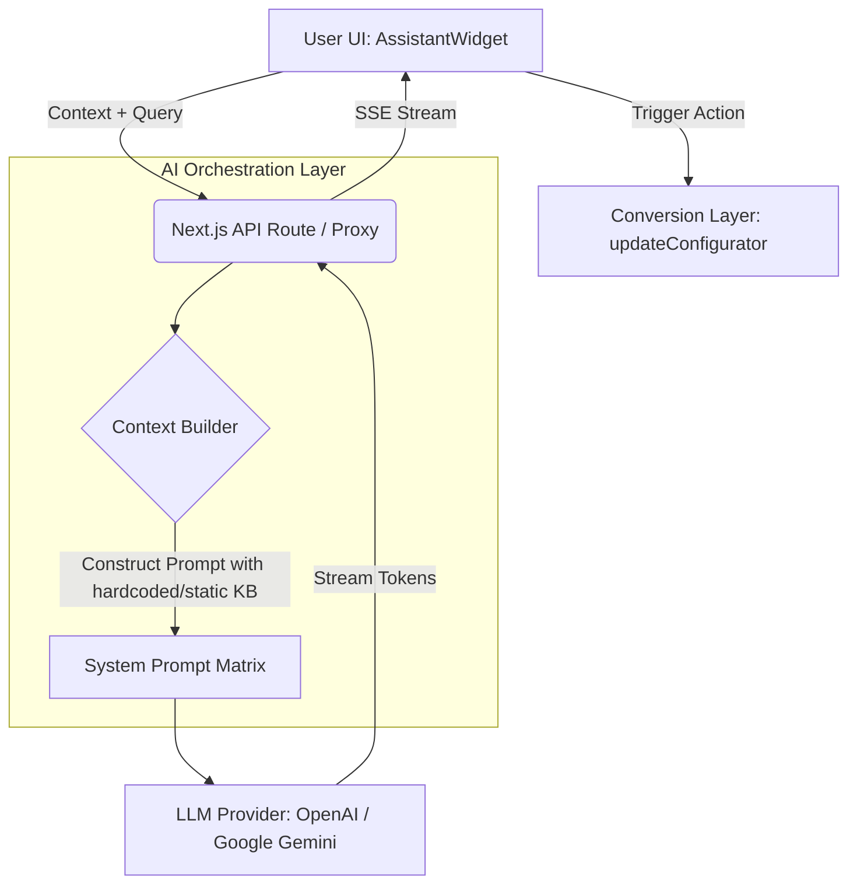

# System Design: AI-Ready Layer (ai-ready-layer)

**Project**: Expoint ADV - Premium AI-Ready B2B Sales Engine
**Version**: 1.0.0

---

## 1. Overview
The AI-Ready Layer provides the conversational interface and orchestration logic necessary to transform the Expoint ADV platform into an intelligent, proactive sales tool. It bridges the gap between the user's intent, the structured data of the Conversion Layer (Configurator), and the unstructured knowledge stored in the Knowledge Layer (NotebookLM).

## 2. Goals & Non-Goals

**Goals**:
- Provide a persistent, premium chat interface (`AssistantWidget`) accessible across the site.
- Establish a "Context Builder" to inject current page state, segment, and configurator data into AI prompts.
- Implement streaming responses (Server-Sent Events) for low-latency UX.
- Create a secure proxy architecture to protect API keys.
- Support "Generative UI" or command-driven actions.

**Non-Goals**:
- Integrating NotebookLM into the live production site (NotebookLM is strictly an internal tool for the AI developer agent).
- Training custom foundational models from scratch.
- Full autonomous voice-calling agents.

## 3. Background & Context
According to **[REQ-4.4] AI Integration**, the platform must natively support an AI assistant. The AI-Ready Layer prepares the architecture for this. Note: The NotebookLM knowledge base is used by the development agent (Antigravity) to understand the business, pricing, and domain, but the live site relies on static prompt matrices or exported context rather than hitting NotebookLM directly.

## 4. Architecture

The AI-Ready Layer follows a RAG (Retrieval-Augmented Generation) proxy architecture combined with the Vercel AI SDK for frontend streaming.



## 5. Interface Design

**Frontend Hooks**:
- `useAssistantContext()`: Gathers contextual data.
  ```typescript
  type AssistantContext = {
    currentRoute: string;
    activeSegment: "horeca" | "retail" | "corporate" | null;
    configuratorState: SignProject | null;
  };
  ```

**API Endpoint**: `POST /api/chat`
- **Payload**: `{ messages: Message[], context: AssistantContext }`
- **Response**: `text/event-stream` (Vercel AI SDK format).

**System Prompts**:
- **Persona**: "You are an expert technical sales engineer at Expoint ADV, specializing in outdoor advertising, channel letters, and premium signage."
- **Constraints**: "Never guarantee a final legal price. Always refer to the configurator's range. If asked about non-signage topics, politely decline."

## 6. Data Model

**Message Structure** (Standard AI SDK format):
```typescript
type Message = {
  id: string;
  role: 'system' | 'user' | 'assistant' | 'function';
  content: string;
  createdAt?: Date;
  // Extensibility for Generative UI
  ui?: React.ReactNode; 
};
```

## 7. Technology Stack
- **Frontend UI**: React, Tailwind CSS, Framer Motion (for chat widget animations).
- **Streaming & State**: `ai` (Vercel AI SDK) for `useChat` hook.
- **Backend Orchestration**: Next.js App Router API Routes (Edge runtime preferred for fast TTFB).
- **LLM/Knowledge Base Integration**: `lib/notebooklm.ts` stub (to be connected to actual NotebookLM API or a LangChain/LlamaIndex proxy wrapper over Google Gemini + NotebookLM docs).

## 8. Trade-offs & Alternatives

### Trade-off 1: Native NotebookLM vs. Vector DB (Pinecone/Weaviate)
- **Alternative**: Export all NotebookLM data and build a custom LangChain + Pinecone RAG pipeline.
- **Decision**: Rely on NotebookLM's native integration if APIs are available; otherwise, use Gemini's context caching with exported NotebookLM markdown as the knowledge base.
- **Why**: NotebookLM provides superior source-grounding and ease of maintenance for the business owners (they just drop PDFs into NotebookLM). Building a custom Vector DB pipeline introduces unnecessary DevOps overhead for MVP.

### Trade-off 2: Generative UI vs. Markdown Text
- **Alternative**: Have the AI return raw JSON commands to update the UI.
- **Decision**: Use markdown text for MVP, with predefined function calling (`tool_calls` in Gemini/OpenAI) to trigger specific UI state changes (e.g., `setCalculatorHeight(50)`).
- **Why**: Full React Server Components (RSC) Generative UI is complex and brittle. Function calling is robust and achieves the same goal of letting the AI control the configurator state.

## 9. Security Considerations
- **Prompt Injection**: The `POST /api/chat` route must forcefully prepend the System Prompt on the server. Never trust the client to send the System Prompt.
- **Rate Limiting**: Implement strict IP-based rate limiting (e.g., Upstash Redis) to prevent malicious actors from running up the LLM billing account.
- **Data Privacy**: Ensure no Personally Identifiable Information (PII) from the configurator lead form is sent to the LLM context unless explicitly required and anonymized.

## 10. Performance Considerations
- **Time To First Byte (TTFB)**: Must be under 800ms. Use Edge functions for the API route if possible.
- **Context Window Management**: Pass only the *relevant* parts of the configurator state to avoid bloating the context window and increasing latency/costs.

## 11. Testing Strategy
- **Prompt Benchmarking**: Run automated tests of 20 common user questions against the API to ensure the AI does not hallucinate pricing or recommend competitor products.
- **Context Injection Tests**: Unit test the `useAssistantContext()` hook to verify it accurately captures URL changes and Zustand store updates.
