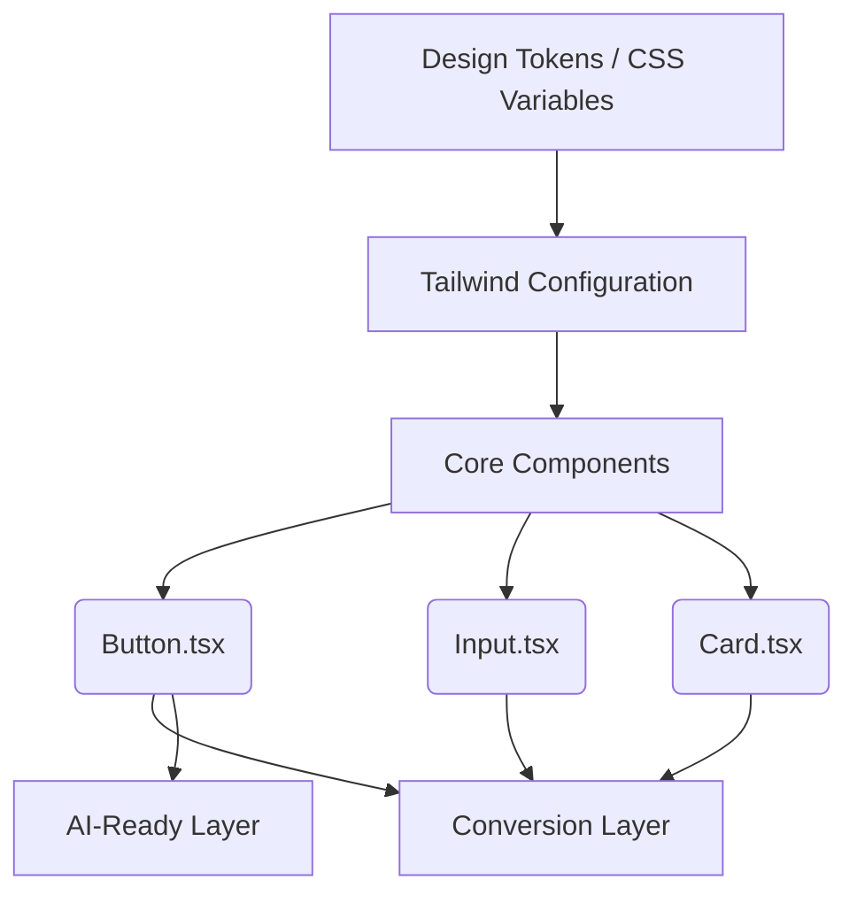

# System Design: Brand Layer (brand-layer)

**Project**: Expoint ADV - Premium AI-Ready B2B Sales Engine
**Version**: 1.0.0

---

## 1. Overview
The Brand Layer is the foundational visual identity and component system of the Expoint ADV platform. It provides the design tokens, typography, CSS utilities, and core React UI components (Buttons, Inputs, Cards) that all other layers (Offer, Conversion, AI-Ready) depend upon to maintain a cohesive, premium, and accessible user experience.

## 2. Goals & Non-Goals

**Goals**:
- Establish a "Premium Industrial" B2B aesthetic.
- Provide a centralized source of truth for all design tokens (colors, spacing, typography).
- Deliver accessible (WCAG 2.1 AA compliant) and deterministic UI components.
- Ensure performant rendering without client-side hydration issues related to styling.

**Non-Goals**:
- Implementing complex business logic or form validation (handled by the Conversion Layer).
- Managing global application state (handled by context or store).
- Specific page layouts or complex section assembly.

## 3. Background & Context
According to **[REQ-4.1] Core Experience & Visual Identity**, the platform must shift from a standard portfolio to a proactive sales tool with a premium look. It requires clean lines, high-contrast typography, and consistent interactive states. The Brand Layer abstracts these requirements into reusable tokens and components so that developers can build higher-level features without worrying about visual consistency.

## 4. Architecture

The Brand Layer follows a "Design Tokens to Components" architecture, tightly coupled with Tailwind CSS.

## 5. Interface Design

The interface of the Brand Layer consists of React Component APIs and CSS Utility classes.

**Component APIs**:
- `Button`: `variant` ('primary' | 'secondary' | 'outline' | 'ghost'), `size`, `isLoading`.
- `Card`: `variant` ('default' | 'outline' | 'glass').
- `Input`: `label`, `error`, `helperText`.

**CSS Tokens**:
- Consumed via standard Tailwind utility classes (e.g., `text-primary-600`, `bg-slate-900`, `shadow-2`, `radius-md`).

## 6. Data Model
*Not applicable for the Brand Layer, as it is strictly related to presentation and does not handle business data or persistence.*

## 7. Technology Stack
- **CSS Architecture**: CSS Variables (`index.css`) + Tailwind CSS framework.
- **Component Library**: React 19 functional components.
- **Iconography**: `lucide-react` and Material Symbols.
- **Animation**: `motion/react` for micro-animations and transitions.

## 8. Trade-offs & Alternatives

### Trade-off 1: Semantic CSS Variables vs. Tailwind Config Colors
- **Alternative**: Define all hex codes directly in `tailwind.config.js`.
- **Decision**: We chose Semantic CSS Variables in `index.css` mapped to Tailwind.
- **Why**: This allows for dynamic theming (like dark mode overrides or brand white-labeling) purely via CSS without recompiling the JavaScript/Tailwind bundle. It also separates the intent (primary, success) from the specific hex values.

### Trade-off 2: Custom Components vs. UI Libraries (e.g., Radix, MUI)
- **Alternative**: Use a heavy UI library like Material-UI.
- **Decision**: Build custom core components (`Button`, `Input`, `Card`) using Tailwind.
- **Why**: Ensures 100% control over the "Premium Industrial" aesthetic. Pre-built libraries often carry bloated CSS and require extensive overriding to break away from their default "look."

## 9. Security Considerations
- **CSS Injection / XSS**: Ensure that component props (like `className` or labels) are properly escaped by React to prevent injection attacks if dynamic data is passed to them.

## 10. Performance Considerations
- **CSS Bundle Size**: Tailwind CSS purges unused classes during the Vite build process, ensuring minimal CSS footprint.
- **Hydration**: Pure CSS and React components without complex `useEffect` styling hooks ensure deterministic server-side rendering (or static generation) to prevent layout shifts.

## 11. Testing Strategy
- **Visual Regression**: Manual visual inspection of focus states, hover states, and disabled states across modern browsers (Chrome, Safari, Firefox).
- **Accessibility Audit**: Automated Lighthouse checks and manual keyboard navigation testing to verify focus rings and contrast ratios.
