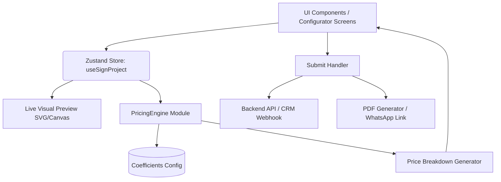

# System Design: Conversion Layer (conversion-layer)

**Project**: Expoint ADV - Premium AI-Ready B2B Sales Engine
**Version**: 1.0.0

---

## 1. Overview
The Conversion Layer is the core business engine of the platform, transforming it from a standard portfolio site into a proactive B2B sales tool. Its primary component is the **Sign Configurator (Калькулятор вывески 2.0)**—a visual, interactive tool that allows clients to select materials, view live previews, receive instant price estimates, and submit comprehensive production specifications (ТЗ) to the sales team.

## 2. Goals & Non-Goals

**Goals**:
- Provide an automotive-style configurator with live 2D (SVG/Canvas) preview.
- Implement a modular, coefficient-based pricing engine (Production, Lighting, Mounting, Margin).
- Support multiple user scenarios: Quick Estimate, Visual Configuration, and Facade Mockup (Future).
- Output a structured JSON payload (`SignProject`) for CRM integration.
- Explain pricing visually to build trust (Price transparency & Value-based upsells).

**Non-Goals**:
- Full 3D rendering (React Three Fiber) in the MVP phase.
- Providing a final, binding legal quote (the tool provides an "estimate range" subject to managerial review).
- Direct e-commerce checkout.

## 3. Background & Context
According to **[REQ-4.3] Conversion Tools**, the platform must convert visitors into qualified leads. Standard contact forms perform poorly because B2B buyers want immediate cost expectations. Competitor analysis reveals that most local competitors offer text-heavy forms without visual feedback. By providing real-time visual feedback, component-level price breakdowns, and AI-assisted recommendations, the Conversion Layer will significantly increase lead quality and conversion rates.

## 4. Architecture

The Conversion Layer is heavily state-driven, utilizing Zustand for global configurator state and a dedicated `PricingEngine` utility class to abstract mathematical logic away from UI components.



## 5. Interface Design

**Configurator UI Flow**:
1. **Quick Start**: Selection of base product (Channel Letters).
2. **Text & Style**: Input text, upload logo, choose aesthetic style.
3. **Letter Type**: Selection of illumination type (Front, Halo, Side, etc.) with mini-previews and pricing tiers.
4. **Size & Readability**: Height inputs and viewing distance recommendations.
5. **Materials & Lighting**: Upgrades (IP67 power supply, premium materials).
6. **Installation**: Mounting requirements, height, facade type.
7. **Summary & CTA**: Price range, breakdown, "Get Precise Quote" form.

**State Management (Zustand)**:
- `projectState`: Holds the current `SignProject` object.
- `updateProject(path, value)`: Generic updater.
- `calculatePrice()`: Invokes the `PricingEngine`.

## 6. Data Model

The core state is represented by the `SignProject` structure:

```typescript
type SignProject = {
  id: string;
  type: "channel_letters";
  text: string;
  logoFileUrl?: string;

  dimensions: {
    letterHeightCm: number;
    viewingDistanceM?: number;
  };

  design: {
    fontPreset: string;
    fontComplexity: "simple" | "medium" | "serif" | "script" | "custom_logo";
    faceColor: string;
    sideColor: string;
  };

  construction: {
    letterType: "non_lit_volume" | "front_lit" | "halo_lit" | "front_and_halo" | "metal_premium" | "open_led_pixel";
    faceMaterial: string;
    sideMaterial: string;
    backingPanel: boolean;
    frame: boolean;
    powerSupplyIp67: boolean;
  };

  installation: {
    needed: boolean | "unknown";
    heightM?: number;
    facadeType?: string;
    permitHelpNeeded: boolean | "unknown";
  };
};
```

## 7. Pricing Engine (Formulas)

The pricing logic is decoupled into a modular engine to allow easy updates via admin configs in the future.

**1. Production Cost**:
`ProductionCost = LetterCount × LetterHeightCm × BaseRate × MaterialCoef × TypeCoef × FontComplexityCoef`
*(Future integration: Use `WeightedLetterCount` instead of raw `LetterCount` for varied character widths).*

**2. Lighting Cost**:
`LedModulesCount = ceil(EstimatedLetterArea / CoveragePerModule)`
`LightingCost = LedModulesCount × LedModulePrice`

**3. Power Supply Cost**:
`TotalPowerW = LedModulesCount × ModulePowerW`
`PowerSupplyCount = ceil(TotalPowerW / PowerSupplyCapacityW × SafetyFactor)`
*(Includes `IP67PowerSupplyCoef` multiplier if selected).*

**4. Total Calculation**:
`CostBase = ProductionCost + LightingCost + PowerSupplyCost + FrameCost + MountingCost + Overhead`
`Estimate = CostBase × MarginMultiplier`
*The system returns `[Estimate * 0.9, Estimate * 1.1]` to present a confidence range.*

## 8. Technology Stack
- **State Management**: `Zustand` (minimal boilerplate, easy to persist to `localStorage`).
- **Form Validation**: `React Hook Form` + `Zod` (for lead capture validation).
- **Preview Engine**: React SVG manipulation (allows dynamic text updates, font-family changes, and SVG filter dropshadows for glowing effects).
- **Animations**: `Framer Motion` (for smooth transitions between configurator steps).

## 9. Trade-offs & Alternatives

### Trade-off 1: Exact Price vs. Confidence Range
- **Alternative**: Calculate and show a single, binding exact price down to the ruble.
- **Decision**: Show a range (e.g., 86,000 – 112,000 ₽) and a "Confidence Score" (e.g., 75%).
- **Why**: B2B manufacturing has hidden variables (facade complexity, exact vector logo topology). Showing a range prevents legal conflicts and positions the tool as a consultative guide rather than a binding contract.

### Trade-off 2: SVG/Canvas 2D vs. Three.js 3D Preview
- **Alternative**: Build a full 3D configurator immediately using `react-three-fiber`.
- **Decision**: Use dynamic 2D SVG previews with CSS drop-shadows to simulate lighting.
- **Why**: Drastically reduces MVP development time and client-side performance overhead. Real-time 2D visual feedback solves 90% of user trust issues. The architecture will allow dropping in a 3D canvas in V2.

## 10. Security & Stability Considerations
- **Pricing Logic Obfuscation**: The exact coefficient matrix (BaseRates, Multipliers) should ideally be calculated server-side or obfuscated to prevent competitors from scraping the exact unit economics. For MVP, client-side is acceptable if base rates are generic market rates.
- **State Persistence**: Store the `SignProject` in `sessionStorage` or `localStorage` so users don't lose their complex configuration if they accidentally refresh the page.

## 11. Testing Strategy
- **Calculation Determinism**: Comprehensive unit testing of the `PricingEngine` against known manual spreadsheets to ensure the algorithms match expected factory quotes.
- **State Edge Cases**: Test scenarios where users change a fundamental type (e.g., switching from "Halo Lit" to "Non-Lit") to ensure lighting costs reset appropriately.
