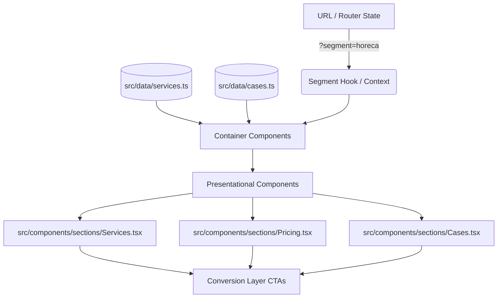

# System Design: Offer Layer (offer-layer)

**Project**: Expoint ADV - Premium AI-Ready B2B Sales Engine
**Version**: 1.0.0

---

## 1. Overview
The Offer Layer is responsible for presenting the company's productized services, pricing tiers (Product Packs), and segment-specific case studies. It bridges the foundational UI (Brand Layer) with user engagement pathways (Conversion Layer), acting as the primary digital catalog that educates the B2B buyer and drives them towards the calculators or lead forms.

## 2. Goals & Non-Goals

**Goals**:
- Decouple catalog and case study data from the React UI components.
- Implement a structured "Product Pack" pricing architecture.
- Support segment-based filtering (e.g., HoReCa vs. Retail) with deep-linking capabilities (URL parameters).
- Ensure fast rendering of heavy media assets (images/videos) associated with portfolio items.

**Non-Goals**:
- Handling the actual submission and CRM routing of leads (handled by the Conversion Layer).
- Managing global visual themes or CSS token definitions (handled by the Brand Layer).
- E-commerce checkout or direct payment processing.

## 3. Background & Context
According to **[REQ-4.2] Catalog & Services (Productization)**, Expoint ADV is shifting from vague, custom quotes to clear, structured service packages. The target audience (HoReCa, Retail, Clinics) requires segment-specific proof of competence (Case Studies) and transparent baseline pricing before engaging. The Offer Layer must dynamically adjust to show the most relevant portfolio items based on the user's selected segment.

## 4. Architecture

The Offer Layer utilizes a **Container/Presenter** pattern combined with a decoupled local data store to simulate a Headless CMS environment.



## 5. Interface Design

**Data Access Hooks**:
- `useSegment()`: Returns `[currentSegment, setSegment]` (syncs with URL search params).
- `useCatalog(segment?)`: Returns filtered `Service[]`.
- `useCaseStudies(segment?)`: Returns filtered `CaseStudy[]`.

**Component Props**:
- `ServicesGrid Props`: `{ services: Service[], onSelect: (id) => void }`
- `PricingTier Props`: `{ pack: ProductPack, isPopular: boolean, onAction: () => void }`
- `CaseStudyCard Props`: `{ case: CaseStudy, layout: 'grid' | 'featured' }`

## 6. Data Model

**Service Interface**:
```typescript
interface Service {
  id: string;
  title: string;
  shortDescription: string;
  benefits: string[];
  imageUrl: string;
  basePrice: number;
}
```

**Product Pack Interface**:
```typescript
interface ProductPack {
  id: string;
  tierName: string; // e.g., "Start", "Business", "Premium"
  price: string;
  features: string[];
  isPopular?: boolean;
}
```

**Case Study Interface**:
```typescript
interface CaseStudy {
  id: string;
  title: string;
  segmentId: 'horeca' | 'retail' | 'clinic' | 'corporate';
  clientName: string;
  solution: string;
  metrics: string[]; // e.g., ["+20% foot traffic", "7 days production"]
  mediaUrls: string[];
}
```

## 7. Technology Stack
- **Data Storage**: TypeScript/JSON files in `src/data/` (precursor to CMS).
- **State Management**: React Router `useSearchParams` or native DOM `URLSearchParams` for deep-linkable segment state.
- **UI Components**: Consumes `Card`, `Button`, and typography tokens from the **Brand Layer**.

## 8. Trade-offs & Alternatives

### Trade-off 1: Hardcoded JSON/TS vs. Headless CMS (e.g., Strapi, Sanity)
- **Alternative**: Integrate a Headless CMS immediately.
- **Decision**: Use hardcoded TypeScript/JSON data files in `src/data/` for Phase 1.
- **Why**: Reduces architectural complexity and infrastructure costs during the MVP/Rebuild phase. The Container/Presenter pattern ensures that migrating to a `fetch()` call for a CMS in Phase 2 will not require rewriting the UI components.

### Trade-off 2: URL State vs. React Context for Segments
- **Alternative**: Use React Context (`<SegmentProvider>`) to store the active segment.
- **Decision**: Store segment in URL parameters (`?segment=horeca`).
- **Why**: B2B sales teams need to share direct links to tailored portfolios (e.g., sending a restaurant owner a link that defaults to HoReCa examples). URL state guarantees deep-linking, whereas memory state does not.

## 9. Security Considerations
- Ensure that if IDs are passed from the URL into the application, they are sanitized or strictly typed against a known enum of segments to prevent unexpected application crashes.

## 10. Performance Considerations
- **Image Optimization**: Case studies rely heavily on high-resolution media. Implement lazy loading (`loading="lazy"`) for images below the fold, and enforce strict aspect ratios in the UI to prevent Cumulative Layout Shift (CLS).

## 11. Testing Strategy
- **Unit Tests**: Verify that data filtering utility functions return the correct subsets based on segment strings.
- **Integration Tests**: Verify that updating the URL parameter correctly re-renders the `Cases` and `Services` sections without a full page reload.
