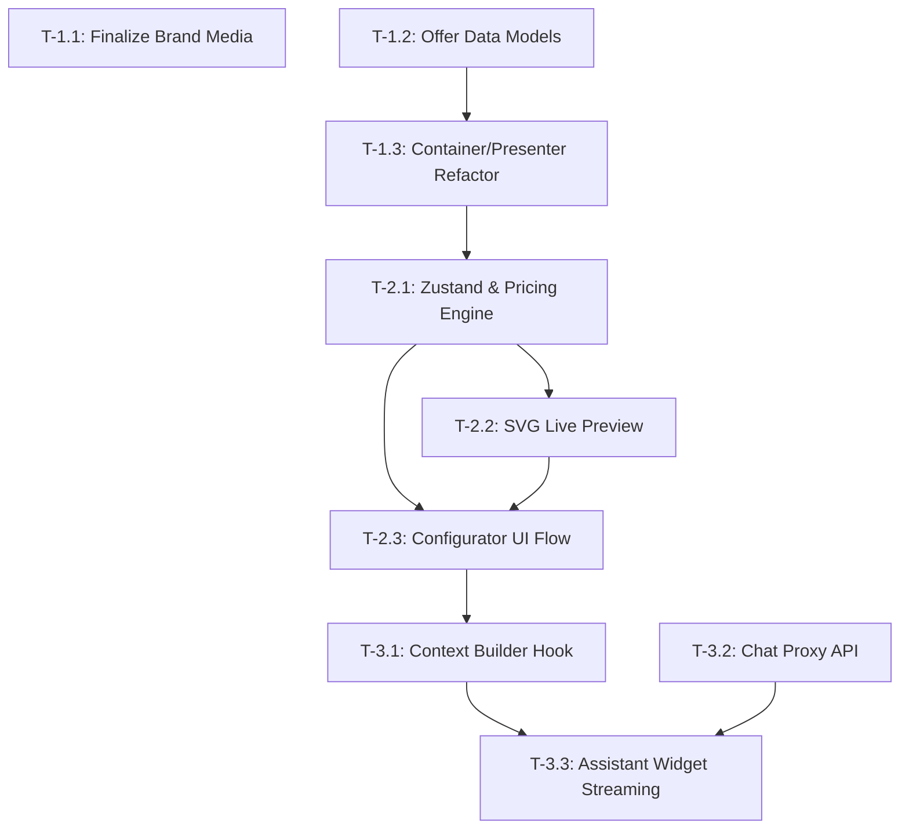

# Task Blueprint (WBS)

**Project**: Expoint ADV
**Version**: 1.0.0
**Status**: DRAFT

---

## 1. Phase Overview

The project is broken down into 3 primary execution phases:
1. **Phase 1: Architecture Core (Brand & Offer)** - Finalizing media assets and decoupling presentation from data to prepare for a Headless CMS.
2. **Phase 2: Conversion Engine (Calculator)** - Building the proactive B2B sales tool with a dynamic pricing engine and live SVG preview.
3. **Phase 3: AI-Ready Layer** - Implementing context-aware chat interfaces and server-side orchestration proxy.

---

## 2. Dependency Graph

---

## 3. Detailed Task List (WBS)

### Phase 1: Architecture Core (Brand & Offer)

- [x] **[T-1.1] Finalize Brand Media (Audit F-001)**
  - **Goal**: Inject high-fidelity horizontal video assets (Stitch project) into the `Hero` component to solidify the premium industrial aesthetic.
  - **Input**: `brand-layer.md`, Audit Report.
  - **Output**: Updated `src/components/sections/Hero.tsx`.
  - **Verification**: Video loops smoothly on mount without layout shifts.
  - **Dependencies**: None.

- [x] **[T-1.2] Offer Data Models**
  - **Goal**: Create static TypeScript files simulating a Headless CMS response for services and portfolios.
  - **Input**: `offer-layer.md`.
  - **Output**: `src/data/services.ts`, `src/data/portfolio.ts`.
  - **Verification**: Types compile successfully.
  - **Dependencies**: None.

- [x] **[T-1.3] Container/Presenter Refactor (Audit F-002)**
  - **Goal**: Refactor `src/components/sections/` to consume data from the static models rather than hardcoding content.
  - **Input**: `offer-layer.md`.
  - **Output**: `ServicesList.tsx` (Container) and `ServiceCard.tsx` (Presenter).
  - **Verification**: UI renders identical to previous state but driven by data models.
  - **Dependencies**: [T-1.2].

### Phase 2: Conversion Engine (Calculator)

- [x] **[T-2.1] Zustand State & Pricing Engine**
  - **Goal**: Implement the state manager for the configurator and the decoupled math logic for pricing.
  - **Input**: `conversion-layer.md`.
  - **Output**: `src/store/useSignProject.ts`, `src/lib/pricingEngine.ts`.
  - **Verification**: `npm run test` (if applicable) or manual console validation of price calculations.
  - **Dependencies**: [T-1.3].

- [x] **[T-2.2] SVG Live Preview Component (Audit F-003)**
  - **Goal**: Build a dynamic 2D visualizer for channel letters (handling text, font, glow colors).
  - **Input**: `conversion-layer.md`.
  - **Output**: `src/components/conversion/LivePreview.tsx`.
  - **Verification**: Changing text or color props dynamically updates the SVG without re-mounting.
  - **Dependencies**: [T-2.1].

- [x] **[T-2.3] Configurator UI Flow**
  - **Goal**: Overhaul `Calculator.tsx` into a multi-step, automotive-style configuration flow.
  - **Input**: `conversion-layer.md`.
  - **Output**: `src/components/conversion/Calculator.tsx`.
  - **Verification**: User can step through text -> type -> size -> install, view price ranges, and submit the lead form.
  - **Dependencies**: [T-2.1], [T-2.2].

### Phase 3: AI-Ready Layer

- [x] **[T-3.1] Context Builder Hook**
  - **Goal**: Write a custom hook that aggregates the current URL, user segment, and Zustand configurator state into a prompt context string.
  - **Input**: `ai-ready-layer.md`.
  - **Output**: `src/hooks/useAssistantContext.ts`.
  - **Verification**: `console.log` accurately reflects state changes when a user types in the calculator.
  - **Dependencies**: [T-2.3].

- [x] **[T-3.2] Chat Proxy API Route**
  - **Goal**: Setup Next.js/Vite API proxy to handle chat completions, securely injecting the System Prompt.
  - **Input**: `ai-ready-layer.md`.
  - **Output**: `src/api/chat/route.ts` (or equivalent backend entry).
  - **Verification**: Route returns a Server-Sent Events (SSE) stream.
  - **Dependencies**: None.

- [x] **[T-3.3] Assistant Widget Integration**
  - **Goal**: Integrate Vercel AI SDK (`useChat`) into the UI widget, passing the constructed context upon initialization.
  - **Input**: `ai-ready-layer.md`.
  - **Output**: `src/components/ai/AssistantWidget.tsx`.
  - **Verification**: Chat bubbles stream in character-by-character.
  - **Dependencies**: [T-3.1], [T-3.2].

---

## 4. Execution Strategy

- **Phase 1** can be executed rapidly as the foundation is already partially laid out.
- **Phase 2** contains the highest complexity (Pricing Engine and SVG Preview). Recommend tackling the Pricing Engine purely as TypeScript logic first, testing it heavily, before connecting it to the UI.
- **Phase 3** is highly decoupled and can be built after the conversion pipeline is verified.
