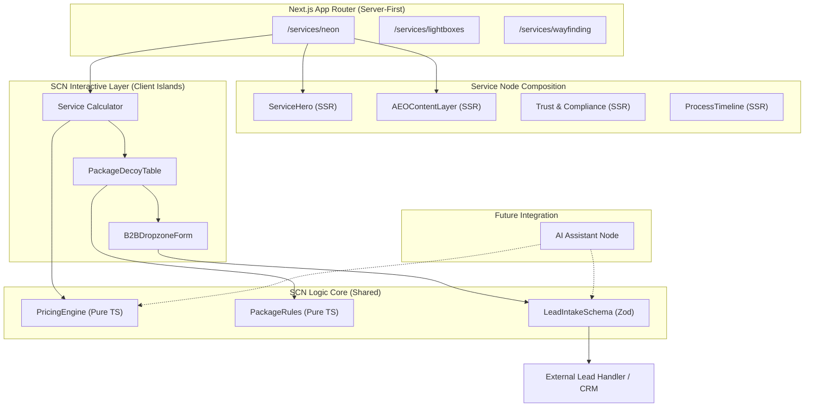

# Architecture Overview — Genesis v10: Premium Internal Service Pages

## 1. System Decomposition

Genesis v10 расширяет существующий **LPG — Landing Page Generator** из генератора маркетинговых страниц в модульную систему **service-commerce страниц**, где каждая внутренняя страница услуги работает не как статический каталог, а как самостоятельный B2B sales node: объясняет ценность, снимает возражения, рассчитывает ориентировочную стоимость, собирает технические вводные и передает лид в дальнейший pipeline продаж.

Ключевое изменение v10: страницы услуг получают отдельный слой интерактивной коммерческой логики — **SCN — Service Commerce Nodes**. SCN не заменяет LPG, а расширяет его через новые компоненты, pricing algorithms, capture forms, AEO-блоки, compliance-блоки и service-specific UI-модули.

---

## 2. Core System Role

### System 6: Service Commerce Nodes — SCN

**Status**: NEW
**System Type**: Extension Layer over LPG
**Primary Scope**: Internal service pages
**Root Domain**: `src/app/(marketing)/services/`

### Responsibility

SCN отвечает за:
* управление интерактивными калькуляторами на страницах услуг;
* трансляцию сложных B2B-ценностей через понятный UI;
* предварительную квалификацию лида через параметры проекта;
* формирование ценового якоря и decoy-пакетов;
* сбор файлов ТЗ, PDF, DWG, эскизов, брендбуков и фото фасада;
* передачу structured lead data в CRM / form handler / future AI assistant;
* поддержку AEO/SEO-блоков с answer-ready контентом;
* снижение тревоги клиента через legal, монтажные и гарантийные блоки.

### Source Roots
```text
src/app/(marketing)/services/
src/components/calculator/
src/components/service/
src/components/ui/
src/data/pricing/
src/lib/pricing/
src/lib/lead-intake/
```

### Boundaries
| Layer | Responsibility | Rendering Mode |
| --- | --- | --- |
| **Service Pages** | SEO, page composition, metadata, structured content | Server Components |
| **Calculators** | Interactive price estimation, package comparison, client-side state | Client Components |
| **Forms** | Lead capture, file upload, project qualification | Client Components |
| **Pricing Core** | Deterministic formulas, coefficients, validation | Pure TypeScript modules |
| **Content Blocks** | AEO, legal, materials, process, guarantees | Server Components where possible |
| **Analytics Layer** | Event tracking, funnel telemetry, calculator usage | Client-side instrumentation |

---

## 3. SCN Subsystems

| Subsystem | Responsibility | Output |
| --- | --- | --- |
| `PricingEngine` | Расчет ориентировочной стоимости по параметрам услуги | `PricingEstimate` |
| `PackageEngine` | Формирование Start / Business / Premium пакетов | `PackageComparison` |
| `LeadCaptureEngine` | Сбор заявки, файлов и технических вводных | `LeadPayload` |
| `ServiceSectionRegistry` | Подключение service-specific секций | Render map |
| `AEOContentLayer` | Ответы на частые вопросы, сравнения, микроразметка | SEO/AEO blocks |
| `AnalyticsBridge` | Отслеживание взаимодействий с калькулятором и формами | Events |
| `ComplianceLayer` | Блоки 902-ПП, согласование, монтажные ограничения | Trust blocks |

---

## 4. Architecture Diagram



---

## 5. Rendering & State Strategy

### Server Components (Default)
Все страницы услуг рендерятся на сервере для максимального SEO-веса. Статический контент (тексты, FAQ, юридические справки) не требует JavaScript для отображения.

### Client Components (Islands)
Интерактивность не должна превращать всю страницу в Client Component. Интерактивные блоки подключаются точечно.
* **Calculator State**: Локальное состояние (React `useState` / `useReducer`).
* **Hydration Rule**: Калькулятор должен отображать «Skeleton» или «Static Preview» до завершения гидратации, чтобы избежать CLS (Cumulative Layout Shift).

---

## 6. Data Flow — Pricing Algorithms

### 6.1 Neon Pricing Logic (Advanced)

```typescript
export interface NeonPricingParams {
  size: 'S' | 'M' | 'L'; // 'S'=30cm/char, 'M'=50cm/char, 'L'=80cm/char
  textLength: number;
  fontType: 'Print' | 'Serif' | 'Script'; // K_font = 1.0 | 1.15 | 1.25
  isRGB: boolean; // K_color = 1.0 | 1.5
  backingType: 'None' | 'Acrylic' | 'Composite'; // K_backing = 0 | 0.4 | 0.55
  mounting: 'None' | 'Indoor' | 'Outdoor'; // Cost = 0 | 2500 | 5500
}

/**
 * Formula:
 * 1. BaseCost = 2000
 * 2. EffectiveLengthCm = textLength * SIZE_MULTIPLIER_CM[size]
 * 3. NeonCost = EffectiveLengthCm * 45 * FONT_COEFFICIENT[fontType] * COLOR_COEFFICIENT
 * 4. AssemblyCost = textLength * 187
 * 5. BackingCost = NeonCost * BACKING_COEFFICIENT[backingType]
 * 6. MountingCost = MOUNTING_COST[mounting]
 * 7. Total = max(Base + Neon + Assembly + Backing + Mounting, 9500)
 */
```

### 6.2 Lightbox Decoy Strategy

```typescript
export interface LightboxPricingParams {
  width: number;
  height: number;
  type: 'Standard' | 'Shape' | 'Composite' | 'Fabric';
  sides: 'One' | 'Two';
  mounting: 'None' | 'Wall' | 'Facade' | 'HighAltitude';
  urgency: 'Standard' | 'Fast' | 'Express';
}

/**
 * Decoy Strategy:
 * - Start: Entry point (RawCost)
 * - Business (Target): Recommended (RawCost + Premium LEDs + Mounting)
 * - Premium (Anchor): Full coverage (Business + Legal Check + Priority + Warranty)
 */
```

---

## 7. Lead Capture & Intake

### B2B Lead Payload (Zod)
```typescript
export interface ServiceLeadPayload {
  serviceType: 'neon' | 'lightbox' | 'wayfinding';
  sourcePage: string;
  calculatorParams?: Record<string, unknown>;
  pricingEstimate?: {
    total: number;
    packageId: string;
    confidence: 'low' | 'medium' | 'high';
  };
  projectContext: {
    objectType?: string;
    address?: string;
    hasDesignMockup?: boolean;
    needsMounting?: boolean;
    needsLegalCheck?: boolean;
  };
  files: Array<{ name: string; url: string; size: number }>;
  contact: { name: string; phone: string; company?: string };
}
```

### Routing Flow
`Calculator Interaction → Pricing Estimate → CTA / Upload TZ → B2BDropzoneForm → LeadPayload → CRM / Telegram / Email`

---

## 8. Verge 2024 Design Guidelines for SCN

Для поддержания премиального B2B-облика все компоненты SCN следуют правилам:
* **Atmospheric Lighting**: Использование `radial-gradient` и `blur` для создания свечения (glow-эффекты для неона).
* **Industrial Glassmorphism**: Карточки калькуляторов с `backdrop-blur-[12px]` и `border-white/10`.
* **Micro-interactions**: Плавная смена цены через `AnimatePresence` и `Layout Camera` в Framer Motion.
* **Typography**: Geist Display для заголовков, Geist Mono для цифр и параметров.

---

## 9. Shared Section Registry (v10)

| Section Type | Component | Purpose |
| --- | --- | --- |
| `service-hero` | `ServiceHero` | Первый экран с оффером и видео-фоном |
| `neon-calculator` | `NeonCalculator` | Интерактивный расчет неона |
| `lightbox-calculator` | `LightboxCalculator` | Калькулятор коробов с decoy-логикой |
| `material-slider` | `MaterialSlider` | Макро-просмотр материалов |
| `tech-comparison` | `TechComparison` | Сравнение технологий (SEO/AEO) |
| `package-decoy-table` | `PackageDecoyTable` | Выбор Start / Business / Premium |
| `legal-902-block` | `Legal902Block` | Блок согласования и рисков |
| `b2b-dropzone-form` | `B2BDropzoneForm` | Захват ТЗ и тяжелых файлов |

---

## 10. Service Page Composition (Blueprints)

### /services/neon
`ServiceHero → NeonCalculator → NeonUseCases → MaterialGrid → ProcessTimeline → MountingRiskBlock → Legal902Block → ServiceFAQ → B2BDropzoneForm`

### /services/lightboxes
`ServiceHero → LightboxCalculator → PackageDecoyTable → LightboxTypes → TechComparison → ProcessTimeline → Legal902Block → ServiceFAQ → B2BDropzoneForm`

---

## 11. Performance & Scalability

* **LCP Optimization**: Видео-фоны загружаются асинхронно или заменяются на статику на мобильных.
* **JS Bundle Control**: Калькуляторы загружаются через `next/dynamic` только при достижении viewport.
* **Scalability**: Добавление новой услуги требует только реализации `PricingEngine` и композиции в `page.tsx` из готовых SCN-блоков.

---

## 12. SEO / AEO Layer

Каждая страница генерирует:
* **Answer-Ready FAQ**: Ответы на интенты «сколько стоит», «сроки», «согласование».
* **JSON-LD Schema**: `Product` (диапазон цен) и `FAQPage`.
* **Commercial H1**: Заголовки с прямым коммерческим интентом.

---

## 13. Analytics Events

```typescript
export type ServicePageEvent =
  | 'calculator_estimate_generated'
  | 'package_selected'
  | 'file_upload_completed'
  | 'lead_form_submitted'
  | 'faq_interaction';
```
*Метрика успеха: Конверсия из Estimate в Lead Form Submit.*

---

## 14. Risks & Fail-Safe

| Risk | Mitigation |
| --- | --- |
| **Price Precision** | Всегда маркировать цену как «Ориентировочная» + сильный CTA на «Точный расчет». |
| **Mobile UX** | Адаптивные калькуляторы со стековой раскладкой. |
| **Logic Drift** | Вынос формул в изолированные `lib/pricing` модули для тестирования. |

---

## 15. Success Criteria (v10)

1. Добавлены 3 service pages: neon, lightboxes, wayfinding.
2. Каждая страница имеет уникальную SCN-структуру.
3. Калькуляторы работают через изолированный pricing engine.
4. Форма B2B-захвата принимает структурированные данные и файлы.
5. Основной SEO/AEO-контент доступен серверно.
6. Дизайн соответствует Verge 2024 (Industrial Luxury).
7. Архитектура готова к AI-ассистенту (structured context).
