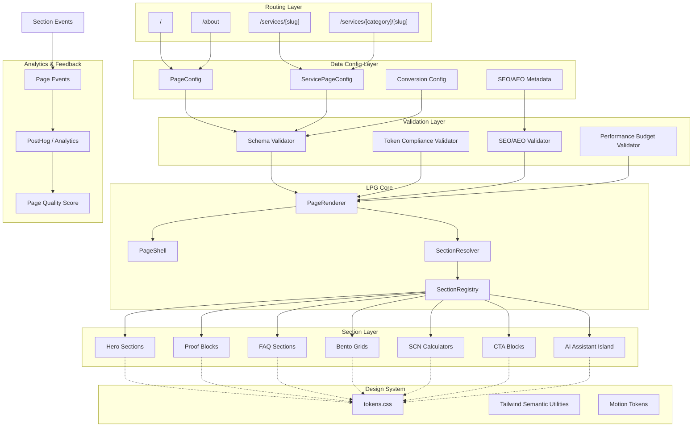

# LPG System Design — Landing Page Generator v10.1
## Expoint ADV Page Revenue Engine

**System ID**: `lpg`
**Version**: `10.1`
**Status**: Active / Production-Oriented
**Owner**: Expoint ADV Frontend Architecture
**Runtime**: Next.js App Router / React Server Components
**Primary Purpose**: Declarative generation of premium marketing, service and conversion pages.

---

## 1. Overview

**LPG (Landing Page Generator)** — центральная подсистема Expoint ADV для декларативной генерации маркетинговых, сервисных и conversion-first страниц.

Начиная с v10.1, LPG рассматривается не как простой UI-генератор, а как **Page Revenue Engine**: типизированный, расширяемый и управляемый слой, который превращает конфигурационные данные в премиальные B2B-страницы, совместимые с главной страницей, дизайн-системой Geist/Verge 2024, SEO/AEO-требованиями, интерактивными SCN-модулями и будущим AI-ассистентом.

Главный принцип:

> Любая страница Expoint ADV должна собираться через единый декларативный pipeline:
> `PageConfig → Validation → PageRenderer → PageShell → SectionRegistry → Tokenized Components → Analytics & Quality Gates`.

LPG обязан обеспечивать:

- визуальную консистентность;
- строгую типизацию;
- SEO/AEO-готовность;
- масштабируемость под новые услуги;
- безопасное подключение интерактивных модулей;
- контроль производительности;
- устойчивую архитектуру без ручного дублирования layout-кода.

---

## 2. System Role

### 2.1 Primary Role

LPG отвечает за генерацию страниц на основе декларативных TypeScript-конфигураций и рендерит их через контролируемый набор зарегистрированных секций.

### 2.2 Strategic Role

LPG является системным мостом между:

- дизайн-системой;
- контентной архитектурой;
- SEO/AEO;
- B2B conversion logic;
- интерактивными калькуляторами;
- будущим AI-ассистентом;
- аналитикой поведения пользователей.

### 2.3 System Boundary

LPG не владеет бизнес-логикой калькуляторов, CRM, lead scoring или AI-чатом, но предоставляет им безопасные точки интеграции через секции, props-контракты и event interfaces.

---

## 3. Goals & Non-Goals

### 3.1 Goals

#### G1 — Declarative Page Composition

Все страницы описываются через строго типизированные конфигурации:

```ts
PageConfig → SectionConfig[] → SectionRegistry → PageRenderer
```

#### G2 — Absolute Token Enforcement

Каждый визуальный элемент обязан использовать глобальные дизайн-токены из `tokens.css`.

Запрещены:

- hardcoded hex;
- произвольные `px`;
- локальные цветовые схемы;
- одноразовые spacing-значения;
- секции, визуально выпадающие из главной страницы.

#### G3 — Main Page Visual Inheritance

Все сервисные страницы наследуют визуальную ДНК главной:

- premium glassmorphism;
- atmospheric mesh/light;
- строгая типографика Geist;
- инженерная сетка;
- clean B2B luxury;
- restrained motion;
- expensive white/black/green visual system.

#### G4 — Extensibility Without Core Mutation

Новые секции, калькуляторы, lead forms, FAQ-блоки, service modules и AI widgets подключаются через registry/protocol без изменения ядра LPG.

#### G5 — SEO/AEO/GEO Readiness

Каждая страница должна поддерживать:

- metadata;
- Open Graph;
- structured data;
- FAQ schema;
- service schema;
- breadcrumbs;
- semantic headings;
- локальные поисковые паттерны;
- AI-search friendly content blocks.

#### G6 — Performance by Default

| Metric         | Target         |
| -------------- | -------------: |
| LCP            | ≤ 2.5s         |
| CLS            | ≤ 0.05         |
| INP            | ≤ 200ms        |
| JS below fold  | lazy-loaded    |
| Critical CSS   | token-first    |
| Heavy sections | dynamic import |

#### G7 — Conversion Architecture

Каждая страница должна иметь conversion spine:

```
Trust → Relevance → Proof → Calculation → Objection Handling → CTA
```

### 3.2 Non-Goals

LPG не отвечает за:

- полноценную Headless CMS;
- сложное состояние калькуляторов;
- CRM-обработку лидов;
- хранение пользовательских данных;
- генерацию контента без approve;
- самостоятельное изменение production-страниц AI-агентом;
- бизнес-логику SCN-модулей.

---

## 4. Background & Context

До внедрения LPG страницы собирались вручную. Это приводило к:

- дублированию `Header`, `Footer`, `AssistantWidget`;
- расхождению отступов;
- разным стилям CTA;
- hardcoded цветам;
- визуальному конфликту с главной страницей;
- сложному обновлению сервисных страниц;
- отсутствию единого quality pipeline.

ADR-001 и ADR-002 закрепили переход к `PageShell` и `SectionRegistry`.

v10.1 расширяет эту модель и вводит:

- Section Contract;
- Page Validation Pipeline;
- Design Token Governance;
- SEO/AEO validation;
- Performance Budget Layer;
- Extension Protocol;
- AI-ready architecture.

---

## 5. Architecture

LPG следует паттерну:

> **Declarative, Registry-Based, Server-First Page Composition**



---

## 6. Core Components

### 6.1 PageConfig

`PageConfig` — декларативная схема страницы.

```ts
export interface PageConfig {
  slug: string;
  status: 'draft' | 'preview' | 'production' | 'deprecated';
  template: PageTemplate;
  meta: PageMetadata;
  seo?: SEOConfig;
  aeo?: AEOConfig;
  breadcrumbs?: BreadcrumbItem[];
  shell?: PageShellConfig;
  conversion?: ConversionConfig;
  sections: SectionConfig[];
  experiments?: ExperimentConfig[];
  quality?: PageQualityPolicy;
}
```

### 6.2 SectionConfig

`SectionConfig` — discriminated union, не `any`.

```ts
export type SectionConfig =
  | HeroSectionConfig
  | BentoSectionConfig
  | FAQSectionConfig
  | ProofSectionConfig
  | CTASectionConfig
  | CalculatorSectionConfig
  | AssistantSectionConfig;

export interface BaseSectionConfig<TType extends string, TProps> {
  id: string;
  type: TType;
  props: TProps;
  visibility?: SectionVisibility;
  analytics?: SectionAnalyticsConfig;
  performance?: SectionPerformancePolicy;
  priority?: SectionPriority;
}
```

### 6.3 SectionRegistry

`SectionRegistry` — контрактный реестр секций, не просто lookup-map.

```ts
export interface SectionRegistryItem<TProps = unknown> {
  type: string;
  component: React.ComponentType<TProps>;
  renderMode: 'server' | 'client' | 'island';
  loadingStrategy: 'eager' | 'lazy' | 'dynamic';
  foldPolicy: 'above-fold' | 'below-fold' | 'conditional';
  seoRole?: 'hero' | 'content' | 'faq' | 'proof' | 'cta' | 'calculator';
  allowedTemplates: PageTemplate[];
  requiredTokens: string[];
  maxJsKb?: number;
  schema: ZodSchema<TProps>;
  status: 'active' | 'experimental' | 'deprecated';
}

export const SECTION_REGISTRY = {
  serviceHero: {
    type: 'serviceHero',
    component: ServiceHero,
    renderMode: 'server',
    loadingStrategy: 'eager',
    foldPolicy: 'above-fold',
    seoRole: 'hero',
    allowedTemplates: ['service', 'landing'],
    requiredTokens: ['bg-background', 'text-on-surface', 'text-on-surface-variant', 'border-outline'],
    schema: ServiceHeroSchema,
    status: 'active'
  },
  neonCalculator: {
    type: 'neonCalculator',
    component: dynamic(() => import('@/components/calculator/NeonCalculator')),
    renderMode: 'island',
    loadingStrategy: 'dynamic',
    foldPolicy: 'below-fold',
    seoRole: 'calculator',
    allowedTemplates: ['service'],
    maxJsKb: 90,
    requiredTokens: ['bg-surface', 'bg-accent', 'text-on-surface', 'border-outline'],
    schema: NeonCalculatorSchema,
    status: 'active'
  }
} satisfies Record<string, SectionRegistryItem>;
```

### 6.4 PageRenderer

```tsx
export function PageRenderer({ config }: { config: PageConfig }) {
  validatePageConfig(config);

  return (
    <PageShell {...config.shell} breadcrumbs={config.breadcrumbs}>
      {config.sections.map((section) => (
        <SectionResolver key={section.id} section={section} />
      ))}
    </PageShell>
  );
}
```

### 6.5 PageShell

```ts
export interface PageShellProps {
  children: React.ReactNode;
  headerVariant?: 'default' | 'immersive' | 'minimal';
  breadcrumbs?: BreadcrumbItem[];
  withMesh?: boolean;
  withAssistant?: boolean;
  withFooter?: boolean;
  pageTheme?: 'default' | 'service' | 'premium' | 'technical';
}
```

Обязанности: Header, Footer, breadcrumbs, атмосферный фон, assistant mount point, global CTA slot, scroll restoration, semantic landmarks, accessibility base.

---

## 7. Design System & Token Governance

### 7.1 Absolute Token Enforcement

Запрещено:

```tsx
<div className="bg-[#101010] text-[#fff] p-[37px]" />
```

Разрешено:

```tsx
<section className="bg-background text-on-surface px-6 py-section border-outline/30" />
```

### 7.2 Token Categories

```
tokens.css
├── color
│   ├── background
│   ├── surface
│   ├── accent
│   ├── outline
│   └── semantic states
├── typography
│   ├── display
│   ├── body
│   ├── label
│   └── numeric
├── spacing
│   ├── section
│   ├── card
│   ├── grid
│   └── stack
├── radius
├── shadow
├── blur
├── motion
└── z-index
```

### 7.3 Visual DNA

| Layer      | Rule                                                      |
| ---------- | --------------------------------------------------------- |
| Background | White/off-white base with atmospheric mesh                |
| Typography | Geist Display for H1-H3, Geist Sans for body              |
| Cards      | Glassmorphism, subtle border, soft depth                  |
| CTA        | High-contrast, premium, no noisy gradients                |
| Motion     | Restrained, purposeful, conversion-supportive             |
| Grid       | Engineering precision, strong alignment                   |
| Accent     | Engineering green / warm light accent only through tokens |

---

## 8. Service Page Composition Model

Каждая сервисная страница строится по conversion spine:

```
1. Hero
2. Pain / Risk Framing
3. Product / Service Explanation
4. Calculator or Estimate Block
5. Process / Workflow
6. Proof / Cases / Materials
7. Objection Handling
8. FAQ
9. Final CTA
```

Пример конфигурации:

```ts
export const flexibleNeonPage: PageConfig = {
  slug: 'gibkiy-neon',
  status: 'production',
  template: 'service',
  meta: {
    title: 'Гибкий неон на заказ в Москве',
    description: 'Проектирование, производство и монтаж гибкого неона под ключ.'
  },
  shell: {
    headerVariant: 'immersive',
    withMesh: true,
    withAssistant: true,
    pageTheme: 'service'
  },
  conversion: {
    primaryGoal: 'lead_submit',
    secondaryGoal: 'calculator_interaction',
    ctaLabel: 'Рассчитать стоимость'
  },
  sections: [
    {
      id: 'hero',
      type: 'serviceHero',
      props: {
        eyebrow: 'Гибкий неон под ключ',
        title: 'Неоновая вывеска, которая выглядит дорого и запускается без хаоса',
        subtitle: 'Замер, дизайн, производство, монтаж и гарантия для B2B-точек в Москве.',
        primaryCta: 'Рассчитать стоимость',
        secondaryCta: 'Посмотреть примеры'
      }
    },
    {
      id: 'calculator',
      type: 'neonCalculator',
      props: { mode: 'b2b', pricingModel: 'length_complexity_mounting', leadCapture: true },
      performance: { loadingStrategy: 'dynamic', maxJsKb: 90 }
    },
    {
      id: 'faq',
      type: 'faq',
      props: { schemaEnabled: true, items: [] }
    }
  ]
};
```

---

## 9. SCN Integration

SCN — Service Commerce Nodes — подключается к LPG как island-секции.

### 9.1 SCN Responsibilities

- калькуляторы;
- lead capture forms;
- интерактивные pricing modules;
- configurators;
- decoy pricing;
- user intent capture;
- event tracking.

### 9.2 LPG Responsibilities Toward SCN

LPG обязан:

- предоставить безопасный mount point;
- передать typed props;
- lazy-load SCN ниже fold-линии;
- не смешивать SCN state с базовой страницей;
- отправлять analytics events;
- иметь fallback, если SCN не загрузился.

### 9.3 SCN Fallback

```tsx
<CalculatorFallback
  title="Расчет временно недоступен"
  description="Оставьте заявку — менеджер рассчитает стоимость вручную."
  cta="Получить расчет"
/>
```

---

## 10. SEO / AEO / GEO Layer

### 10.1 SEO

- title, description, canonical, Open Graph, robots;
- semantic H1-H3, local keywords, service keywords, internal links.

### 10.2 AEO

Для AI-search и answer engines:

- краткие answer blocks;
- FAQ schema;
- service definitions;
- comparison blocks;
- process blocks;
- pricing explanation;
- objections and answers.

### 10.3 GEO

Локальный SEO: Москва, районы, B2B-кластеры, ТЦ/ритейл, horeca, аптеки, клиники, шоурумы, офисы, торговые галереи.

---

## 11. Analytics & Event Model

```ts
export type LPGEvent =
  | 'page_view'
  | 'section_view'
  | 'cta_click'
  | 'calculator_started'
  | 'calculator_completed'
  | 'lead_form_opened'
  | 'lead_form_submitted'
  | 'faq_opened'
  | 'assistant_opened';

export interface SectionAnalyticsConfig {
  trackView?: boolean;
  trackClicks?: boolean;
  conversionWeight?: number;
  funnelStage?: 'awareness' | 'consideration' | 'calculation' | 'decision';
}
```

---

## 12. Page Quality Scoring

```ts
export interface PageQualityScore {
  visualConsistency: number;
  tokenCompliance: number;
  seoCompleteness: number;
  conversionReadiness: number;
  performanceBudget: number;
  accessibility: number;
  schemaValidity: number;
}
```

Минимальные требования для production:

| Category             | Minimum Score |
| -------------------- | ------------: |
| Token Compliance     |           100 |
| Schema Validity      |           100 |
| SEO Completeness     |            90 |
| Conversion Readiness |            85 |
| Performance Budget   |            85 |
| Accessibility        |            90 |
| Visual Consistency   |            90 |

Если `tokenCompliance < 100`, merge запрещен.

---

## 13. Governance Rules

### 13.1 Section Registration Rules

Новая секция попадает в `SectionRegistry` только при наличии:

- typed props schema;
- token-only styling;
- Storybook story;
- visual regression baseline;
- SEO role;
- loading strategy;
- performance budget;
- fallback state;
- accessibility pass;
- owner.

### 13.2 Forbidden Patterns

- локально импортировать Header/Footer внутри страниц;
- использовать hardcoded colors;
- использовать inline style без approved reason;
- создавать service page вручную без `PageRenderer`;
- добавлять секцию без registry item;
- смешивать client state с server layout;
- подключать тяжелые animation libraries в above-fold server sections.

### 13.3 Merge Policy

```
1. Typecheck
2. ESLint
3. Token audit
4. Storybook build
5. Visual regression
6. Lighthouse check
7. SEO schema validation
8. PageQualityScore calculation
```

---

## 14. Extension System

### 14.1 Add New Section

```
1. Create component
2. Create props schema
3. Add Storybook story
4. Register in SectionRegistry
5. Add token compliance test
6. Add visual baseline
7. Add analytics config
8. Add usage example in page config
```

### 14.2 Add New Page Template

```
1. Define PageTemplate
2. Define allowed sections
3. Define shell variant
4. Define SEO requirements
5. Define conversion spine
6. Add test page
7. Add production quality gates
```

### 14.3 Add New SCN Module

```
1. Create SCN island component
2. Define business props
3. Define fallback
4. Add dynamic import
5. Define analytics events
6. Add performance budget
7. Add lead capture contract
8. Add integration tests
```

---

## 15. Performance Strategy

### 15.1 Loading Rules

| Section Type    | Strategy                     |
| --------------- | ---------------------------- |
| Hero            | eager / server               |
| SEO text        | server                       |
| FAQ             | server + small client island |
| Calculator      | dynamic island               |
| Map             | dynamic island               |
| Assistant       | delayed island               |
| Heavy animation | below fold only              |

### 15.2 Bundle Rules

- Above-fold sections не должны тянуть GSAP.
- Framer Motion разрешен только в client islands.
- Yandex Maps загружается только после interaction или viewport entry.
- Calculator chunks должны быть изолированы.
- Assistant не должен блокировать LCP.

---

## 16. Security Considerations

### 16.1 Риски

- dangerous SVG;
- rich text;
- third-party embeds;
- map widgets;
- assistant iframe/widget.

### 16.2 Required Controls

- CSP через Next.js middleware;
- SVG sanitization;
- запрет raw HTML без sanitize;
- trusted media domains;
- no inline scripts;
- typed external embed policy.

### 16.3 SCN Security

- input validation;
- rate limiting на backend;
- spam protection;
- consent checkbox;
- no sensitive data in analytics events.

---

## 17. Testing Strategy

### 17.1 Static Tests

- TypeScript strict mode;
- Zod schema validation;
- ESLint;
- Tailwind token linting;
- dependency boundary checks.

### 17.2 Visual Tests

- Storybook stories;
- Chromatic visual regression;
- screenshot comparison for service pages;
- dark/light theme variant checks.

### 17.3 SEO Tests

- metadata completeness;
- heading hierarchy;
- structured data validation;
- FAQ schema validation;
- canonical check;
- internal linking check.

### 17.4 Performance Tests

- Lighthouse CI;
- bundle analyzer;
- Core Web Vitals budget;
- dynamic import check;
- above-fold JS budget.

---

## 18. Failure Modes & Fallbacks

| Failure                 | Risk          | Fallback                                                              |
| ----------------------- | ------------- | --------------------------------------------------------------------- |
| Unknown section type    | Page crash    | Render `UnknownSectionFallback` in preview, fail build in production  |
| Calculator load failure | Lost lead     | Static CTA fallback                                                   |
| Token violation         | Visual drift  | Block merge                                                           |
| Heavy JS bundle         | Slow page     | Force dynamic import                                                  |
| Bad config              | Runtime error | Schema validation before render                                       |
| Missing SEO metadata    | Weak indexing | Build warning or fail depending on page type                          |
| Assistant unavailable   | No AI help    | Hide widget and preserve CTA                                          |
| Broken external media   | Empty block   | Placeholder + log event                                               |

Главный fail-safe принцип:

> LPG должен ломаться на этапе сборки, а не на стороне пользователя.

---

## 19. File Structure

```
src/
├── app/
│   ├── (marketing)/
│   │   ├── page.tsx
│   │   └── services/
│   │       └── [slug]/
│   │           └── page.tsx
├── components/
│   ├── page-shell/
│   │   └── PageShell.tsx
│   ├── sections/
│   │   ├── hero/
│   │   ├── faq/
│   │   ├── proof/
│   │   ├── cta/
│   │   └── bento/
│   ├── calculator/
│   └── assistant/
├── lpg/
│   ├── PageRenderer.tsx
│   ├── SectionResolver.tsx
│   ├── SectionRegistry.ts
│   ├── schemas.ts
│   ├── validators/
│   │   ├── validatePageConfig.ts
│   │   ├── validateTokens.ts
│   │   ├── validateSEO.ts
│   │   └── validatePerformance.ts
│   └── scoring/
│       └── calculatePageQualityScore.ts
├── data/
│   ├── pages/
│   ├── services/
│   └── seo/
├── styles/
│   └── tokens.css
└── tests/
    ├── lpg/
    ├── visual/
    ├── seo/
    └── performance/
```

---

## 20. Technology Stack

| Layer             | Technology                                  |
| ----------------- | ------------------------------------------- |
| Framework         | Next.js App Router                          |
| Rendering         | React Server Components                     |
| Styling           | Tailwind CSS + `tokens.css`                 |
| Type Safety       | TypeScript strict mode                      |
| Schema Validation | Zod                                         |
| Motion            | Framer Motion / GSAP only in client islands |
| Visual Regression | Storybook / Chromatic                       |
| Performance       | Lighthouse CI / Bundle Analyzer             |
| Analytics         | PostHog / Yandex Metrica / GA4              |
| Data Source       | TypeScript configs                          |

---

## 21. Trade-Offs & Alternatives

### 21.1 Headless CMS vs TypeScript Configs

Выбран вариант TypeScript Configs.

Причины: высокий уровень кастомного UI, строгая типизация, SCN-калькуляторы сложно моделировать в CMS, быстрый CI/CD, меньше runtime-зависимостей, контроль качества через code review.

Trade-off: тексты меняются через commit. Решение на будущее: lightweight content editor или AI-assisted config generator с human approve.

### 21.2 Server Components vs Client Components

Server: SEO, fast paint, стабильность, меньше JS.
Client islands: калькуляторы, accordions, assistant, maps, advanced motion.

### 21.3 Registry vs Manual Imports

Registry выбран потому, что: централизует контроль, позволяет валидировать секции, упрощает расширение, снижает хаос, дает основу для AI-generation.

---

## 22. Agent & Orchestration Layer

```mermaid
graph LR
    Discovery["Discovery Agent"]
    Architect["Page Architect"]
    Copy["B2B Copy Agent"]
    Design["Design System Guardian"]
    SEO["SEO/AEO Agent"]
    Perf["Performance Auditor"]
    QA["QA Validator"]
    Human["Human Approver"]

    Discovery --> Architect
    Architect --> Copy
    Copy --> Design
    Design --> SEO
    SEO --> Perf
    Perf --> QA
    QA --> Human
```



| Agent               | Responsibility                                |
| ------------------- | --------------------------------------------- |
| Discovery Agent     | Анализ услуги, ЦА, конкурентов, интентов      |
| Page Architect      | Сборка conversion spine и структуры секций    |
| Copy Agent          | Генерация B2B-контента                        |
| Design Guardian     | Проверка соответствия Geist/Verge и tokens    |
| SEO/AEO Agent       | Проверка metadata, schema, FAQ, answer blocks |
| Performance Auditor | Проверка веса секций и загрузки               |
| QA Validator        | Финальный audit перед merge                   |
| Human Approver      | Production approve                            |

---

## 23. Roadmap

### Phase 1 — Architecture Hardening
- Перевести `SectionConfig` на discriminated union.
- Добавить Zod-схемы.
- Расширить `SectionRegistry`.
- Создать `SectionResolver`.
- Ввести fail-fast для production.

### Phase 2 — Quality Gates
- PageQualityScore.
- Lighthouse CI.
- Visual regression.
- SEO validation.
- Build blocking при token violations.

### Phase 3 — Service Page Expansion
- Гибкий неон, световые короба, объемные буквы, архитектурная навигация, монтаж/демонтаж, согласование.

### Phase 4 — SCN Revenue Layer
- Калькуляторы, decoy pricing, lead capture, service package selection, analytics events.

### Phase 5 — AI-Ready LPG
- AI page config generator, prompt-driven section builder, human approve, pattern memory, automated page audit.

### Phase 6 — Programmatic SEO
- Service/location pages, local intent clusters, FAQ generation, schema expansion, internal linking graph.

---

## 24. Success Criteria

LPG считается успешным, если:

- 100% сервисных страниц собираются через `PageRenderer`;
- 0 hardcoded hex в зарегистрированных секциях;
- все новые секции проходят registry contract;
- все production-страницы имеют PageQualityScore ≥ 90;
- калькуляторы подключаются как isolated islands;
- главная и сервисные страницы визуально едины;
- LCP остается ≤ 2.5s;
- новые сервисные страницы можно собирать без изменения LPG core;
- SEO/AEO metadata генерируются системно;
- analytics events фиксируют ключевые conversion actions.

---

## 25. Final Architecture Principle

LPG — это управляемая система генерации премиальных B2B-страниц, где каждая секция:

- типизирована;
- зарегистрирована;
- валидирована;
- токенизирована;
- оптимизирована;
- измеряема;
- расширяема;
- готова к будущей AI-оркестрации.

> Если секция не может быть описана, проверена, измерена и переиспользована — она не должна попадать в LPG.
