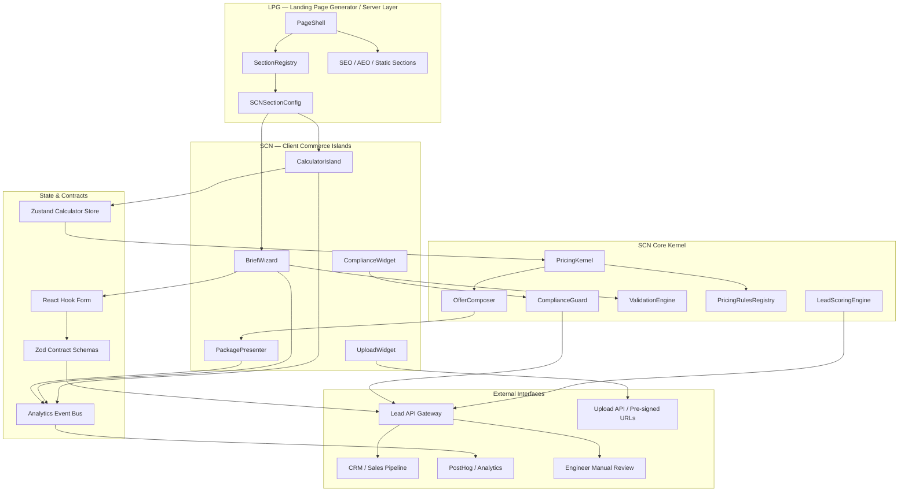

# System Design: Service Commerce Nodes (SCN)

**Version**: 10.2
**Date**: 2026-05-16
**Status**: Production Architecture Candidate
**System ID**: `service-commerce-nodes`
**Parent System**: `landing-page-generator` / LPG
**Related PRDs**: REQ-102, REQ-203, REQ-305
**Primary Domain**: Premium B2B service pages for signage, neon, lightboxes, 3D letters, wayfinding, facade advertising

---

## 1. Overview

**Service Commerce Nodes (SCN)** is the interactive commercial intelligence layer embedded into the **Landing Page Generator (LPG)** platform.

LPG owns static SEO/AEO-optimized service page composition: Hero, FAQ, text blocks, cases, trust sections, and content-driven conversion.
SCN owns dynamic conversion systems: calculators, pricing scenarios, B2B brief forms, package selectors, lead scoring, compliance checks, and CRM-ready lead payloads.

SCN acts as the **B2B Pricing Trust-Machine** for premium signage products. It converts passive visitors into qualified leads by giving them controlled transparency: not a final price, but an engineered estimate, packaged into clear commercial scenarios.

SCN is designed around four core conversion principles:

1. **Reduce fear of hidden cost**
   Show transparent estimate ranges and explain what affects price.

2. **Anchor value before price**
   Present Start / Business / Premium packages with clear differences.

3. **Convert uncertainty into structured brief data**
   Ask only the next necessary question, not the whole brief at once.

4. **Protect business margin and compliance**
   Use guarded pricing rules, qualification scoring, 902-ПП checks, and final engineer validation.

---

## 2. System Role

SCN is not a standalone e-commerce module.

It is a **conversion and qualification subsystem** responsible for:

- dynamic estimate generation;
- package composition;
- user input normalization;
- progressive brief capture;
- compliance pre-checks;
- lead quality scoring;
- CRM payload preparation;
- analytics event emission;
- controlled integration into LPG pages.

SCN must never become:

- a full checkout system;
- a final commercial offer generator;
- a direct database mutation layer;
- a static content management system;
- an uncontrolled client-side business logic dump.

---

## 3. Goals & Non-Goals

### 3.1 Goals

#### G1. Lead Generation

Convert service page visitors into structured B2B leads through calculators, brief forms, file uploads, package selectors, and low-friction contact capture.

#### G2. Price Transparency & Anchoring

Generate three controlled pricing scenarios:

- **Start** — entry-level / minimum viable production;
- **Business** — recommended turnkey option;
- **Premium** — premium materials, warranty, compliance preparation, and higher service confidence.

#### G3. Isomorphic LPG Integration

Inject SCN modules into LPG using the **Isolated Islands Pattern**, preserving:

- SSR for SEO content;
- fast initial load;
- lazy hydration;
- graceful fallback;
- page-level design consistency.

#### G4. Manufacturing-Aware Pricing

Calculate preliminary estimates using product-specific formulas based on:

- dimensions;
- material class;
- font complexity;
- lighting type;
- installation complexity;
- urgency;
- compliance requirements;
- minimum order values;
- assembly coefficients.

#### G5. Compliance Risk Reduction

Integrate 902-ПП and 152-ФЗ compliance awareness into the flow:

- consent checkbox;
- personal data notice;
- signage approval hints;
- risk flags for facade / size / illumination / placement.

#### G6. Lead Qualification

Score leads before CRM delivery using commercial and operational signals:

- budget range;
- project size;
- urgency;
- file availability;
- mounting required;
- compliance risk;
- contact completeness;
- package selected.

#### G7. Observability & Self-Improvement

Emit analytics events for every major calculator and form interaction to support:

- conversion analysis;
- funnel optimization;
- pricing rule improvement;
- UX friction detection;
- sales prioritization.

### 3.2 Non-Goals

SCN does **not** own:

- direct payment processing;
- final contract generation;
- static content blocks;
- content SEO management;
- CRM database storage;
- engineering approval of final price;
- server-side file storage lifecycle beyond upload handoff;
- legal approval of signage projects.

---

## 4. Background & Context

Previous service pages relied on static price blocks, vague "price upon request" messaging, and generic contact forms. This created several B2B conversion problems:

- users feared hidden costs;
- premium products looked commoditized;
- no interactive reason existed to leave contact details;
- sales received low-context leads;
- pricing did not communicate value differences;
- compliance and mounting risks were not addressed early.

SCN solves this by turning pricing into a guided interaction.

Instead of asking the visitor to "send a request," SCN gives the visitor a useful estimate and then asks for missing project data needed to improve accuracy.

---

## 5. System Architecture

SCN is implemented as a set of isolated client-side islands inside LPG pages.



---

## 6. Architectural Layers

### 6.1 LPG Integration Layer

Responsible for rendering SCN blocks inside service pages.

Main responsibilities:

- accept declarative SCN configs;
- lazy-load islands;
- preserve SSR for static sections;
- provide fallback UI;
- inject theme tokens;
- prevent SCN from leaking into LPG content logic.

Recommended config contract:

```typescript
export type SCNProductType =
  | 'neon'
  | 'lightbox'
  | 'letters'
  | 'wayfinding'
  | 'facade-signage';

export type SCNContext =
  | 'b2b'
  | 'retail'
  | 'premium'
  | 'urgent';

export interface SCNSectionConfig {
  type: 'service-commerce-node';
  nodeId: string;
  productType: SCNProductType;
  context: SCNContext;
  calculatorVariant:
    | 'compact'
    | 'full'
    | 'wizard'
    | 'package-first'
    | 'brief-first';
  defaultPackage?: 'start' | 'business' | 'premium';
  initialParams?: Partial<PricingParams>;
  complianceMode?: 'disabled' | 'soft-check' | 'strict-check';
  leadCaptureMode?: 'inline' | 'modal' | 'stepper';
  uploadEnabled?: boolean;
  analyticsContext: {
    pageSlug: string;
    serviceSlug: string;
    sourceBlock: string;
  };
}
```

### 6.2 Client Island Layer

Contains interactive UI components.

Core islands:

| Island             | Responsibility                                                  |
| ------------------ | --------------------------------------------------------------- |
| `CalculatorIsland` | Collects dimensions, product type, materials, urgency, mounting |
| `PackagePresenter` | Displays Start / Business / Premium scenarios                   |
| `BriefWizard`      | Captures structured B2B brief data                              |
| `UploadWidget`     | Handles drawings, facade photos, logos, DWG/PDF/images          |
| `ComplianceWidget` | Shows legal/safety hints and risk warnings                      |
| `ContactCapture`   | Captures phone, Telegram, name, company                         |
| `SuccessState`     | Shows next steps and expectation management                     |

All islands must be:

- lazy-loaded;
- token-driven;
- accessible;
- analytics-aware;
- resilient to partial failure.

### 6.3 Pricing Kernel

The **PricingKernel** is a headless module containing deterministic pricing formulas.

Rules:

- no React dependencies;
- no DOM dependencies;
- pure functions only;
- unit-testable;
- versioned;
- deterministic;
- must return traceable calculation breakdown.

Example:

```typescript
export interface PricingInput {
  productType: SCNProductType;
  dimensions: {
    widthMm?: number;
    heightMm?: number;
    areaM2?: number;
  };
  text?: string;
  symbolCount?: number;
  material?: string;
  fontComplexity?: 'simple' | 'medium' | 'complex' | 'logo';
  lighting?: 'none' | 'front' | 'back' | 'rgb' | 'dynamic';
  urgency?: 'standard' | 'fast' | 'urgent';
  mountingRequired?: boolean;
  complianceRequired?: boolean;
  region?: 'moscow' | 'mo' | 'other';
}

export interface PricingBreakdownItem {
  code: string;
  label: string;
  value: number;
  unit?: string;
  formula?: string;
}

export interface PricingResult {
  ruleVersion: string;
  currency: 'RUB';
  basePrice: number;
  minOrderApplied: boolean;
  confidence: 'low' | 'medium' | 'high';
  breakdown: PricingBreakdownItem[];
  warnings: string[];
}
```

### 6.4 Pricing Rules Registry

Pricing rules must be externalized from UI code.

Recommended structure:

```text
src/features/scn/
  model/
    pricing/
      rules/
        neon.v10.2.ts
        lightbox.v10.2.ts
        letters.v10.2.ts
        wayfinding.v10.2.ts
      registry.ts
      pricing-kernel.ts
      pricing-types.ts
```

Each rule file must contain:

- formula;
- coefficients;
- minimum order value;
- validation limits;
- margin protection;
- confidence rules;
- warning rules;
- test fixtures.

Example:

```typescript
export interface PricingRuleSet {
  productType: SCNProductType;
  version: string;
  effectiveFrom: string;
  minOrderRub: number;
  coefficients: Record<string, number>;
  calculate: (input: PricingInput) => PricingResult;
  validateInput: (input: PricingInput) => PricingValidationResult;
}
```

### 6.5 Offer Composer

The **OfferComposer** converts a base estimate into commercially meaningful packages.

It must not simply multiply price by fixed percentages.

It should use:

- base price;
- minimum margin;
- product type;
- operational complexity;
- mounting requirement;
- urgency;
- compliance requirements;
- warranty tier;
- material tier.

Package logic:

```typescript
export interface OfferPackage {
  id: 'start' | 'business' | 'premium';
  title: string;
  priceFrom: number;
  priceTo?: number;
  isRecommended: boolean;
  marginClass: 'low' | 'normal' | 'high';
  included: string[];
  excluded: string[];
  riskNotes: string[];
  ctaLabel: string;
}
```

### 6.6 Lead Capture Engine

The **LeadCaptureEngine** collects structured B2B data using progressive disclosure.

Flow:

```text
Step 1 — Product intent
Step 2 — Dimensions / text / material / usage
Step 3 — Mounting / urgency / region
Step 4 — Upload files
Step 5 — Contact capture
Step 6 — Consent / compliance
Step 7 — Submit / success state
```

Rules:

- never ask for all data at once;
- preserve partial state;
- allow skipping non-critical fields;
- show estimate before asking for contact when possible;
- request contact only after value has been created;
- store calculation trace in payload.

### 6.7 Lead Scoring Engine

SCN must score leads before sending to CRM.

```typescript
export interface LeadScore {
  total: number;
  grade: 'cold' | 'warm' | 'hot' | 'priority';
  reasons: string[];
  salesPriority: 'low' | 'normal' | 'high' | 'urgent';
}
```

Suggested scoring:

| Signal                            | Weight |
| --------------------------------- | -----: |
| Selected Business/Premium package |    +15 |
| Mounting required                 |    +10 |
| Uploaded facade/photo/logo        |    +15 |
| Urgency fast/urgent               |    +15 |
| Price above threshold             |    +15 |
| Complete contact data             |    +10 |
| Compliance required               |     +5 |
| B2B context/company field filled  |    +10 |
| Low confidence estimate           |     -5 |
| Missing dimensions                |    -10 |

### 6.8 Compliance Guard

Compliance Guard is responsible for legal and regulatory risk hints.

It must check:

- personal data consent;
- 152-ФЗ checkbox;
- basic signage approval hints;
- 902-ПП risk flags;
- facade mounting risks;
- illuminated signage risk;
- large-format signage risk;
- city/region-specific disclaimers.

Compliance Guard does not provide legal approval.
It provides **risk classification** and routes high-risk leads for manual review.

```typescript
export interface ComplianceRisk {
  level: 'none' | 'low' | 'medium' | 'high';
  flags: string[];
  userMessage: string;
  requiresEngineerReview: boolean;
}
```

### 6.9 Upload Architecture

SCN must not submit raw `File[]` directly to CRM.

Correct upload flow:

```text
1. Client selects file
2. Client validates size/type
3. Client requests upload session
4. Server returns pre-signed URL
5. Client uploads file to storage
6. Server scans / validates file
7. Client receives attachment reference
8. Lead payload includes attachment IDs, not raw files
```

Allowed file types:

- PDF;
- DWG;
- DXF;
- PNG;
- JPG/JPEG;
- WebP;
- SVG, if sanitized;
- ZIP only if explicitly enabled and scanned.

File constraints:

- max file size: 100MB;
- max files per lead: configurable;
- executable extensions blocked;
- MIME type and extension must both be checked;
- server-side virus scan required;
- SVG sanitization required;
- upload sessions must expire.

---

## 7. State Management

### 7.1 Zustand Store

Used for calculator state and package preview.

```typescript
interface CalculatorStore {
  params: PricingInput;
  result?: PricingResult;
  packages?: OfferPackage[];
  complianceRisk?: ComplianceRisk;
  leadScore?: LeadScore;

  updateParam: <K extends keyof PricingInput>(
    key: K,
    value: PricingInput[K]
  ) => void;

  calculate: () => void;
  composeOffers: () => void;
  reset: () => void;
}
```

Rules:

- use selector-based subscriptions;
- avoid storing derived values if they can be recomputed cheaply;
- debounce high-frequency inputs;
- isolate calculator state from form state.

### 7.2 React Hook Form

Used for contact and brief capture.

Rules:

- all forms validated by Zod;
- form schema version must be included in payload;
- partial progress can be preserved in session storage if allowed;
- consent fields must not be pre-checked.

---

## 8. Data Contracts

### 8.1 Lead Payload

```typescript
export interface ServiceLeadPayload {
  schemaVersion: '10.2';
  source: {
    pageSlug: string;
    serviceSlug: string;
    nodeId: string;
    productType: SCNProductType;
    calculatorVariant: string;
  };
  customer: {
    name?: string;
    company?: string;
    contact: string;
    contactType: 'phone' | 'telegram' | 'whatsapp' | 'email';
  };
  projectData: {
    pricingInput: PricingInput;
    pricingResult: PricingResult;
    selectedPackage?: OfferPackage;
    complianceRisk?: ComplianceRisk;
    leadScore?: LeadScore;
  };
  attachments: Array<{
    attachmentId: string;
    filename: string;
    mimeType: string;
    sizeBytes: number;
    scanStatus: 'pending' | 'clean' | 'blocked';
  }>;
  consent: {
    personalDataAccepted: boolean;
    marketingAccepted?: boolean;
    acceptedAt: string;
  };
  analytics: {
    sessionId?: string;
    visitorId?: string;
    events?: string[];
  };
}
```

### 8.2 CRM Handoff Contract

CRM should receive a normalized payload with:

- lead title;
- selected package;
- estimated price range;
- lead score;
- urgency;
- compliance risk;
- uploaded files;
- calculation breakdown;
- recommended next action.

---

## 9. Pricing Algorithms

### 9.1 Flexible Neon Formula

```text
Total =
  Base_Kit
  + (L_neon * C_neon * K_font * K_color)
  + Assembly
  + Backing
  + Mounting
```

Rules:

- apply minimum order value;
- increase coefficient for complex logos;
- increase coefficient for RGB/dynamic light;
- add backing based on acrylic/metal/frame;
- confidence is lower when actual line length is estimated from text only.

Minimum order: `9,500 RUB`

### 9.2 Lightbox Formula

```text
Total =
  ((Area_m2 * BaseRate_m2) * K_Type * K_Sides)
  * UrgencyFactor
  + Mounting
  + Power
```

### 9.3 3D Letters Formula

```text
Total =
  (SymbolCount * Height_cm * BaseRate_cm * K_font)
  * UrgencyFactor
  + PowerUnit
  + Mounting
```

### 9.4 Wayfinding Formula

```text
Total =
  Base_Project
  + (NodeCount * NodeRate * K_Material)
  + DesignSystem
  + Mounting
  + Documentation
```

---

## 10. Decoy & Package Strategy

Simple static percentages are replaced by margin-aware package generation.

Generation must consider:

- margin floor;
- product-specific minimum order;
- installation complexity;
- warranty cost;
- compliance workload;
- material tier;
- urgency;
- operational capacity.

---

## 11. Analytics & Event Model

Core events:

```text
scn_viewed
scn_calculator_started
scn_param_changed
scn_price_revealed
scn_package_viewed
scn_package_selected
scn_brief_started
scn_file_uploaded
scn_compliance_warning_shown
scn_contact_started
scn_lead_submitted
scn_lead_failed
```

Event context should include:

- `nodeId`
- `productType`
- `pageSlug`
- `serviceSlug`
- selected package
- estimate range
- step index
- device type
- timestamp

---

## 12. Performance Requirements

- SCN islands must be dynamically imported via `next/dynamic`.
- Static LPG content must render without SCN hydration.
- Calculator fallback must display if JS is disabled or island fails.
- input/slider updates should feel instant.
- expensive calculations must be debounced.
- avoid unnecessary full-tree re-renders.

---

## 13. Security Requirements

- Zod validation on client and server-side validation mandatory.
- Rate limiting + bot protection + honeypot + idempotency key.
- no direct CRM mutation from browser.
- extension allowlist + MIME validation + signed URLs + scanning.
- explicit 152-ФЗ consent, no pre-checked boxes.

---

## 14. Reliability & Fail-Safe

| Failure | Fallback |
| --- | --- |
| Calculator JS fails | Static price range + CTA |
| PricingKernel throws | "Estimate unavailable" + brief form |
| Upload fails | Submit without file |
| CRM API fails | Queue/retry on server |
| Analytics fails | Do not block user flow |
| Compliance check unavailable | Soft warning + manual review flag |

Error boundary pattern:

```text
SCNErrorBoundary
  -> fallback calculator card
  -> contact CTA
  -> event: scn_error_boundary_triggered
```

---

## 15. Testing Strategy

Unit tests:
- pricing formulas;
- minimum order logic;
- package composition;
- lead scoring;
- compliance risk classification.

Contract tests:
- `SCNSectionConfig`;
- `PricingInput` / `PricingResult`;
- `OfferPackage`;
- `ServiceLeadPayload`.

Component tests:
- slider updates;
- package re-render;
- contact validation;
- consent validation;
- upload states;
- error boundary fallback.

E2E:
- page -> price reveal -> package select -> upload -> consent -> submit.

Regression:
- formula snapshots;
- package regression;
- payload schema tests;
- margin floor tests.

---

## 16. Governance

### 16.1 Pricing Rule Governance

Pricing changes require:
- version bump;
- changelog entry;
- fixture update;
- margin review;
- product/business approval.

### 16.2 Feature Flags

```typescript
export interface SCNFeatureFlags {
  enableUpload: boolean;
  enableComplianceGuard: boolean;
  enableLeadScoring: boolean;
  enablePremiumPackage: boolean;
  enableAnalytics: boolean;
  enableABTests: boolean;
}
```

### 16.3 Rollback

Rollback sequence:

```text
1. Disable feature flag
2. Revert SCN config in LPG
3. Restore previous pricing rule version
4. Preserve lead payload compatibility
5. Emit rollback event
```

---

## 17. Recommended Folder Structure

```text
src/
  features/
    scn/
      ui/
      model/
        pricing/
          rules/
        offers/
        lead-scoring/
        compliance/
        store/
        schemas/
      api/
      lib/
      tests/
```

---

## 18. Integration With LPG

LPG integrates SCN only through declarative section config (`type: 'service-commerce-node'`) and must remain backward-compatible with existing static sections.

---

## 19. Success Metrics

Business:
- calculator start rate;
- price reveal rate;
- lead submit rate;
- Business/Premium selection share;
- qualified lead share;
- file upload share.

Technical:
- pricing test coverage;
- schema coverage;
- SCN JS budget impact;
- interaction latency;
- API/upload failure rates;
- error boundary trigger rate.

UX:
- full step tracking;
- form completion time;
- visible consent errors;
- mobile usability;
- WCAG AA baseline.

---

## 20. Future Extension System

Extension workflow:
1. add product type;
2. add pricing rule;
3. add fixtures/tests;
4. add package mapping;
5. add SCN config;
6. add analytics labels;
7. add CRM mapping;
8. add E2E scenario.

---

## 21. AI / Agent Readiness

Potential modules:
- brief assistant;
- facade analyzer;
- compliance explainer;
- sales summary generator;
- pricing anomaly detector.

AI modules must not finalize prices without engineer review.

---

## 22. Final Principle

SCN converts uncertainty into trust:
- transparent estimate logic;
- clear package rationale;
- compliance-aware qualification;
- structured CRM handoff;
- measurable conversion loop.
