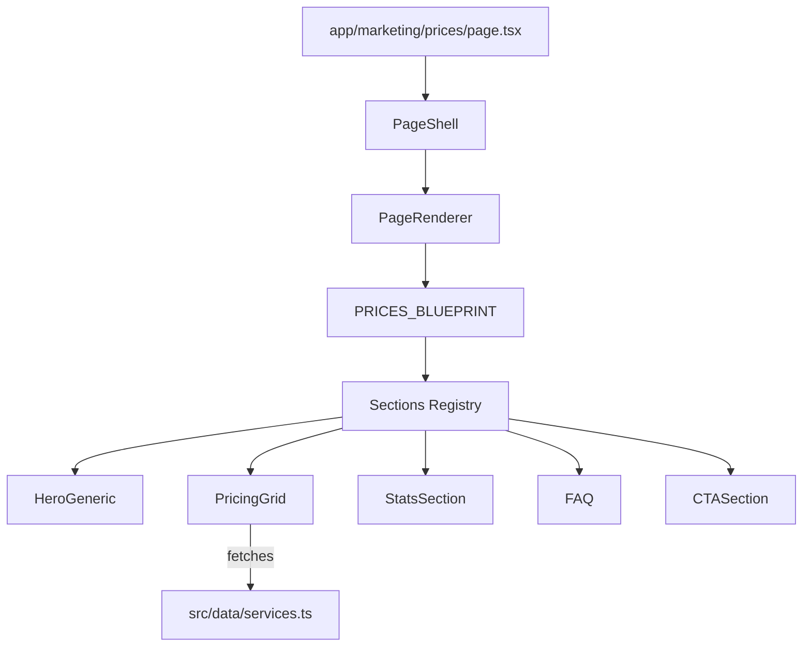

# System Design: Prices Page (`/prices`)

**Version**: 1.0  
**Status**: Draft  
**Owner**: PFC (Presentation Framework Core)  
**Related Requirements**: [REQ-001] to [REQ-006] from Genesis v7 PRD

---

## 1. Overview

Страница `/prices` является ключевым коммерческим хабом платформы. Она переводит пользователя из состояния «изучаю услуги» в состояние «оцениваю бюджет и готов к заказу». Страница строится на базе `Presentation Framework Core (PFC)`, используя декларативные секции.

---

## 2. Goals & Non-Goals

### Goals
- Прозрачное отображение цен на все ключевые услуги.
- Высокая конверсия в калькулятор (`/calculator`) и лид-форму.
- Соответствие премиальной инженерной эстетике Expoint ADV.
- 100% SEO-оптимизация и производительность (LCP < 2.5s).

### Non-Goals
- Прямая оплата на странице.
- Личный кабинет клиента.

---

## 3. Background & Context

Существующая страница цен реализована как жестко закодированный компонент. Это затрудняет управление контентом и нарушает единообразие с новыми страницами (About, Contacts), которые строятся через `PageShell`.

---

## 4. Architecture

Страница реализуется через паттерн **Blueprint-Based Rendering**.

### Diagram (Mermaid)



---

## 5. Interface Design

### Section Configuration (Blueprint)

```typescript
const PRICES_BLUEPRINT: PageBlueprint = {
  slug: '/prices',
  metadata: {
    title: 'Цены на наружную рекламу | Expoint ADV',
    description: 'Инженерный подход к ценообразованию...'
  },
  headerVariant: 'immersive',
  sections: [
    { 
      type: 'hero-generic', 
      props: { 
        kicker: 'Commercial Terms',
        title: 'Тарифы и Эффективность',
        subtitle: 'Прозрачное ценообразование на базе инженерных расчетов.'
      } 
    },
    { type: 'pricing', props: { compact: false } },
    { type: 'stats', props: { theme: 'dark' } },
    { type: 'faq', props: { category: 'pricing' } },
    { type: 'cta', props: { variant: 'primary' } }
  ]
}
```

---

## 6. Data Model

### Shared Data
- **SERVICES**: Основной источник цен (`basePrice`, `priceUnit`).
- **PRODUCT_PACKS**: Готовые пакетные решения (v7).

---

## 7. Technology Stack

- **Framework**: Next.js 15+ (App Router).
- **Styling**: Tailwind CSS (v4 compatible).
- **Animation**: Framer Motion (через MIC).
- **Data**: Static TypeScript modules.

---

## 8. Trade-offs & Alternatives

### Decision: Custom Component vs Shared Section
**Alternative**: Оставить кастомную верстку в `page.tsx`.  
**Chosen**: Использовать `SectionRegistry`.  
**Reason**: Позволяет переиспользовать блок `Pricing` на лендингах услуг (REQ-040) без дублирования кода.

---

## 9. Security Considerations

- **CSRF**: Форма в `CTASection` защищена middleware.
- **Data Integrity**: Цены хранятся в коде (статично), что исключает подмену через API.

---

## 10. Performance Considerations

- **SSG**: Страница рендерится на этапе сборки.
- **Image Optimization**: Использование `next/image` для всех визуалов.
- **Lazy Loading**: Секции подгружаются динамически через `dynamic` в реестре.

---

## 11. Testing Strategy

- **Visual Regression**: Проверка отображения сетки цен на разных экранах.
- **Link Integrity**: Проверка перехода на `/calculator?type=...` для всех карточек.
- **SEO Audit**: Проверка Schema.org разметки (JSON-LD).
