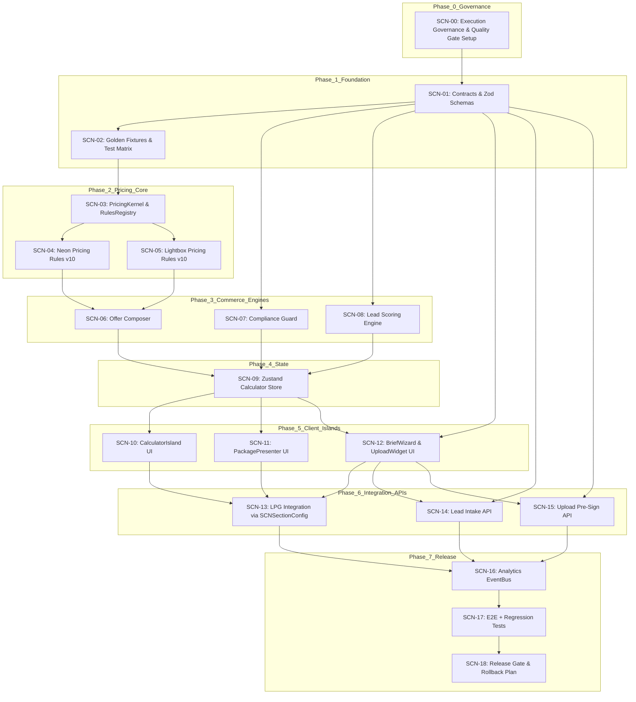

# SCN Implementation Tasks (WBS)

**Version**: 10.3
**Date**: 2026-05-16
**System**: Service Commerce Nodes (SCN)
**Parent System**: Landing Page Generator (LPG)
**Execution Mode**: Deterministic Agentic Delivery
**Primary Goal**: Build SCN as a headless, versioned, testable B2B pricing and lead-capture subsystem integrated into LPG.

---

## 1. System Intent

Service Commerce Nodes (SCN) is the interactive commerce and conversion layer for LPG service pages.

SCN must provide:

- deterministic pricing calculators;
- Good / Better / Best offer packaging;
- 902-PP compliance risk hints;
- progressive B2B brief capture;
- upload-aware lead scoring;
- analytics telemetry for funnel optimization;
- declarative LPG integration through `SCNSectionConfig`.

SCN must not become a visual-only React feature.
It must behave as a reusable pricing, offer, compliance, lead-scoring and telemetry subsystem.

---

## 2. Architecture Boundaries

### 2.1 Core Boundary

The following modules must remain framework-independent:

```txt
src/features/scn/model/schemas/
src/features/scn/model/pricing/
src/features/scn/model/offers/
src/features/scn/model/compliance/
src/features/scn/model/lead-scoring/
src/features/scn/model/fixtures/
```

Rules:

- no React imports;
- no Zustand imports;
- no DOM APIs;
- no Next.js route logic;
- deterministic input/output only;
- all formulas covered by unit tests.

### 2.2 State Boundary

```txt
src/features/scn/model/store/
```

Rules:

- Zustand is an adapter, not the source of business truth;
- store actions call pure engines;
- no pricing formulas inside store;
- no direct API submission logic inside pricing store unless isolated into actions with typed service adapters.

### 2.3 UI Boundary

```txt
src/features/scn/ui/
```

Rules:

- UI consumes store/selectors;
- UI never calculates final prices;
- UI uses Geist/Verge tokens only;
- no hardcoded colors, shadows, spacing or typography values;
- UI must support loading, error, empty and degraded states.

### 2.4 API Boundary

```txt
src/app/api/leads/intake/route.ts
src/app/api/upload/pre-sign/route.ts
```

Rules:

- API validates all payloads through shared Zod contracts;
- API never trusts client-calculated lead score blindly;
- server recalculates or verifies critical fields;
- rate limiting and file upload constraints are mandatory.

---

## 3. Phase Overview

### Phase 0: Execution Governance

Prepare the implementation environment, ownership model, branch strategy, fixture discipline, and quality gates.

### Phase 1: Foundation - Contracts, Schemas, Fixtures

Create typed contracts, Zod schemas, golden fixtures and validation tests.

### Phase 2: Pricing Core - Kernel, Registry, Rules

Implement versioned pricing execution with deterministic Neon and Lightbox rules.

### Phase 3: Commerce Engines - Offers, Compliance, Lead Scoring

Create offer packaging, compliance guard, and lead scoring engines.

### Phase 4: State Orchestration - Zustand Store

Wire pure engines into a reactive client-safe store.

### Phase 5: Client Islands - UI Layer

Build CalculatorIsland, PackagePresenter and BriefWizard.

### Phase 6: LPG + API Integration

Connect SCN to LPG SectionRegistry and backend endpoints.

### Phase 7: Analytics, E2E, Regression, Release Gate

Add telemetry, Playwright E2E, regression tests and release readiness validation.

---

## 4. Dependency Graph



---

## 5. Detailed Task List

### Phase 0: Execution Governance

#### [SCN-00] Establish Execution Governance & Quality Gates

**Goal**: Create the control layer that prevents architecture drift during implementation.

**Outputs**:

```txt
docs/scn/implementation-plan.md
docs/scn/quality-gates.md
docs/scn/test-matrix.md
docs/scn/pricing-rule-versioning.md
```

**Requirements**:

- define allowed module dependencies;
- define branch naming;
- define test commands;
- define rollback rules;
- define pricing rule versioning;
- define DoD for each phase.

**Verification**:

- implementation plan exists;
- quality gate checklist exists;
- test matrix maps every critical engine to fixtures;
- no task begins without accepted DoD.

**Dependencies**: None

### Phase 1: Foundation - Contracts, Schemas, Fixtures

#### [SCN-01] Define Contracts & Zod Schemas

**Goal**: Create canonical types and validation schemas for all SCN data flows.

**Input**:

```txt
SCN.md
Data Contracts section
Lead Capture section
Pricing Kernel section
```

**Outputs**:

```txt
src/features/scn/model/schemas/contracts.ts
src/features/scn/model/schemas/pricing.schema.ts
src/features/scn/model/schemas/lead.schema.ts
src/features/scn/model/schemas/upload.schema.ts
src/features/scn/model/schemas/index.ts
```

**Core Types**:

```ts
ProductType
PricingInput
PricingResult
PricingBreakdownItem
OfferPackage
ComplianceRisk
LeadScore
ServiceLeadPayload
UploadAttachment
SCNSectionConfig
```

**Rules**:

- Zod schemas are source of runtime truth.
- TypeScript inferred types must derive from schemas where useful.
- All API and UI flows must reuse these schemas.
- Do not duplicate contracts in UI components.

**Verification**:

```bash
pnpm tsc --noEmit
pnpm test src/features/scn/model/schemas
```

**Acceptance Criteria**:

- valid `ServiceLeadPayload` passes;
- malformed payload fails with useful error;
- pricing input rejects impossible values;
- upload schema rejects invalid file metadata;
- exported index has no circular imports.

**Dependencies**: [SCN-00]

#### [SCN-02] Create Golden Fixtures & Test Matrix

**Goal**: Establish deterministic examples for pricing, offers, compliance and lead scoring before implementation.

**Outputs**:

```txt
src/features/scn/model/fixtures/pricing/neon.fixture.ts
src/features/scn/model/fixtures/pricing/lightbox.fixture.ts
src/features/scn/model/fixtures/leads/lead.fixture.ts
src/features/scn/model/fixtures/compliance/compliance.fixture.ts
docs/scn/test-matrix.md
```

**Fixture Categories**:

- simple neon sign;
- complex neon logo;
- acrylic-backed neon;
- standard lightbox;
- premium lightbox;
- urgent production;
- low-information lead;
- high-intent lead with DWG upload;
- compliance-sensitive facade case.

**Verification**:

```bash
pnpm test src/features/scn/model/fixtures
```

**Acceptance Criteria**:

- each fixture has expected result snapshot;
- each pricing scenario has explicit expected min/base/max;
- fixture values are documented and traceable to coverage docs.

**Dependencies**: [SCN-01]

### Phase 2: Pricing Core

#### [SCN-03] Implement PricingKernel & RulesRegistry

**Goal**: Build the headless execution engine that routes pricing input to the correct versioned pricing rule.

**Outputs**:

```txt
src/features/scn/model/pricing/kernel.ts
src/features/scn/model/pricing/registry.ts
src/features/scn/model/pricing/types.ts
src/features/scn/model/pricing/errors.ts
```

**Required Capabilities**:

- register product rules dynamically;
- execute rule by `productType`;
- support `ruleVersion`;
- return structured error for unsupported product;
- return audit metadata for pricing traceability.

**Kernel Contract**:

```ts
calculatePricing(input: PricingInput): PricingResult
```

**PricingResult Must Include**:

```ts
{
  productType: ProductType;
  ruleVersion: string;
  basePrice: number;
  minPrice: number;
  maxPrice?: number;
  currency: "RUB";
  breakdown: PricingBreakdownItem[];
  assumptions: string[];
  warnings: string[];
  audit: {
    formulaId: string;
    calculatedAt: string;
    inputHash: string;
  };
}
```

**Verification**:

```bash
pnpm test src/features/scn/model/pricing/kernel.test.ts
```

**Acceptance Criteria**:

- unknown product returns controlled error;
- registered product executes correct rule;
- rule version is present in result;
- result is deterministic for same input.

**Dependencies**: [SCN-02]

#### [SCN-04] Implement Neon Pricing Rules v10

**Goal**: Implement deterministic Neon pricing formulas with breakdown logic.

**Inputs**:

```txt
docs/knowledge/coverage/t3_neon.md
SCN.md
```

**Output**:

```txt
src/features/scn/model/pricing/rules/neon.v10.ts
src/features/scn/model/pricing/rules/neon.v10.test.ts
```

**Required Variables**:

- length in cm/m;
- complexity level;
- font/logo complexity;
- acrylic backing;
- RGB option;
- indoor/outdoor;
- urgency multiplier;
- minimum order;
- installation hint;
- warranty tier hint.

**Verification**:

```bash
pnpm test neon.v10.test.ts
```

**Acceptance Criteria**:

- 5+ size scenarios pass;
- minimum order enforced;
- breakdown includes material, complexity, backing, RGB, urgency;
- impossible dimensions rejected by schema;
- no floating price drift beyond allowed tolerance.

**Dependencies**: [SCN-03]

#### [SCN-05] Implement Lightbox Pricing Rules v10

**Goal**: Implement deterministic Lightbox pricing formulas with size, material and lighting breakdown.

**Inputs**:

```txt
docs/knowledge/coverage/t4_lightbox.md
SCN.md
```

**Output**:

```txt
src/features/scn/model/pricing/rules/lightbox.v10.ts
src/features/scn/model/pricing/rules/lightbox.v10.test.ts
```

**Required Variables**:

- width;
- height;
- area;
- frame material;
- face material;
- illumination type;
- outdoor protection;
- installation complexity;
- urgency multiplier;
- minimum order.

**Verification**:

```bash
pnpm test lightbox.v10.test.ts
```

**Acceptance Criteria**:

- 5+ sizing scenarios pass;
- area-based calculation is correct;
- minimum order enforced;
- breakdown is human-readable;
- warning appears for oversized/installation-sensitive cases.

**Dependencies**: [SCN-03]

### Phase 3: Commerce Engines

#### [SCN-06] Implement Offer Composer

**Goal**: Convert a `PricingResult` into Start, Business and Premium packages.

**Input**:

```txt
SCN.md
Decoy & Package Strategy section
```

**Output**:

```txt
src/features/scn/model/offers/composer.ts
src/features/scn/model/offers/composer.test.ts
```

**Package Logic**:

**Start**

- lower entry point;
- limited options;
- safe discount bounds;
- no margin destruction;
- designed as anchor, not default winner.

**Business**

- default recommended package;
- matches or slightly improves base price;
- includes strongest B2B value proposition;
- should be marked as recommended.

**Premium**

- higher margin;
- faster production / better warranty / premium material;
- should make Business look rational.

**Verification**:

```bash
pnpm test src/features/scn/model/offers
```

**Acceptance Criteria**:

- Business package aligns with base price logic;
- Start package respects min margin;
- Premium package includes premium benefits;
- every package includes price, benefits, limitations, CTA intent;
- no package produces price below hard minimum.

**Dependencies**: [SCN-04], [SCN-05]

#### [SCN-07] Implement Compliance Guard

**Goal**: Evaluate facade/signage risk hints, including Moscow 902-PP relevance.

**Output**:

```txt
src/features/scn/model/compliance/guard.ts
src/features/scn/model/compliance/guard.test.ts
```

**Risk Inputs**:

- outdoor/facade placement;
- sign dimensions;
- building type;
- mounting method;
- electrical illumination;
- user uncertainty;
- uploaded documents;
- district/location optionality.

**Risk Output**:

```ts
{
  level: "low" | "medium" | "high";
  reasons: string[];
  requiredDocuments: string[];
  disclaimers: string[];
  recommendedAction: string;
}
```

**Verification**:

```bash
pnpm test src/features/scn/model/compliance
```

**Acceptance Criteria**:

- facade + illuminated sign increases risk;
- uploaded drawings reduce uncertainty but not legal risk automatically;
- high-risk output recommends manager review;
- disclaimers avoid legal overpromising.

**Dependencies**: [SCN-01]

#### [SCN-08] Implement Lead Scoring Engine

**Goal**: Score lead quality before CRM handoff.

**Output**:

```txt
src/features/scn/model/lead-scoring/engine.ts
src/features/scn/model/lead-scoring/engine.test.ts
```

**Scoring Signals**:

| Signal | Weight Logic |
| --- | --- |
| Selected Premium package | High intent |
| Uploaded DWG/PDF/photo | Higher seriousness |
| Deadline provided | Higher urgency |
| Phone provided | Higher contactability |
| Company name provided | B2B qualification |
| Outdoor/facade case | Higher ticket / compliance complexity |
| Large dimensions | Higher revenue potential |
| No contact details | Severe penalty |

**Output**:

```ts
{
  score: number;
  tier: "cold" | "warm" | "hot" | "priority";
  reasons: string[];
  recommendedNextAction: string;
}
```

**Verification**:

```bash
pnpm test src/features/scn/model/lead-scoring
```

**Acceptance Criteria**:

- DWG upload + Premium package produces high score;
- missing contact details caps score;
- large outdoor project increases score;
- scoring is deterministic and explainable.

**Dependencies**: [SCN-01]

### Phase 4: State Orchestration

#### [SCN-09] Build Zustand Calculator Store

**Goal**: Connect inputs, PricingKernel, OfferComposer, ComplianceGuard and LeadScoring into a reactive client store.

**Output**:

```txt
src/features/scn/model/store/useCalculatorStore.ts
src/features/scn/model/store/selectors.ts
src/features/scn/model/store/useCalculatorStore.test.ts
```

**Store Responsibilities**:

- hold current product type;
- hold pricing params;
- trigger recalculation;
- expose packages;
- track selected package;
- expose compliance risk;
- expose lead score preview;
- expose validation errors;
- expose loading/error state for UI.

**Store Must Not**:

- contain raw pricing formulas;
- contain duplicate Zod schemas;
- directly mutate package logic;
- bypass pure engines.

**Verification**:

```bash
pnpm test src/features/scn/model/store
```

**Acceptance Criteria**:

- `updateParam()` triggers recalculation;
- packages update after pricing changes;
- selected package persists if still valid;
- invalid input produces typed error;
- selectors prevent unnecessary UI rerenders.

**Dependencies**: [SCN-06], [SCN-07], [SCN-08]

### Phase 5: Client Islands

#### [SCN-10] Develop CalculatorIsland UI

**Goal**: Build interactive calculator controls for sizing, material, complexity and urgency.

**Output**:

```txt
src/features/scn/ui/CalculatorIsland.tsx
src/features/scn/ui/CalculatorControls.tsx
src/features/scn/ui/PriceBreakdown.tsx
```

**Requirements**:

- client component only where needed;
- Geist/Verge tokens only;
- responsive layout;
- keyboard-accessible sliders;
- debounce expensive updates;
- visible assumptions/warnings;
- no pricing logic in component.

**Verification**:

```bash
pnpm test CalculatorIsland
pnpm playwright test scn-calculator.spec.ts
```

**Acceptance Criteria**:

- sliders update price without lag;
- invalid values show user-safe error;
- price breakdown renders correctly;
- component works inside LPG page shell.

**Dependencies**: [SCN-09]

#### [SCN-11] Develop PackagePresenter UI

**Goal**: Render Start, Business and Premium packages with decoy-aware hierarchy.

**Output**:

```txt
src/features/scn/ui/PackagePresenter.tsx
src/features/scn/ui/PackageCard.tsx
```

**Requirements**:

- Business visually recommended;
- Start clearly limited;
- Premium aspirational but credible;
- Framer Motion used without layout instability;
- package selection updates store;
- accessible buttons and labels.

**Verification**:

```bash
pnpm test PackagePresenter
pnpm playwright test scn-package-selection.spec.ts
```

**Acceptance Criteria**:

- all packages render from store data;
- selected package state is stable;
- animation does not break layout;
- recommended package is visually clear but not manipulative.

**Dependencies**: [SCN-09]

#### [SCN-12] Develop BriefWizard & UploadWidget UI

**Goal**: Build progressive lead capture with React Hook Form, Zod and upload support.

**Output**:

```txt
src/features/scn/ui/BriefWizard.tsx
src/features/scn/ui/UploadWidget.tsx
src/features/scn/ui/LeadSummary.tsx
```

**Wizard Steps**:

1. Project basics.
2. Dimensions and placement.
3. Package confirmation.
4. Contact data.
5. Upload files.
6. Final review and submit.

**Requirements**:

- progressive disclosure;
- validation before step progression;
- file type/size hints;
- payload preview for debug mode;
- accessibility-friendly errors;
- no raw server submission without schema validation.

**Verification**:

```bash
pnpm test BriefWizard
pnpm playwright test scn-brief-wizard.spec.ts
```

**Acceptance Criteria**:

- invalid step blocks progression;
- valid flow generates `ServiceLeadPayload`;
- upload metadata is attached to payload;
- selected package is included;
- compliance risk and lead score can be included in preview.

**Dependencies**: [SCN-01], [SCN-09]

### Phase 6: LPG + Backend Integration

#### [SCN-13] Implement LPG Integration via SCNSectionConfig

**Goal**: Expose SCN as declarative LPG section type.

**Output**:

```txt
src/features/scn/ui/ServiceCommerceNode.tsx
src/features/scn/model/schemas/scn-section.schema.ts
src/components/sections/registry.ts
```

**SCNSectionConfig Example**:

```ts
{
  type: "service-commerce-node",
  productType: "neon",
  variant: "calculator-with-brief",
  defaultParams: {
    lengthCm: 300,
    complexity: "medium",
    acrylicBacking: true
  },
  analyticsScope: "service/neon/calculator"
}
```

**Verification**:

```bash
pnpm test SectionRegistry
pnpm playwright test service-page-scn-render.spec.ts
```

**Acceptance Criteria**:

- dummy service page renders SCN through LPG registry;
- invalid config fails safely;
- server/static sections remain unaffected;
- SCN can be disabled via feature flag.

**Dependencies**: [SCN-10], [SCN-11], [SCN-12]

#### [SCN-14] Build Lead Intake API

**Goal**: Create secure endpoint for lead submission.

**Output**:

```txt
src/app/api/leads/intake/route.ts
src/features/scn/server/lead-intake.ts
```

**Endpoint**:

```txt
POST /api/leads/intake
```

**Requirements**:

- Zod validation;
- rate limiting;
- idempotency key support;
- server-side score verification;
- sanitized payload;
- structured error responses;
- CRM-ready adapter boundary.

**Verification**:

```bash
curl -X POST /api/leads/intake
pnpm test src/features/scn/server
```

**Acceptance Criteria**:

- valid payload returns 200/201;
- malformed payload returns 400;
- repeated idempotent request does not duplicate lead;
- suspicious payload is rejected;
- server does not trust client-only score.

**Dependencies**: [SCN-01], [SCN-08], [SCN-12]

#### [SCN-15] Build Upload Pre-Sign API

**Goal**: Create controlled upload preparation endpoint.

**Output**:

```txt
src/app/api/upload/pre-sign/route.ts
src/features/scn/server/upload-policy.ts
```

**Endpoint**:

```txt
POST /api/upload/pre-sign
```

**Requirements**:

- allowed file types: PDF, DWG, DXF, JPG, PNG, WEBP;
- max file size policy;
- filename sanitization;
- upload token expiration;
- rate limiting;
- optional virus-scan hook placeholder;
- attachment metadata contract.

**Verification**:

```bash
pnpm test src/features/scn/server/upload-policy.test.ts
```

**Acceptance Criteria**:

- valid file metadata returns pre-sign payload;
- invalid file extension rejected;
- oversized file rejected;
- dangerous filename sanitized;
- policy is reusable by BriefWizard.

**Dependencies**: [SCN-01], [SCN-12]

### Phase 7: Analytics, E2E, Regression, Release

#### [SCN-16] Implement Analytics EventBus

**Goal**: Track SCN funnel progression and pricing interactions.

**Output**:

```txt
src/features/scn/lib/analytics.ts
src/features/scn/lib/events.ts
```

**Event Taxonomy**:

```txt
scn_viewed
scn_input_changed
scn_price_calculated
scn_package_viewed
scn_package_selected
scn_brief_started
scn_wizard_step_completed
scn_file_upload_started
scn_file_upload_completed
scn_lead_submit_started
scn_lead_submit_succeeded
scn_lead_submit_failed
```

**Requirements**:

- typed event payloads;
- analytics adapter abstraction;
- no PII leakage in analytics event body;
- event scope includes productType and page slug.

**Verification**:

```bash
pnpm test src/features/scn/lib/analytics.test.ts
```

**Acceptance Criteria**:

- all funnel events are typed;
- no raw phone/email in analytics payload;
- failed submit has error category;
- event bus works in test mode.

**Dependencies**: [SCN-13], [SCN-14], [SCN-15]

#### [SCN-17] Implement E2E + Regression Tests

**Goal**: Validate the complete SCN user journey.

**Output**:

```txt
tests/e2e/scn-flow.spec.ts
tests/e2e/scn-upload.spec.ts
tests/e2e/scn-lpg-integration.spec.ts
src/features/scn/model/pricing/regression.test.ts
```

**Main E2E Scenario**:

1. Visit dummy service page.
2. Move calculator slider.
3. Verify price changes.
4. Select Business package.
5. Start brief wizard.
6. Fill required contact fields.
7. Attach mock file metadata.
8. Submit lead.
9. Verify success state.
10. Verify analytics events fired.

**Verification**:

```bash
pnpm test
pnpm playwright test tests/e2e/scn-flow.spec.ts
```

**Acceptance Criteria**:

- complete flow passes;
- pricing regression snapshots pass;
- LPG registry render passes;
- upload policy tests pass;
- analytics does not leak PII.

**Dependencies**: [SCN-16]

#### [SCN-18] Release Gate & Rollback Plan

**Goal**: Prevent unstable SCN logic from shipping to production.

**Output**:

```txt
docs/scn/release-gate.md
docs/scn/rollback-plan.md
```

**Release Gate Checklist**:

- `pnpm tsc --noEmit` passes;
- unit tests pass;
- pricing regression tests pass;
- E2E tests pass;
- Lighthouse does not regress core service pages;
- SCN disabled state works;
- feature flag works;
- analytics events verified;
- API rejects malformed payloads;
- fallback UI works.

**Rollback Strategy**:

- feature flag disables SCN section;
- pricing rule version can revert from `v10` to previous stable version;
- API can continue accepting leads without calculator metadata;
- LPG registry ignores unknown SCN config safely;
- broken upload flow degrades to manual file request.

**Dependencies**: [SCN-17]

---

## 6. Parallel Execution Strategy

### Sequential Critical Path

```txt
SCN-00 -> SCN-01 -> SCN-02 -> SCN-03 -> SCN-04/05 -> SCN-06/07/08 -> SCN-09
```

### Parallel Lanes After SCN-09

```txt
Lane A: SCN-10 CalculatorIsland
Lane B: SCN-11 PackagePresenter
Lane C: SCN-12 BriefWizard
Lane D: SCN-14/15 API routes, if contracts are stable
```

### Final Integration Path

```txt
SCN-13 -> SCN-16 -> SCN-17 -> SCN-18
```

---

## 7. Agent Ownership Model

| Agent Role | Owns | Cannot Do |
| --- | --- | --- |
| Architecture Agent | Boundaries, dependency graph, contracts | Implement UI without tests |
| Core Engine Agent | Pricing kernel, rules, offers, scoring | Add React dependencies |
| UI Agent | CalculatorIsland, PackagePresenter, BriefWizard | Add pricing formulas |
| Backend Agent | Lead API, upload API, server verification | Trust client score blindly |
| QA/Eval Agent | Fixtures, unit tests, E2E, regression | Change business rules silently |
| Release Guard | Feature flags, rollback, release gate | Approve failing gates |

---

## 8. Quality Gates

### Gate 1: Contract Gate

Required before pricing implementation:

```bash
pnpm tsc --noEmit
pnpm test schemas
```

Pass conditions:

- all schemas compile;
- valid fixtures pass;
- invalid fixtures fail as expected.

### Gate 2: Pricing Gate

Required before UI implementation:

```bash
pnpm test pricing
pnpm test regression
```

Pass conditions:

- Neon scenarios pass;
- Lightbox scenarios pass;
- minimum order rules pass;
- price snapshots stable.

### Gate 3: Store Gate

Required before Client Islands:

```bash
pnpm test store
```

Pass conditions:

- updateParam recalculates;
- packages populate;
- compliance updates;
- no duplicate business logic in store.

### Gate 4: UI Gate

Required before LPG integration:

```bash
pnpm test ui
pnpm playwright test scn-ui
```

Pass conditions:

- calculator works;
- package selection works;
- wizard validation works;
- accessibility basics pass.

### Gate 5: Integration Gate

Required before release:

```bash
pnpm test
pnpm playwright test
pnpm tsc --noEmit
```

Pass conditions:

- full flow works;
- API validation works;
- telemetry works;
- feature flag rollback works.

---

## 9. Metrics & Success Criteria

### Engineering Metrics

| Metric | Target |
| --- | --- |
| TypeScript errors | 0 |
| Unit test pass rate | 100% |
| Pricing regression pass rate | 100% |
| E2E critical flow pass rate | 100% |
| Schema reuse | 100% shared contracts |
| UI hardcoded token violations | 0 |
| Client-side pricing formula duplication | 0 |

### Product Metrics

| Metric | Target |
| --- | --- |
| Calculator interaction rate | Track baseline |
| Package selection rate | Track by package |
| Brief start rate | Track |
| Brief completion rate | Track |
| File upload rate | Track |
| Premium package selection rate | Track |
| High-score lead share | Track |
| Lead submit failure rate | < 2% after stabilization |

---

## 10. Extension System

Future services must be added through the following path:

```txt
1. Add ProductType
2. Add Zod pricing input schema
3. Add golden fixtures
4. Add pricing rule version
5. Register rule in RulesRegistry
6. Add package copy/benefits config
7. Add UI controls config
8. Add regression scenarios
9. Add analytics product scope
```

Forbidden:

- adding pricing formula directly into UI;
- creating separate calculator architecture per service;
- duplicating lead schema;
- bypassing registry;
- shipping unversioned pricing rules.

---

## 11. Fail-Safe Behavior

| Failure | System Behavior |
| --- | --- |
| Pricing rule missing | Show controlled unavailable state |
| Invalid section config | Do not render SCN; log warning |
| API lead submit fails | Preserve form data and show retry |
| Upload pre-sign fails | Allow lead submit without file |
| Analytics unavailable | Do not block UX |
| Compliance risk unknown | Show conservative manager-review message |
| Pricing uncertainty high | Show range instead of false precision |
| Feature unstable | Disable via feature flag |

---

## 12. Definition of Done

SCN v10.3 is complete only when:

- all contracts exist and are reused;
- Neon and Lightbox pricing rules are deterministic;
- Offer Composer generates Start/Business/Premium packages;
- Compliance Guard and Lead Scoring are pure and tested;
- Zustand store wires engines without duplicating logic;
- CalculatorIsland, PackagePresenter and BriefWizard work;
- LPG renders SCN through declarative config;
- lead and upload APIs validate payloads;
- analytics events cover the funnel;
- Playwright E2E passes;
- rollback plan is documented and tested;
- feature flag can disable SCN safely.
