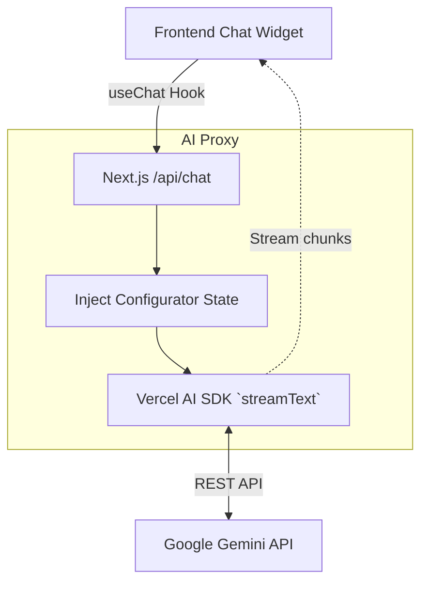

# System Design: AI Proxy System

## 1. Overview
The AI Proxy System is responsible for securely managing communication between the client-side AI Consultant widget and the backend LLM provider (Google Gemini).

## 2. Goals & Non-Goals
**Goals**:
- Provide a streaming response pipeline to the frontend widget [REQ-004].
- Securely inject system prompts and live user configuration context into the LLM request.
- Protect LLM API keys from being exposed to the client.

**Non-Goals**:
- Do not build custom LLM models (use provider APIs).
- Do not store chat history in a database initially (stateless chat during session).

## 3. Architecture
Utilizes Vercel AI SDK.



## 4. Interface Design
- **Endpoint**: `POST /api/chat`
- **Request Payload** (standard Vercel AI SDK format):
  ```json
  {
    "messages": [{ "role": "user", "content": "Сколько будет стоить вывеска?" }],
    "data": { "context": "User configured neon sign, width 2m, price 15000 RUB" }
  }
  ```

## 5. Technology Stack
- **Framework**: Next.js Route Handlers (Edge Runtime recommended for streaming).
- **SDK**: `ai` (Vercel AI SDK), `@ai-sdk/google`.

## 6. Trade-offs & Alternatives
- **Edge vs Node.js Runtime**: We will use the Edge runtime for the `/api/chat` route to ensure minimal latency and optimal streaming performance, trading off access to some native Node.js APIs (which aren't needed for this proxy).

## 7. Performance Considerations
- Streaming is critical for UX. The Vercel AI SDK handles the streaming automatically, reducing perceived latency to milliseconds.

## 8. Security Considerations
- **Prompt Injection**: The system prompt must instruct the AI to *only* answer questions related to signs and production.
- **Rate Limiting**: Implementation of basic rate limiting (e.g., Upstash Redis or Vercel KV) is recommended to prevent abuse of the paid LLM API.
