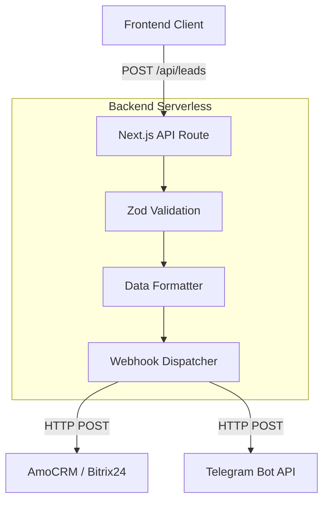

# System Design: Backend API System

## 1. Overview
The Backend API System consists of Next.js Route Handlers. It acts as the secure middleware between the frontend client and external services (CRM, Analytics, Telegram).

## 2. Goals & Non-Goals
**Goals**:
- Securely process lead submissions from the configurator [REQ-003].
- Format and forward lead data to the designated CRM or Telegram Bot.
- Provide endpoints for analytics event tracking.

**Non-Goals**:
- Do not build a custom database for leads yet (rely on the external CRM).
- Do not handle heavy background processing (use serverless functions).

## 3. Architecture
Utilizes Next.js App Router API Routes (`app/api/...`).



## 4. Interface Design
- **Endpoint**: `POST /api/leads`
- **Request Payload**:
  ```json
  {
    "contact": { "name": "John Doe", "phone": "+123456789" },
    "configuration": { "text": "HELLO", "material": "neon", "priceEstimate": 1500 }
  }
  ```
- **Response**: `200 OK` or `400 Bad Request`

## 5. Technology Stack
- **Framework**: Next.js Route Handlers (Node.js runtime or Edge).
- **Validation**: Zod (for strict typing and payload validation).

## 6. Trade-offs & Alternatives
- **Next.js API vs Separate Express Server**: Since we are migrating to Next.js, keeping the API routes within the same repository (Monorepo approach) drastically reduces operational complexity and deployment overhead on Vercel. We trade off backend framework features (like NestJS DI) for velocity.

## 7. Performance Considerations
- Since this is a serverless function, cold starts are a factor. However, for a form submission, a 500ms cold start is acceptable.

## 8. Security Considerations
- **CORS**: Next.js automatically secures API routes to the same origin by default.
- **Validation**: All incoming data MUST be validated via Zod to prevent injection attacks.
- **Secrets**: CRM Webhook URLs and Telegram Tokens must be stored in `.env.local` and accessed only server-side via `process.env`.
