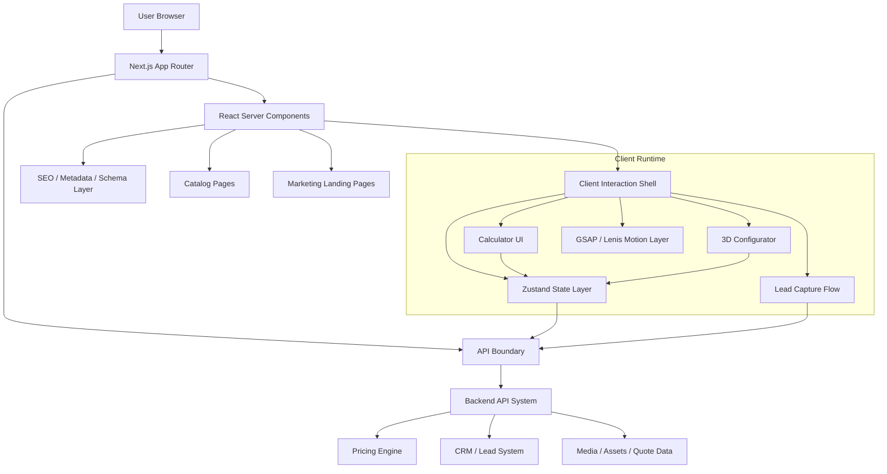

# System Design: Frontend System — Expoint ADV v2

## 1. System Role

The Frontend System is the user-facing presentation, conversion, visualization and interaction layer for **Expoint ADV v2**.

It is responsible for:

* SEO-optimized marketing pages.
* Premium B2B catalog experience.
* Interactive outdoor advertising calculator.
* 3D sign configurator.
* Lead capture and quote preparation.
* Future AI assistant interface.
* Future personal cabinet / quote workspace.

The system is built on **Next.js App Router** and follows a strict separation between:

* **React Server Components** for SEO, fast loading and static/server-rendered content.
* **Client Components** for stateful interaction, 3D rendering, GSAP motion, form flows and browser APIs.

The frontend must look premium, but behave like an enterprise-grade conversion machine.

---

## 2. System Objectives

### 2.1 Primary Goals

| ID     | Goal                         | Description                                                                                  |
| ------ | ---------------------------- | -------------------------------------------------------------------------------------------- |
| FE-001 | SEO-first architecture       | All marketing, service and catalog pages must support SSR/SSG and metadata generation.       |
| FE-002 | Premium B2B visual layer     | UI must communicate trust, manufacturing quality, precision and premium execution.           |
| FE-003 | 3D sign configurator         | Users must be able to preview volumetric letters and sign options interactively.             |
| FE-004 | Calculator conversion engine | Calculator must reduce friction, explain pricing factors and generate qualified leads.       |
| FE-005 | Scalable module architecture | System must support future calculators, AI assistant and personal account.                   |
| FE-006 | Performance-governed motion  | GSAP/Lenis/Three.js must enhance UX without harming speed, SEO or accessibility.             |
| FE-007 | Clear boundary with backend  | Frontend may preview estimates, but authoritative pricing and order logic belong outside UI. |

---

## 3. Non-Goals

The Frontend System must **not**:

* Own final pricing logic.
* Store sensitive business rules as client-only logic.
* Directly access private API keys.
* Execute heavy backend workflows inside React components.
* SSR WebGL canvas.
* Put GSAP timelines inside generic UI components.
* Use animation as a substitute for information clarity.
* Block user flow because a 3D asset failed to load.
* Require 3D interaction to submit a quote request.

---

## 4. Architecture Overview



---

## 5. Core Frontend Domains

### 5.1 Marketing Domain

Responsible for:

* Main landing page.
* Product/service category pages.
* Segment pages: restaurants, clinics, retail, franchises, offices, shopping centers.
* Educational pages: “how pricing works”, “approval rules”, “materials”, “installation”.
* Lead capture CTAs.

Recommended route structure:

```txt
app/
  (marketing)/
    page.tsx
    obemnye-bukvy/
    gibkiy-neon/
    svetovye-koroba/
    vyveski-dlya-kafe/
    vyveski-dlya-klinik/
    vyveski-dlya-magazinov/
    soglasovanie-vyvesok/
```

---

### 5.2 Catalog Domain

Responsible for:

* Product/service catalog.
* Material options.
* Lighting options.
* Mounting options.
* Portfolio/case references.
* SEO product pages.

Recommended entities:

```ts
type CatalogEntity =
  | "volumetric_letters"
  | "flex_neon"
  | "lightbox"
  | "facade_sign"
  | "interior_sign"
  | "navigation"
  | "roof_sign"
  | "franchise_rollout";
```

---

### 5.3 Calculator Domain

Responsible for:

* Collecting project parameters.
* Explaining price drivers.
* Showing preliminary estimate range.
* Creating lead intent.
* Passing structured data to backend.

The calculator should behave as a guided sales assistant, not just a numeric form.

Core user flow:

```txt
Select product type
  → Select size / text / quantity
  → Select material
  → Select lighting
  → Select mounting complexity
  → Select urgency
  → Preview price range
  → Show recommendation
  → Capture contact
  → Send structured quote request
```

---

### 5.4 3D Configurator Domain

Responsible for:

* Rendering volumetric letters/sign preview.
* Syncing visual preview with calculator inputs.
* Providing material/color/light variants.
* Supporting low-performance fallback.

Core props:

```ts
type SignModelProps = {
  text: string;
  widthMm?: number;
  heightMm?: number;
  depthMm?: number;
  material: SignMaterial;
  faceColor: string;
  sideColor?: string;
  lighting: LightingType;
  mountingType?: MountingType;
  qualityMode: "low" | "medium" | "high";
};
```

Recommended rendering modes:

```ts
type RenderMode =
  | "static_preview"
  | "interactive_3d"
  | "reduced_motion"
  | "mobile_lightweight"
  | "fallback_image";
```

---

### 5.5 Motion Domain

Responsible for:

* Scroll-driven premium animations.
* Page transitions.
* Section reveals.
* 3D scene choreography.
* Microinteractions.

Motion must be isolated from business components.

Recommended structure:

```txt
components/
  motion/
    MotionProvider.tsx
    ScrollScene.tsx
    Reveal.tsx
    ParallaxLayer.tsx
    GsapTimeline.tsx
    ReducedMotionBoundary.tsx
```

Rules:

* Use GSAP only inside motion components.
* Use `@gsap/react` and `useGSAP`.
* Register plugins in one controlled location.
* Respect `prefers-reduced-motion`.
* Disable heavy scroll timelines on low-end/mobile devices.
* Do not animate layout-heavy properties.
* Prefer `transform`, `opacity`, `clip-path` carefully.
* Never let animation delay the primary CTA.

### 5.6 Design System Tokens (Premium Industrial Dark)

The visual identity follows a **"Premium Industrial Dark"** aesthetic, emphasizing high-end manufacturing precision and ultra-modern B2B trust.

| Token Group | Value / Description | Rationale |
| :--- | :--- | :--- |
| **Primary Palette** | `Slate 950` (#020617) to `Slate 400` | High-end technical depth, "Mission Control" feel. |
| **Accent Color** | **Vivid Neon Orange** (`#FF4D00`) | High-visibility industrial action, neon energy. |
| **Geometry** | **Sharp Edges** (`radius: 0px`) | Industrial precision, brutalist high-end manufacturing. |
| **Layout Pattern** | **Industrial Bento Grid** | Organized technical information, modular "Dashboard" look. |
| **Typography** | Outfit (Headers) / Inter (Body) | "Outfit" provides a technical-yet-modern luxury feel. |
| **Motion** | Cinematic GSAP Timelines | Premium, controlled transitions that build trust. |
| **Background** | Deep Slate Texture / Industrial Grid | Sublte background patterns that suggest engineering blueprints. |

---

## 6. State Architecture

### 6.1 State Ownership

| State Type          | Owner                     | Description                           |
| ------------------- | ------------------------- | ------------------------------------- |
| UI state            | Local component / Zustand | Tabs, open sections, selected UI step |
| Calculator draft    | Zustand                   | Temporary user selections             |
| Quote estimate      | Backend / Pricing Engine  | Authoritative pricing                 |
| 3D preview state    | Zustand + R3F             | Visual-only synchronized config       |
| Lead form state     | React Hook Form / Zustand | Contact and project details           |
| SEO content         | Server Components         | Static/SSR content                    |
| Auth/account future | Backend session           | Future personal cabinet               |

### 6.2 Zustand Store Shape

```ts
type CalculatorStore = {
  productType: ProductType | null;
  signText: string;
  dimensions: {
    widthMm?: number;
    heightMm?: number;
    depthMm?: number;
  };
  material: SignMaterial | null;
  lighting: LightingType | null;
  mounting: MountingType | null;
  urgency: UrgencyLevel;
  locationType: LocationType | null;
  estimatePreview: EstimatePreview | null;
  currentStep: number;
  setField: <K extends keyof CalculatorStore>(
    key: K,
    value: CalculatorStore[K]
  ) => void;
  reset: () => void;
};
```

### 6.3 State Rules

* Zustand is allowed for interactive multi-step flows.
* Server data should not be duplicated into Zustand unless necessary.
* Backend quote response is immutable from UI perspective.
* Store must not contain secrets.
* Store must support serialization for future account/quote saving.

---

## 7. Interface Contracts

### 7.1 Frontend → Backend Quote Request

```ts
type QuoteRequest = {
  productType: ProductType;
  text?: string;
  dimensions?: {
    widthMm?: number;
    heightMm?: number;
    depthMm?: number;
  };
  material?: SignMaterial;
  lighting?: LightingType;
  mounting?: MountingType;
  urgency?: UrgencyLevel;
  locationType?: LocationType;
  city?: string;
  files?: UploadedAssetRef[];
  contact: {
    name?: string;
    phone: string;
    email?: string;
    company?: string;
  };
  source: {
    page: string;
    utm?: Record<string, string>;
    calculatorVersion: string;
  };
};
```

### 7.2 Backend → Frontend Estimate Response

```ts
type QuoteEstimateResponse = {
  estimateId: string;
  priceRange: {
    min: number;
    max: number;
    currency: "RUB";
  };
  confidence: "low" | "medium" | "high";
  priceDrivers: PriceDriver[];
  recommendedPackage: "start" | "business" | "premium" | "network";
  nextStep: "call" | "brief" | "manager_review" | "upload_files";
  warnings?: string[];
};
```

---

## 8. Preliminary Calculator Formula Layer

Frontend may show a **non-authoritative preview** using simplified formulas.

### 8.1 Volumetric Letters Preview Formula

```txt
Base Estimate =
  Letter Height Factor
  × Letter Count
  × Material Factor
  × Lighting Factor
  × Complexity Factor
  × Mounting Factor
  × Urgency Factor
  + Setup Cost
```

Example pseudo-code:

```ts
function previewVolumetricLettersEstimate(input: PreviewInput) {
  const letterCount = normalizeText(input.text).length;

  const basePerLetter = getHeightBaseRate(input.heightMm);
  const materialFactor = getMaterialFactor(input.material);
  const lightingFactor = getLightingFactor(input.lighting);
  const complexityFactor = getComplexityFactor(input.fontComplexity);
  const mountingFactor = getMountingFactor(input.mounting);
  const urgencyFactor = getUrgencyFactor(input.urgency);

  const raw =
    basePerLetter *
    letterCount *
    materialFactor *
    lightingFactor *
    complexityFactor *
    mountingFactor *
    urgencyFactor;

  return {
    min: Math.round(raw * 0.85),
    max: Math.round(raw * 1.25),
    confidence: getConfidence(input),
    priceDrivers: [
      { name: "Material", impact: "high", value: input.material },
      { name: "Complexity", impact: "medium", value: input.fontComplexity }
    ]
  };
}

### 8.3 Pricing Psychology (NotebookLM Strategy)

To maximize conversion, the engine follows an **"Automotive Configurator"** model:

1.  **Price as a Range**: Show `[Min, Max]` to build trust while allowing for manufacturing variability.
2.  **Value-Selling Upgrades**: Every technical option (e.g., IP67) is accompanied by a value proposition (e.g., "Best for outdoor longevity").
3.  **TЗ Output**: The configurator generates a structured `SignProject` JSON for direct factory ingestion, eliminating sales back-and-forth.
4.  **Height-Based Matrix**: Base rates are calculated per cm of letter height, following industry-standard Reklamastroy patterns.
```

### 8.2 Important Rule

The frontend formula is used only for:

* UX guidance.
* Price expectation.
* Lead qualification.
* Package comparison.

Final pricing must be calculated by backend pricing engine.

---

## 9. SEO / AEO / GEO Architecture

### 9.1 SEO Requirements

Every marketing/catalog page must support:

* `generateMetadata`.
* Canonical URL.
* Open Graph image.
* Structured headings.
* Breadcrumbs.
* Schema.org markup.
* FAQ blocks.
* Internal links.
* Local commercial intent blocks.
* Case/portfolio references.

### 9.2 Recommended Schema Types

```txt
LocalBusiness
Product
Service
Offer
FAQPage
BreadcrumbList
Review
AggregateRating
ImageObject
VideoObject
```

### 9.3 AI Engine Optimization (AEO/GEO)

The system is optimized for discovery by LLMs (ChatGPT, Perplexity) and AI Agents:

*   **Structured Metadata**: Every page includes JSON-LD for `Service`, `Product`, and `LocalBusiness` to ground AI answers in facts.
*   **Expert Context Layer**: A hidden `/experts.json` endpoint provides the site's entire service matrix in a format optimized for AI ingestion.
*   **Grounded Facts**: All AI Consultant responses are strictly grounded in the **NotebookLM Knowledge Base** via the AI-Ready Layer.

### 9.4 Page Pattern

```txt
Hero
  → Problem / use case
  → Product variants
  → Visual examples
  → Price factors
  → Calculator CTA
  → Materials
  → Installation process
  → Portfolio
  → FAQ
  → Final CTA
```

### 9.4 Programmatic SEO Expansion

Future page generation should support:

```txt
/product + /segment + /city + /use-case
```

Examples:

```txt
/obemnye-bukvy-dlya-kafe
/obemnye-bukvy-dlya-kliniki
/vyveska-dlya-restorana-moskva
/gibkiy-neon-dlya-salona-krasoty
/svetovoy-korob-dlya-magazina
```

---

## 10. Visual Design System

### 10.1 Design Direction

The visual layer should combine:

* Premium industrial precision.
* Dark luxury B2B aesthetic.
* Clean technical interface.
* High-contrast product photography.
* Controlled cinematic motion.
* Clear conversion hierarchy.

### 10.2 Core UI Principles

| Principle        | Rule                                                         |
| ---------------- | ------------------------------------------------------------ |
| Premium clarity  | Expensive visual feel, but no decorative noise               |
| Conversion-first | Every section must push user toward quote/calculator/contact |
| Technical trust  | Show materials, production, mounting, warranty, process      |
| Guided choice    | Help user choose, not just browse                            |
| B2B seriousness  | Avoid childish configurator/game-like UI                     |
| Visual proof     | Portfolio and real photos must dominate trust sections       |

### 10.3 Component Categories

```txt
ui/
  Button
  Card
  Badge
  Tabs
  Slider
  Select
  Input
  Tooltip
  Modal
  Drawer
  Stepper
  PriceRange
  MaterialSwatch
  LightingToggle
  ComplexityBadge
```

---

## 11. 3D Performance Architecture

### 11.1 Asset Pipeline

All 3D assets must pass through:

```txt
Source Model
  → Geometry cleanup
  → Draco or Meshopt compression
  → Texture compression
  → LOD generation
  → GLTF/GLB export
  → CDN/cache setup
  → runtime preload
```

### 11.2 Runtime Rules

* Use dynamic import for 3D canvas.
* Disable SSR for canvas.
* Use Suspense fallback.
* Use fixed-size skeleton.
* Use adaptive DPR.
* Use performance regression detection.
* Use fallback image if WebGL unavailable.
* Use low-poly mode on mobile.
* Do not load 3D on pages where it is not visible.

Example:

```ts
const SignConfigurator = dynamic(
  () => import("@/components/three/SignConfigurator"),
  {
    ssr: false,
    loading: () => <ConfiguratorSkeleton />,
  }
);
```

### 11.3 Quality Modes

| Mode   | Use Case                  | Features                                        |
| ------ | ------------------------- | ----------------------------------------------- |
| Low    | Mobile / weak GPU         | Low DPR, simplified materials, no heavy shadows |
| Medium | Default desktop           | Balanced lights, medium geometry                |
| High   | Premium hero / strong GPU | Better reflections, shadows, postprocessing     |
| Static | Fallback                  | Rendered image / mockup                         |

---

## 12. Motion Governance

### 12.1 Animation Types

| Type                          | Allowed | Notes                             |
| ----------------------------- | ------- | --------------------------------- |
| Hero cinematic intro          | Yes     | Must not delay content visibility |
| Scroll reveal                 | Yes     | Lightweight and progressive       |
| Page transition               | Limited | Avoid blocking navigation         |
| 3D scroll choreography        | Yes     | Desktop-first only                |
| Infinite decorative animation | Limited | Must not distract                 |
| Form animation                | Yes     | Must improve clarity              |
| CTA animation                 | Yes     | Subtle only                       |

### 12.2 Motion Kill Switch

The system must support:

```ts
type MotionPolicy = {
  reducedMotion: boolean;
  lowPowerMode: boolean;
  disableScrollSmoothing: boolean;
  disableCanvasMotion: boolean;
  disableHeavyTimelines: boolean;
};
```

Triggers:

* `prefers-reduced-motion`.
* Low FPS detection.
* Mobile viewport.
* Low battery/device memory if available.
* User accessibility setting.

---

## 13. Performance Budgets

| Metric                   |       Target |    Hard Limit |
| ------------------------ | -----------: | ------------: |
| LCP                      |       ≤ 2.5s |        ≤ 3.5s |
| CLS                      |       ≤ 0.05 |         ≤ 0.1 |
| INP                      |      ≤ 200ms |       ≤ 300ms |
| JS initial route bundle  | ≤ 180KB gzip |  ≤ 250KB gzip |
| 3D route bundle          | ≤ 450KB gzip |  ≤ 650KB gzip |
| FPS desktop 3D           | 60fps target | 45fps minimum |
| FPS mobile 3D            | 45fps target | 30fps minimum |
| WebGL memory             |      ≤ 150MB |       ≤ 250MB |
| Lighthouse Performance   |         ≥ 90 |          ≥ 80 |
| Lighthouse SEO           |         ≥ 95 |          ≥ 90 |
| Lighthouse Accessibility |         ≥ 95 |          ≥ 90 |

---

## 14. Security Architecture

### 14.1 Client Security Rules

* No private API keys in frontend.
* No sensitive pricing tables in static JS bundle.
* No CRM credentials client-side.
* No unrestricted upload endpoints.
* Validate all form input with schema validation.
* Sanitize user-generated text before rendering in 3D/text previews.
* Rate-limit quote submissions via backend.
* Use CSP headers.
* Avoid unsafe inline scripts.

### 14.2 Environment Variables

Only expose variables with `NEXT_PUBLIC_` when they are safe for public use.

Allowed:

```txt
NEXT_PUBLIC_SITE_URL
NEXT_PUBLIC_ANALYTICS_ID
NEXT_PUBLIC_FEATURE_FLAGS_ENV
```

Forbidden:

```txt
CRM_API_KEY
BACKEND_SECRET
PRICING_ADMIN_TOKEN
DATABASE_URL
PRIVATE_STORAGE_KEY
```

---

## 15. Observability & Analytics

### 15.1 Required Events

```txt
calculator_started
calculator_step_completed
calculator_material_selected
calculator_lighting_selected
calculator_estimate_viewed
quote_submitted
phone_clicked
messenger_clicked
portfolio_case_opened
configurator_loaded
configurator_failed
configurator_fallback_used
```

### 15.2 Lead Scoring Signals

```ts
type LeadScoreSignal = {
  productType: ProductType;
  estimatedBudgetRange?: string;
  companyProvided: boolean;
  phoneProvided: boolean;
  filesUploaded: boolean;
  urgency: UrgencyLevel;
  viewedPortfolioCases: number;
  calculatorCompleted: boolean;
  configuratorUsed: boolean;
};
```

### 15.3 Frontend Observability

Track:

* Web vitals.
* JS errors.
* Hydration errors.
* 3D load failures.
* Asset load failures.
* API latency.
* Form abandonment.
* Scroll depth.
* CTA conversion.

---

## 16. Testing & Validation

### 16.1 Required Test Layers

| Layer             | Tool                               | Purpose                                    |
| ----------------- | ---------------------------------- | ------------------------------------------ |
| Unit tests        | Vitest                             | Utility functions, validators, store logic |
| Component tests   | React Testing Library              | UI behavior                                |
| E2E tests         | Playwright                         | Calculator, lead form, navigation          |
| Visual regression | Playwright screenshots / Chromatic | Premium visual consistency                 |
| Performance       | Lighthouse CI                      | Core Web Vitals                            |
| Bundle analysis   | next-bundle-analyzer               | JS budget control                          |
| Accessibility     | axe / Lighthouse                   | WCAG checks                                |
| 3D smoke tests    | Playwright + WebGL check           | Canvas load/fallback                       |

### 16.2 Quality Gates

Build cannot pass if:

* TypeScript has errors.
* ESLint fails.
* Critical Playwright flows fail.
* Lighthouse SEO < 90.
* Lighthouse Accessibility < 90.
* Initial JS bundle exceeds hard limit.
* Calculator submission flow is broken.
* No fallback exists for 3D configurator.
* Metadata missing on commercial SEO pages.

---

## 17. Feature Flags

The frontend must support controlled rollout:

```ts
type FrontendFeatureFlags = {
  enable3DConfigurator: boolean;
  enableAdvancedCalculator: boolean;
  enableAiAssistantEntry: boolean;
  enablePersonalCabinetPreview: boolean;
  enablePortfolioFilters: boolean;
  enableProgrammaticSeoPages: boolean;
};
```

Rules:

* Experimental features must be gated.
* Broken 3D must be remotely disableable.
* AI assistant entrypoint must be gated until backend is ready.
* Personal cabinet UI can exist as preview but must not imply unavailable functionality.

---

## 18. Extension System

### 18.1 Adding New Calculator Type

To add a new calculator:

```txt
1. Add product entity.
2. Add calculator schema.
3. Add UI step config.
4. Add preview formula.
5. Add backend quote contract.
6. Add analytics events.
7. Add SEO page CTA.
8. Add Playwright scenario.
```

### 18.2 Adding New Product Page

```txt
1. Add catalog entity.
2. Add metadata.
3. Add schema.org config.
4. Add content sections.
5. Add price factors.
6. Add calculator mapping.
7. Add portfolio mapping.
8. Add FAQ block.
```

### 18.3 Adding New Motion Scene

```txt
1. Define motion purpose.
2. Check accessibility.
3. Add reduced-motion behavior.
4. Add performance budget.
5. Isolate GSAP timeline.
6. Test mobile behavior.
7. Add visual regression snapshot.
```

---

## 19. Fail-Safe Scenarios

| Failure                 | Required Behavior                                          |
| ----------------------- | ---------------------------------------------------------- |
| 3D canvas fails         | Show static product preview and keep calculator usable     |
| GSAP fails              | Page remains readable and navigable                        |
| Backend quote API fails | Save lead intent locally/session and show contact fallback |
| Image CDN fails         | Show optimized fallback image                              |
| WebGL unsupported       | Disable 3D and show static mockup                          |
| Slow device detected    | Enable lightweight motion and low-quality 3D               |
| Hydration mismatch      | Component must degrade without blocking page               |
| Pricing confidence low  | Show “manager review required” instead of fake precision   |

---

## 20. Implementation Phases

### Phase 1 — Foundation

* Next.js App Router structure.
* Design system base.
* Marketing landing page.
* Catalog page templates.
* SEO metadata system.
* Basic calculator shell.

### Phase 2 — Calculator Engine UI

* Multi-step calculator.
* Zustand store.
* Preview estimate.
* Lead capture.
* Analytics events.
* Backend quote contract.

### Phase 3 — 3D Configurator

* R3F canvas.
* Text/sign model rendering.
* Materials and lighting options.
* Quality modes.
* Static fallback.

### Phase 4 — Premium Motion System

* Lenis integration.
* GSAP provider.
* Scroll scenes.
* Reduced motion policy.
* Visual regression tests.

### Phase 5 — SEO Scale

* Product pages.
* Segment pages.
* FAQ schema.
* Programmatic SEO foundation.
* Internal linking system.

### Phase 6 — AI & Account Readiness

* AI assistant entrypoint.
* Saved quote draft structure.
* Personal cabinet placeholder architecture.
* Quote history contract.
* CRM enrichment events.

---

## 21. ULTRA PROMPT — Frontend System Architect Agent for Expoint ADV v2

You are a Senior Frontend Systems Architect, Next.js App Router Engineer, Creative Technologist, 3D Web Performance Engineer and B2B Conversion UX Designer.

Your task is to evolve and implement the Expoint ADV v2 Frontend System as a premium, SEO-first, conversion-driven, 3D-enabled web platform for an outdoor advertising production company.

### 21.1 Mission

Build a frontend system that combines:

- premium B2B landing experience;
- SEO-optimized product and service catalog;
- interactive calculator for outdoor advertising;
- 3D sign configurator for volumetric letters and signage;
- lead capture and quote preparation;
- future readiness for AI assistant and personal account.

The system must be visually premium, technically stable, scalable and measurable.

### 21.2 Required Stack

Use:

- Next.js 15+ App Router;
- React Server Components by default;
- Client Components only where required;
- TypeScript;
- Tailwind CSS v4;
- Three.js;
- @react-three/fiber;
- @react-three/drei;
- GSAP with @gsap/react;
- ScrollTrigger;
- Lenis;
- Zustand;
- React Hook Form;
- Zod;
- Playwright;
- Lighthouse CI.

### 21.3 Core Architecture Rules

1. Server Components are default.
2. Client Components are allowed only for:
   - browser APIs;
   - forms;
   - Zustand;
   - GSAP;
   - Lenis;
   - Three.js;
   - interactive calculator;
   - 3D configurator.
3. Never SSR WebGL.
4. Never put final pricing logic in frontend.
5. Frontend may show only preliminary estimate ranges.
6. Backend/pricing engine is the source of truth.
7. Every 3D experience must have a static fallback.
8. Every motion scene must support reduced-motion mode.
9. Every commercial page must have metadata and structured content.
10. Every lead path must be measurable.

### 21.4 System Modules

Implement or preserve these modules:

```txt
app/
  (marketing)/
  (catalog)/
  (calculator)/
  (configurator)/
components/
  ui/
  layout/
  motion/
  three/
  calculator/
  catalog/
  seo/
modules/
  lead-capture/
  sign-configurator/
  quote-preview/
  product-catalog/
  analytics/
lib/
  api/
  store/
  seo/
  motion/
  three/
  validators/
config/
  frontend-budgets.ts
  motion-policy.ts
  feature-flags.ts
```

### 21.5 Execution Algorithm

Follow this sequence:

**Phase 1 — Discovery**
* Inspect current repo.
* Identify whether current frontend is Vite, Next.js or hybrid.
* Map existing components, pages, styles, assets and API usage.
* Detect duplicated UI logic.
* Detect client components that should be server components.
* Detect business logic inside UI.

Output:
* architecture gap report;
* migration risk list;
* component inventory.

**Phase 2 — Architecture Stabilization**
* Create or align Next.js App Router structure.
* Add route groups for marketing, catalog, calculator and configurator.
* Add strict server/client boundaries.
* Add shared type contracts.
* Add feature flags.
* Add motion policy config.
* Add frontend budget config.

Output:
* stable frontend directory structure;
* typed config files;
* documented architecture boundaries.

**Phase 3 — Design System**
* Build premium UI primitives:
  * Button;
  * Card;
  * Badge;
  * Input;
  * Select;
  * Slider;
  * Tabs;
  * Stepper;
  * PriceRange;
  * MaterialSwatch;
  * LightingToggle.
* Ensure all components are accessible.
* Ensure visual style is premium, technical and B2B.

Output:
* reusable UI kit;
* visual consistency;
* no one-off chaotic styling.

**Phase 4 — Calculator**
* Build multi-step calculator.
* Use Zustand for draft state.
* Use Zod for validation.
* Use React Hook Form where needed.
* Implement preliminary estimate preview.
* Show price range, not fake exact price.
* Add lead capture.
* Send structured quote request to backend API boundary.

Output:
* usable calculator;
* typed quote request;
* analytics events;
* fallback contact path.

**Phase 5 — 3D Configurator**
* Dynamically import 3D canvas with SSR disabled.
* Build SignConfigurator component.
* Support text, dimensions, material, color, lighting and quality mode.
* Use Suspense fallback.
* Add low/medium/high render modes.
* Add static image fallback.
* Add WebGL availability check.
* Add mobile lightweight mode.

Output:
* stable 3D preview;
* no broken UX if WebGL fails;
* acceptable FPS.

**Phase 6 — Motion System**
* Add GSAP provider.
* Add Lenis integration.
* Add ScrollTrigger scenes.
* Isolate all imperative animation code.
* Add reduced-motion mode.
* Disable heavy animations on weak devices.
* Ensure animation never blocks CTA or content.

Output:
* cinematic premium motion;
* safe fallback;
* no performance collapse.

**Phase 7 — SEO/AEO/GEO**
* Add metadata for all marketing/catalog pages.
* Add schema.org:
  * LocalBusiness;
  * Product;
  * Service;
  * Offer;
  * FAQPage;
  * BreadcrumbList.
* Add SEO page templates.
* Add FAQ blocks.
* Add internal linking.
* Prepare programmatic SEO expansion.

Output:
* SEO-ready commercial frontend;
* scalable page generation pattern.

**Phase 8 — Observability**
Track:
* calculator_started;
* calculator_step_completed;
* calculator_estimate_viewed;
* quote_submitted;
* configurator_loaded;
* configurator_failed;
* configurator_fallback_used;
* phone_clicked;
* messenger_clicked.

Output:
* analytics integration;
* conversion visibility;
* 3D failure visibility.

**Phase 9 — Testing**
Add:
* TypeScript checks;
* ESLint;
* Vitest;
* React Testing Library;
* Playwright E2E;
* Lighthouse CI;
* visual regression;
* bundle analyzer.

Required E2E scenarios:
1. User opens landing page.
2. User opens calculator.
3. User completes volumetric letters calculator.
4. User receives estimate range.
5. User submits quote request.
6. 3D configurator loads.
7. 3D fallback works when WebGL unavailable.

**Phase 10 — Final Audit**
Before final output, verify:
* no secrets exposed;
* no final pricing logic hardcoded in client;
* all commercial pages have metadata;
* all client components are justified;
* 3D is not SSR-rendered;
* calculator works without 3D;
* reduced motion works;
* mobile flow is usable;
* Lighthouse targets are not violated;
* critical user path works.

### 21.6 Performance Budgets

Hard limits:
```txt
LCP <= 3.5s
CLS <= 0.1
INP <= 300ms
Initial JS <= 250KB gzip
3D route JS <= 650KB gzip
Desktop 3D FPS >= 45
Mobile 3D FPS >= 30
Lighthouse SEO >= 90
Lighthouse Accessibility >= 90
```

Target values:
```txt
LCP <= 2.5s
CLS <= 0.05
INP <= 200ms
Desktop 3D FPS = 60
Lighthouse Performance >= 90
Lighthouse SEO >= 95
Lighthouse Accessibility >= 95
```

### 21.7 Fail-Safe Rules

If 3D fails:
* show static preview;
* keep calculator usable;
* log configurator_fallback_used.

If backend quote API fails:
* show fallback contact CTA;
* preserve user form data;
* do not lose lead intent.

If GSAP/Lenis fails:
* page must remain readable and scrollable.

If pricing confidence is low:
* show “manager review required”;
* do not show fake precision.

If device is weak:
* enable low motion;
* reduce DPR;
* disable heavy shadows/postprocessing.

### 21.8 Definition of Done

The task is complete only if:
* architecture is modular;
* visual quality is premium;
* calculator works end-to-end;
* 3D configurator has fallback;
* SEO pages are server-rendered;
* motion is isolated and governed;
* tests cover critical flows;
* performance budgets are checked;
* no sensitive data is exposed;
* future AI assistant/account integration is not blocked by current design.

### 21.9 Output Format

Return:
1. Summary of changes.
2. Files changed.
3. Architecture decisions.
4. Risks found.
5. Tests run.
6. Performance results.
7. Remaining TODOs.
8. Next recommended phase.

---

## 22. SYSTEM EVOLUTION PLAN

### Phase 1 — Stabilized Premium Frontend
Цель: сделать базовый сайт стабильным, быстрым, премиальным.
Состав:
- Next.js App Router.
- Landing.
- Catalog.
- Basic calculator.
- SEO metadata.
- Design system.
- Analytics.
Результат: сайт уже продает и индексируется.

### Phase 2 — Quote Engine UI
Цель: превратить калькулятор в полноценный лидогенератор.
Состав:
- Multi-step calculator.
- Estimate range.
- Package recommendation.
- File upload.
- CRM-ready quote request.
- Lead scoring.
Результат: пользователь не просто оставляет заявку, а передает структурированный бриф.

### Phase 3 — 3D Configurator
Цель: дать premium wow-effect без разрушения производительности.
Состав:
- R3F canvas.
- Объемные буквы.
- Материалы.
- Свет.
- Цвета.
- Fallback.
- Mobile lightweight mode.
Результат: визуальное преимущество над конкурентами.

### Phase 4 — SEO Scale Engine
Цель: сделать сайт органической машиной лидогенерации.
Состав:
- Programmatic SEO pages.
- Segment pages.
- Local pages.
- FAQ/schema.
- Internal linking.
- Portfolio-linked pages.
Результат: рост поискового трафика по commercial intent запросам.

### Phase 5 — AI Assistant Layer
Цель: добавить AI-продавца/консультанта.
Состав:
- AI assistant entrypoint.
- Product recommendation.
- Quote explanation.
- Brief generation.
- FAQ answering.
- Lead qualification.
- Manager handoff.
Результат: сайт становится полуавтоматическим sales assistant.

### Phase 6 — Personal Cabinet / Quote Workspace
Цель: превратить заявку в управляемый B2B-процесс.
Состав:
- Saved quotes.
- Project files.
- Manager comments.
- Status tracking.
- Repeat order.
- Franchise/network quote mode.
Результат: появляется база для повторных продаж и B2B retention.

---

## 23. RISKS & FAIL-SAFE

| Risk | Impact | Fail-Safe |
|---|---|---|
| 3D перегрузит сайт | Падение скорости и конверсии | Dynamic import, fallback image, adaptive DPR |
| GSAP создаст хаос | Тяжелый UX, баги, плохой mobile | Motion governance, isolated wrappers, reduced motion |
| Цена в калькуляторе будет неточной | Потеря доверия | Показывать диапазон и confidence |
| SEO пострадает из-за client-heavy UI | Меньше органики | RSC-first architecture |
| UI станет красивым, но непонятным | Падение заявок | Conversion-first UX, CTA hierarchy |
| Будущий AI assistant будет сложно встроить | Переделка архитектуры | Заложить assistant entrypoint и quote context schema |
| Личный кабинет потребует переписывания | Архитектурный долг | Сразу хранить calculator draft как serializable quote object |
| Слишком много анимаций | Усталость пользователя | Motion budget and kill switch |
| Коммерческие страницы будут дублироваться | SEO cannibalization | SEO entity registry and canonical rules |
| Разработчики начнут смешивать business logic и UI | Технический долг | Interface contracts, backend authority, quality gates |
