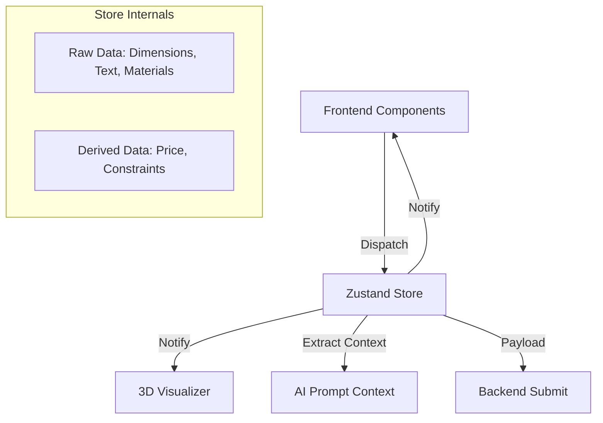

# System Design: State & Conversion Logic

## 1. Overview
The State System acts as the single source of truth for the client-side sign configuration. It bridges the gap between the interactive UI, the 3D visualizer, the pricing engine, and the AI context.

## 2. Goals & Non-Goals
**Goals**:
- Maintain deterministic state for the 3D configurator.
- Execute real-time pricing calculations locally for instant feedback.
- Provide a clean context object for the AI Assistant [REQ-004].

**Non-Goals**:
- Do not persist state to a database directly (done via Backend API).
- Do not store heavy 3D assets in state.

## 3. Architecture
Using the Flux/Zustand pattern. The store contains the raw data and pure functions for calculations.



## 4. Interface Design
- **Store Schema**:
  ```typescript
  interface SignProjectState {
    text: string;
    width: number;
    height: number;
    material: 'acrylic' | 'metal' | 'neon';
    color: string;
    price: number;
    // Actions
    updateText: (text: string) => void;
    calculatePrice: () => void;
    generateAiContext: () => string;
  }
  ```

## 5. Technology Stack
- **Framework**: Zustand (React hooks)
- **Math**: Pure TypeScript functions (extracted to `pricingEngine.ts`).

## 6. Trade-offs & Alternatives
- **Zustand vs Redux vs Context**: Zustand is chosen over Redux (too much boilerplate) and React Context (causes unnecessary re-renders for the 3D canvas). Zustand allows subscribing to partial state, which is critical for 60fps 3D rendering without re-rendering the whole UI.

## 7. Performance Considerations
- To prevent stutter in the 3D canvas when typing text, the text input updates may be debounced, or the 3D text generation may run in a Web Worker if it becomes a bottleneck.

## 8. Security Considerations
- The price calculated locally is strictly an "estimate". The backend or CRM should ideally re-verify pricing logic before final invoicing to prevent client-side tampering.
