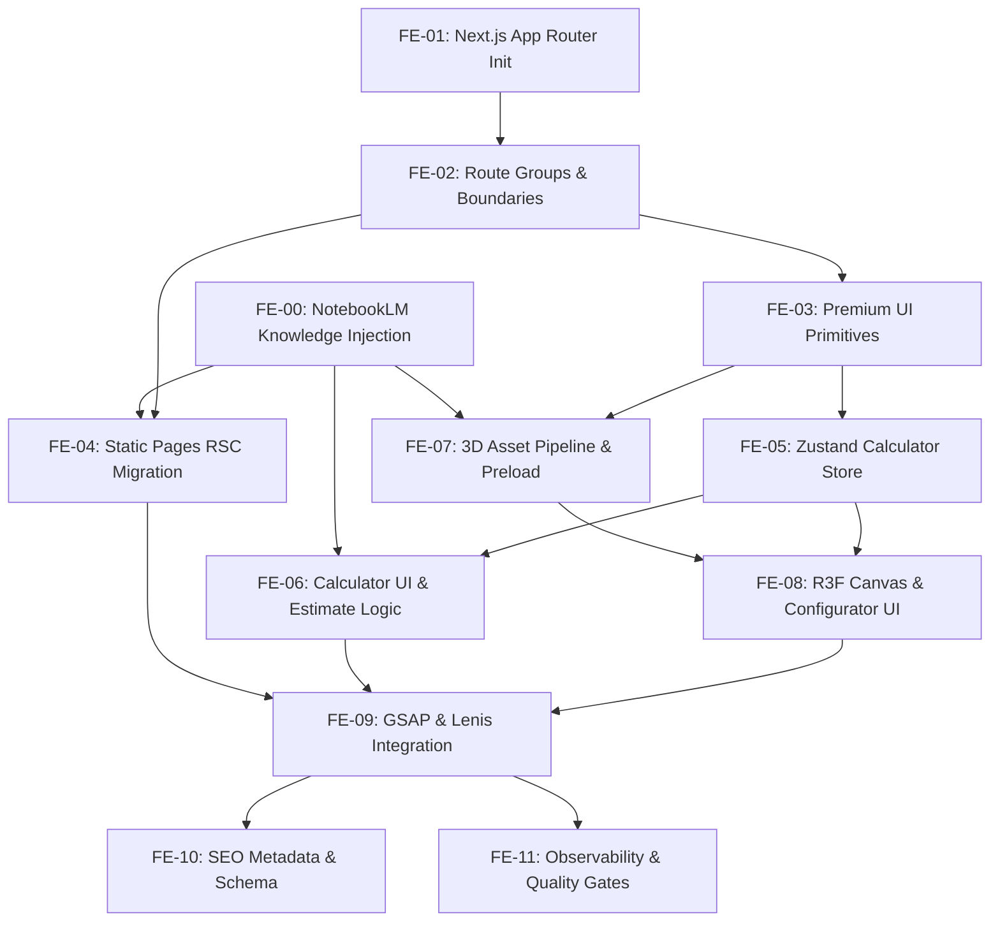

# Execution Blueprint & WBS (Work Breakdown Structure)

**Project:** Expoint ADV v2 Frontend Migration & System Upgrade
**Target Document:** `genesis/v2/05_TASKS.md`

## 1. Phase Overview

Based on the PRD, Architecture Overview, and Frontend System Design, the execution is broken down into 6 logical phases.

- **Phase 0: Knowledge Grounding & Content Development** (NotebookLM data extraction, material specs, pricing matrices)
- **Phase 1: Foundation & Architecture Stabilization** (Next.js App Router, Routing, Server/Client boundaries)
- **Phase 2: Premium Design System** (UI Primitives, Tailwind v4 integration)
- **Phase 3: Calculator Conversion Engine** (Zustand store, multi-step forms, backend API contract)
- **Phase 4: 3D Configurator** (React-Three-Fiber, dynamic loading, rendering modes)
- **Phase 5: Motion Governance** (GSAP, Lenis Smooth Scroll, accessibility)
- **Phase 6: SEO, AEO & Observability** (Metadata, Schema.org, Lead capture)

---

## 2. Dependency Graph

---

## 3. Detailed Task List (WBS)

### Phase 0: Knowledge Grounding & Content Development

- [x] **[FE-00] NotebookLM Knowledge Extraction & Grounding** [COMPLETED]
  - **Goal**: Convert research findings (Materials, Pricing Matrices, Cases) into structured TypeScript data files in `src/data/`.
  - **Input**: `04_SYSTEM_DESIGN/_research/*.md`
  - **Output**: `src/data/materials.ts`, `src/data/pricing-matrix.ts`, `src/data/cases.ts`, `src/data/services.ts`.
  - **Verification**: Files exist and contain valid TS interfaces that match system design.
  - **Dependencies**: None

### Phase 1: Foundation & Architecture Stabilization

- [x] **[FE-01] Initialize Next.js App Router Architecture** [COMPLETED]
  - **Goal**: Scaffold the `/app` directory, migrate Vite configuration to Next.js configuration.
  - **Input**: `04_SYSTEM_DESIGN/frontend-system.md`
  - **Output**: `next.config.ts`, `app/layout.tsx`, `app/page.tsx`
  - **Verification**: `npm run dev` starts Next.js successfully on port 3000.
  - **Dependencies**: None

- [x] **[FE-02] Define Route Groups & Client Boundaries** [COMPLETED]
  - **Goal**: Create `(marketing)`, `(catalog)`, `(calculator)` route groups and strictly separate client/server components.
  - **Input**: `frontend-discovery-report.md`
  - **Output**: Folder structure, `'use client'` tags added to interactive elements.
  - **Verification**: Build succeeds without Server Component errors for client hooks.
  - **Dependencies**: [FE-01]

### Phase 2: Premium Design System

- [/] **[FE-03] Implement Premium UI Primitives** [IN PROGRESS]
  - **Goal**: Build reusable accessible components (Button, Card, Stepper, PriceRange) using Tailwind v4.
  - **Input**: `04_SYSTEM_DESIGN/frontend-system.md` (Design Direction)
  - **Output**: `components/ui/*.tsx`
  - **Verification**: Storybook/UI page renders all primitives correctly.
  - **Dependencies**: [FE-02]

- [/] **[FE-04] Migrate Static Sections to React Server Components (RSC)** [IN PROGRESS]
  - **Goal**: Convert Hero, Services, Footer, Cases, and FAQ from standard React components to RSCs.
  - **Input**: Existing `src/components/sections/*.tsx`
  - **Output**: Refactored components in `app/(marketing)/page.tsx`
  - **Verification**: Network tab confirms HTML payload contains pre-rendered content.
  - **Dependencies**: [FE-02]

### Phase 3: Calculator Conversion Engine

- [ ] **[FE-05] Setup Zustand Calculator Store & Validation**
  - **Goal**: Create the interactive state for project parameters, integrating Zod schemas.
  - **Input**: `04_SYSTEM_DESIGN/frontend-system.md` (Store Shape)
  - **Output**: `store/useCalculatorStore.ts`, `lib/validators/quote.ts`
  - **Verification**: Unit tests pass for state mutations and validation.
  - **Dependencies**: [FE-03]

- [ ] **[FE-06] Build Calculator UI & Estimate Logic**
  - **Goal**: Implement the multi-step guided calculator and preliminary pricing formula logic (client-side preview only).
  - **Input**: `04_SYSTEM_DESIGN/frontend-system.md` (Calculator Domain)
  - **Output**: `components/calculator/*`, `lib/pricingPreview.ts`
  - **Verification**: User can navigate steps and see an estimated price range.
  - **Dependencies**: [FE-05]

### Phase 4: 3D Configurator

- [ ] **[FE-07] Setup 3D Asset Pipeline & Fallbacks**
  - **Goal**: Configure Draco compression, load models, and establish static fallback images.
  - **Input**: `01_PRD.md` [REQ-002]
  - **Output**: `lib/three/assets.ts`, `public/models/*`
  - **Verification**: Assets load locally without WebGL errors.
  - **Dependencies**: [FE-03]

- [ ] **[FE-08] Implement R3F Canvas & Configurator UI**
  - **Goal**: Build the `SignConfigurator` component, bind it to Zustand store, and implement dynamic import (`ssr: false`).
  - **Input**: `04_SYSTEM_DESIGN/frontend-system.md` (3D Configurator Domain)
  - **Output**: `components/three/SignConfigurator.tsx`
  - **Verification**: Changing text/material in calculator updates the 3D model in real-time.
  - **Dependencies**: [FE-05], [FE-07]

### Phase 5: Motion Governance

- [ ] **[FE-09] Integrate GSAP & Lenis Smooth Scroll**
  - **Goal**: Add premium scroll-driven animations and a MotionPolicy configuration to respect `prefers-reduced-motion`.
  - **Input**: `04_SYSTEM_DESIGN/frontend-system.md` (Motion Governance)
  - **Output**: `components/motion/MotionProvider.tsx`, `config/motion-policy.ts`
  - **Verification**: Smooth scrolling works, GSAP timelines fire correctly on scroll, animations disable on low power mode.
  - **Dependencies**: [FE-04], [FE-06], [FE-08]

### Phase 6: SEO, AEO & Observability

- [x] **[FE-10] Implement SEO Metadata & Schema.org Layer** [COMPLETED]
  - **Goal**: Add `generateMetadata` and JSON-LD schema (LocalBusiness, Product, FAQPage) to all pages.
  - **Input**: `04_SYSTEM_DESIGN/frontend-system.md` (SEO Architecture)
  - **Output**: `lib/seo/schema.ts`, `app/**/page.tsx` metadata exports.
  - **Verification**: Google Rich Results Test validates schemas.
  - **Dependencies**: [FE-04]

- [ ] **[FE-11] Configure Analytics & Quality Gates**
  - **Goal**: Implement lead tracking events and integrate Lighthouse/Bundle analyzers.
  - **Input**: `04_SYSTEM_DESIGN/frontend-system.md` (Observability)
  - **Output**: `modules/analytics/events.ts`, `.github/workflows/quality.yml` (if applicable).
  - **Verification**: Lighthouse scores > 90 for Performance, Accessibility, and SEO.
  - **Dependencies**: [FE-10]

---

## 4. Execution Strategy

- **Sequential Execution**: Phase 1 -> Phase 2 must be completed strictly in order, as Next.js layout and routing are foundational.
- **Parallel Execution**: Phase 3 (Calculator) and Phase 4 (3D Configurator) can be executed in parallel since they both rely on the Zustand store contract but are visually independent.
- **Testing**: E2E testing (Playwright) should be implemented immediately after Phase 3 and Phase 4 to lock in the conversion flows.
