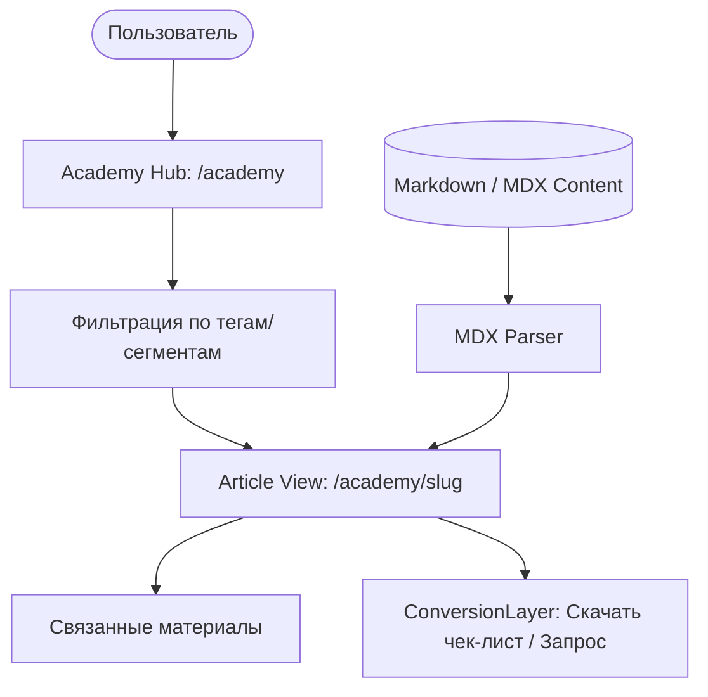

# System Design: AcademyPlatform

## Overview
Система `AcademyPlatform` (Экспертная Академия) предназначена для капитализации базы знаний (19 research-документов из NotebookLM). Её главная цель — выстроить абсолютный технический авторитет (Thought Leadership) в глазах B2B-заказчика, предоставляя глубокие экспертные материалы, руководства и разборы сложных кейсов.

## Architecture Diagram

## Data Management
- **Технология**: **MDX** (Markdown + JSX). Это позволит встраивать интерактивные React-компоненты (например, калькуляторы цены или мини-3D вьюеры) прямо в текст экспертных статей.
- **Хранилище**: Локальные `.mdx` файлы в `src/content/academy/` (в перспективе — интеграция с Headless CMS).

## Key Features
1. **Rich Typography**: Кинематографичная типографика, оптимизированная для чтения длинных текстов (Long-reads), поддержка темной темы.
2. **Floating TOC (Table of Contents)**: Плавающее оглавление для удобной навигации по сложным техническим лонгридам.
3. **Smart Linking**: Контент должен быть кросс-линкован. Например, статья про правила 902-ПП должна иметь прямую ссылку на `ComplianceHub` (интерактивный аудит).
4. **Gated Content**: Самые ценные материалы (например, PDF "Гайд по согласованию крышных установок") могут быть скрыты за формой (Lead Capture).

## Integration with NotebookLM
Материалы из базы NotebookLM будут служить «сырьем». Процесс:
1. Запрос к NotebookLM: "Сделай выжимку по материалам для световых коробов".
2. Редактура и преобразование в MDX.
3. Публикация в AcademyPlatform.

## SEO Strategy
Академия — главный драйвер органического B2B-трафика. Каждая статья будет иметь строгую семантическую разметку (Schema.org `Article` / `TechArticle`) и оптимизированный URL (Slug).

---

**Следующая система: `ConversionLayer`** (Механика превращения вовлеченности в заявки). 
Переходим к ней?
