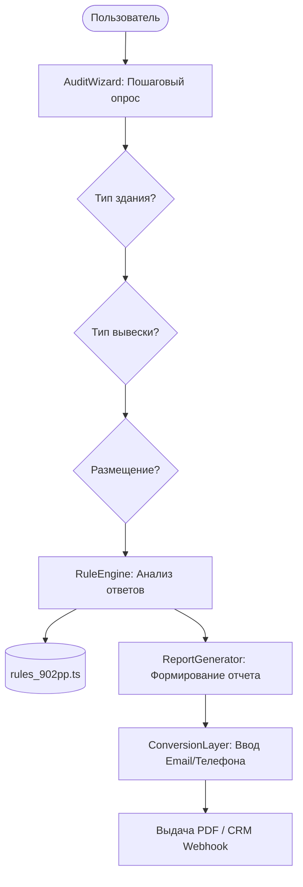

# System Design: ComplianceHub

## Overview
Система `ComplianceHub` (Центр Комплаенса) — это интерактивный инструмент для B2B-клиентов, позволяющий провести предварительный аудит вывески на соответствие постановлению 902-ПП (г. Москва). Это мощный лидогенерирующий инструмент (Lead Magnet), который формирует экспертный статус (Trust Signal) и конвертирует холодный трафик в теплые лиды.

## Architecture Diagram


## Component Breakdown

### 1. `AuditWizard` (Client Component)
Многошаговый интерактивный опросник.
- **Состояние**: Управляется через `useReducer` или Zustand для сохранения прогресса.
- **UX**: Анимации перехода (Framer Motion), прогресс-бар, визуальные подсказки (иконки для типов зданий/вывесок).

### 2. `RuleEngine` (Logic Layer)
Ядро проверки, изолированное от UI.
- Хранит актуальные ограничения 902-ПП.
- Принимает стейт опросника, возвращает `AuditStatus` (Green, Yellow, Red) и список потенциальных нарушений.

### 3. `ReportGenerator` & `LeadCapture`
- Показывает краткое резюме ("Обнаружено 2 возможных нарушения").
- Для получения детального отчета с рекомендациями пользователю предлагается оставить контакт (интеграция с `ConversionLayer`).

## Interface Design
```typescript
interface AuditState {
  buildingType: 'residential' | 'commercial' | 'historic' | null;
  signType: 'wall' | 'cantilever' | 'roof' | 'window' | null;
  placement: 'facade' | 'stylobate' | null;
  hasLogo: boolean | null;
}

interface AuditResult {
  status: 'safe' | 'warning' | 'critical';
  issues: string[];
  recommendations: string[];
}
```

## Security & Performance
- Основная логика `RuleEngine` может выполняться на клиенте для мгновенного отклика (Zero-latency).
- Отправка контактов (Lead Capture) защищена анти-спам механизмом (Turnstile/reCAPTCHA v3) перед триггером CRM-вебхука.

## Path Forward
Текущая секция `Safety.tsx` будет переработана. Вместо статического текста она станет точкой входа (CTA-блоком), ведущим на полноформатный интерактивный маршрут `/compliance/audit`.
