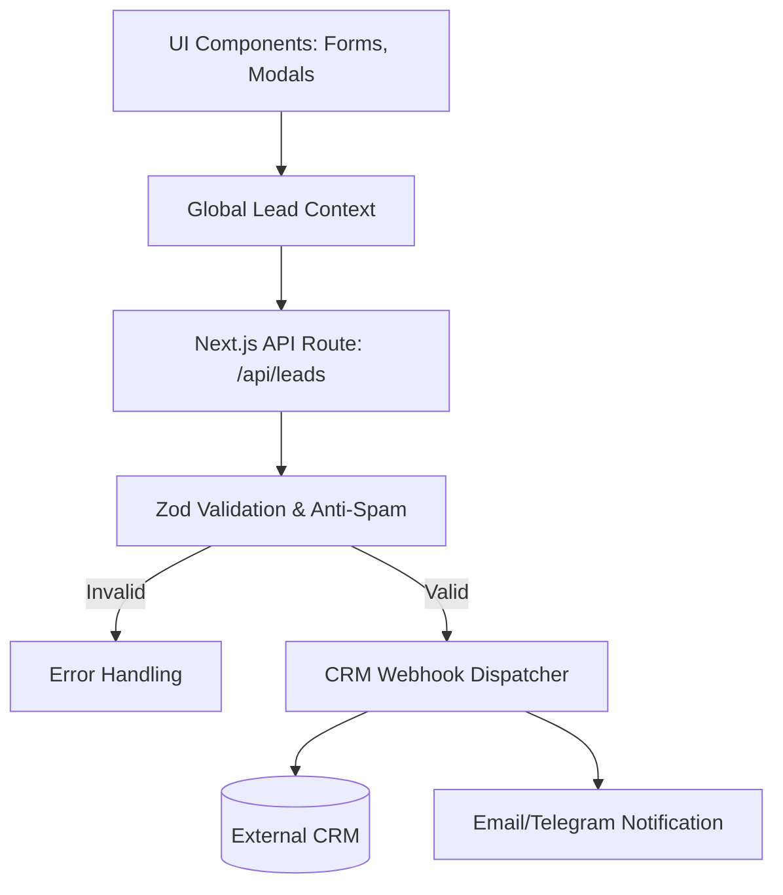

# System Design: ConversionLayer

## Overview
Система `ConversionLayer` (Слой Конверсии) — это унифицированная инфраструктура для захвата лидов, обработки заявок и интеграции с внешними CRM (Bitrix24, amoCRM). Она обеспечивает бесшовный опыт конверсии на любом этапе клиентского пути (от запроса консультации до скачивания гайда из Академии).

## Architecture Diagram


## Core Components

### 1. Умные формы (Smart Forms)
- **Прогрессивное профилирование**: Если мы уже знаем имя клиента из предыдущего шага (например, в аудите), форма запросит только недостающий телефон.
- **Micro-interactions**: Анимации успешной отправки, инлайн-валидация полей без перезагрузки, маски для телефонов.

### 2. Маршрутизация заявок (Lead Routing)
Каждый лид обогащается контекстом:
- `source`: откуда пришел лид (Hero, Academy, ComplianceHub).
- `segment`: к какому B2B-сегменту относится (если известно).
- `utm_tags`: для сквозной аналитики.

```typescript
interface LeadPayload {
  name?: string;
  contact: string; // Phone or Email
  source: 'header_cta' | 'compliance_audit' | 'academy_download' | '3d_configurator';
  metadata: {
    segment?: string;
    auditStatus?: string;
    requestedDocument?: string;
    utm?: Record<string, string>;
  };
}
```

### 3. API & Интеграции
- **Роут**: `src/app/api/leads/route.ts` (Next.js Serverless Function).
- **Безопасность**: Защита от спама (Cloudflare Turnstile или Google reCAPTCHA v3) перед отправкой вебхука.
- **Отказоустойчивость**: Механизм retry (повторных попыток) на случай, если API CRM временно недоступно.

## UI/UX Integration
- `ConversionLayer` предоставляет глобальные компоненты (через Zustand или Context API), такие как `CommandMenu` (⌘+K для быстрого запроса) или плавающие виджеты (Floating CTA), которые контекстно меняются в зависимости от того, на какой странице находится пользователь.

---

**Все 4 ключевые системы (SegmentEngine, ComplianceHub, AcademyPlatform, ConversionLayer) успешно спроектированы.**

В соответствии с вашими указаниями ("все по очереди"), следующим логическим шагом является создание **WBS (Work Breakdown Structure)** — разбивка этой архитектуры на конкретные задачи для выполнения (`05_TASKS.md`). 

Запустить процесс генерации чертежа задач (Blueprint)?
