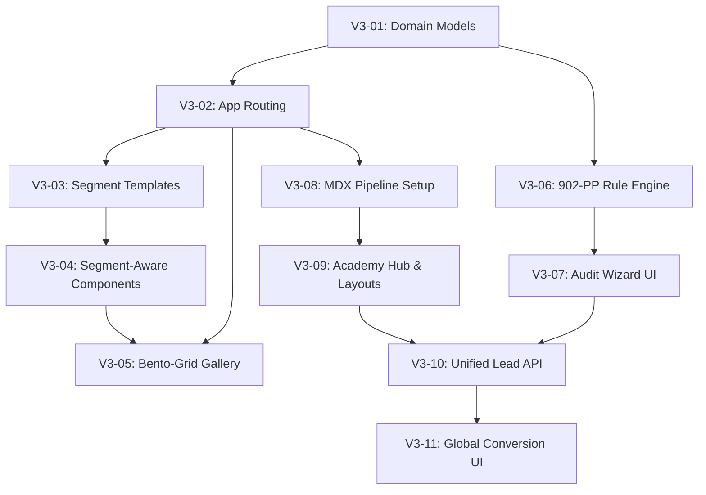

# Execution Blueprint & WBS (Work Breakdown Structure)

**Project:** Expoint ADV v3 (B2B Industrial Engine)
**Target Document:** `genesis/v3/05_TASKS.md`

## 1. Phase Overview

В соответствии с глубокой архитектурной проработкой `v3` (System Design), реализация разбита на высокогранулярные фазы с четкими критериями приемки и валидации.

- **Phase 1: Foundation Data & Routing** (Централизация контента сегментов, правил 902-ПП и маршрутов Next.js).
- **Phase 2: Segment Engine Implementation** (Динамическая адаптация B2B-посадочных страниц).
- **Phase 3: Portfolio & Gallery Evolution** (Разработка компактной премиум-галереи).
- **Phase 4: Compliance Hub** (Инструмент интерактивного аудита 902-ПП).
- **Phase 5: Academy Platform** (MDX-движок для базы знаний NotebookLM).
- **Phase 6: Global Conversion Layer** (Умные формы, антиспам, интеграция CRM).

---

## 2. Dependency Graph

---

## 3. Detailed Task List (WBS)

### Phase 1: Foundation Data & Routing

- [x] **[V3-01] Define Segment & Compliance Domain Models**
  - **Goal**: Создать типизированные конфигурации для B2B-отраслей и нормативов 902-ПП (вынос логики из компонентов в данные).
  - **Input**: `concept_model.json`, `Safety.tsx` (существующая логика).
  - **Output**: `src/data/segments.ts`, `src/data/rules_902pp.ts`.
  - **Verification**: Модели компилируются, типы экспортируются без ошибок.
  - **Dependencies**: None

- [x] **[V3-02] App Router & Route Group Restructuring**
  - **Goal**: Настроить структуру каталогов Next.js (App Router) для новых путей V3.
  - **Input**: `Architecture Overview`.
  - **Output**: `src/app/(marketing)/segments/[id]/`, `src/app/(marketing)/academy/`, `src/app/(marketing)/compliance/`.
  - **Verification**: Сборка Next.js проходит без конфликтов путей.
  - **Dependencies**: [V3-01]

### Phase 2: Segment Engine Implementation

- [x] **[V3-03] Implement Segment Templates & Static Generation**
  - **Goal**: Реализовать генерацию статических страниц для каждого сегмента для макс. скорости и SEO.
  - **Input**: `src/data/segments.ts`.
  - **Output**: `src/app/(marketing)/segments/[id]/page.tsx` (с `generateStaticParams`).
  - **Verification**: `next build` предрендерит пути (например, `/segments/retail`).
  - **Dependencies**: [V3-02]

- [x] **[V3-04] Refactor Core Sections for Segment-Awareness**
  - **Goal**: Адаптировать существующие секции (`Hero`, `Benefits`) для приема `SegmentData` и динамической смены контента.
  - **Input**: `src/components/sections/Hero.tsx`, `Benefits.tsx`.
  - **Output**: Обновленные компоненты.
  - **Verification**: Смена URL приводит к смене H1, УТП и фонов без перезагрузки (Next.js Link).
  - **Dependencies**: [V3-03]

### Phase 3: Portfolio & Gallery Evolution

- [x] **[V3-05] Implement Compact Bento-Grid Gallery**
  - **Goal**: Создать элегантную, не перегружающую экран галерею для портфолио из локальных `img/`.
  - **Input**: `/Users/user/projects/Expoint_ADV Tabs/img`.
  - **Output**: `src/components/sections/PortfolioMini.tsx`.
  - **Verification**: Изображения оптимизированы (Next/Image), сетка не ломается на мобильных, нет огромных полноэкранных превью.
  - **Dependencies**: [V3-04]

### Phase 4: Compliance Hub

- [x] **[V3-06] Implement 902-PP Rule Engine**
  - **Goal**: Изолировать логику расчета допустимости вывесок по параметрам здания/вывески.
  - **Input**: `src/data/rules_902pp.ts`.
  - **Output**: `src/lib/compliance.ts` (функции калькулятора).
  - **Verification**: Unit-тесты для функции `calculateCompliance(params)` проходят успешно.
  - **Dependencies**: [V3-01]

- [x] **[V3-07] Develop 902-PP Audit Wizard UI**
  - **Goal**: Интерактивный UI с прогресс-баром и анимациями переходов.
  - **Input**: `src/lib/compliance.ts`.
  - **Output**: `src/components/compliance/AuditWizard.tsx`, `AuditResult.tsx`.
  - **Verification**: Пользователь может пройти 3 шага и увидеть статус (безопасно/внимание).
  - **Dependencies**: [V3-06], [V3-02]

### Phase 5: Academy Platform

- [x] **[V3-08] Setup MDX Processing Pipeline**
  - **Goal**: Интегрировать MDX для парсинга локальных markdown статей.
  - **Input**: NotebookLM data.
  - **Output**: Установка `@next/mdx`, `src/lib/mdx.ts`.
  - **Verification**: Рендер тестового `.mdx` файла проходит успешно с Tailwind Typography.
  - **Dependencies**: [V3-02]

- [x] **[V3-09] Build Academy Hub & Article Layouts**
  - **Goal**: Создать каталог статей и layout для глубокого чтения (TOC, навигация).
  - **Input**: Дизайн Академии.
  - **Output**: `src/app/(marketing)/academy/page.tsx`, `[slug]/page.tsx`.
  - **Verification**: Страницы статей корректно отображают код, списки и оглавление.
  - **Dependencies**: [V3-08]

### Phase 6: Global Conversion Layer

- [x] **[V3-10] Unify Lead API & Anti-Spam**
  - **Goal**: Единый Route Handler для сбора лидов, валидации Zod и интеграции Turnstile.
  - **Input**: `ConversionLayer.md`.
  - **Output**: `src/app/api/leads/route.ts`, `src/lib/validators/lead.ts`.
  - **Verification**: API возвращает 400 при неверных данных, 200 при успешной мок-отправке в CRM.
  - **Dependencies**: [V3-07], [V3-09]

- [x] **[V3-11] Deploy Global Conversion UI**
  - **Goal**: Обновленные плавающие модалки и Command Menu для мгновенного доступа к заявке с обогащением контекста (source/segment).
  - **Input**: `src/app/api/leads/route.ts`.
  - **Output**: `src/components/ui/ConsultationModal.tsx`.
  - **Verification**: Вызов модалки из `ComplianceHub` передает в CRM статус "Запрошен детальный отчет по 902-ПП".
  - **Dependencies**: [V3-10]

---

## 4. Execution Rules

- Строго следовать последовательности: Phase 1 → Phase 2.
- Запуск Phase 3, 4 и 5 можно параллелить после завершения базовой маршрутизации.
- Каждый шаг должен завершаться запуском `npm run build` для проверки отсутствия ошибок TypeScript/ESLint.
