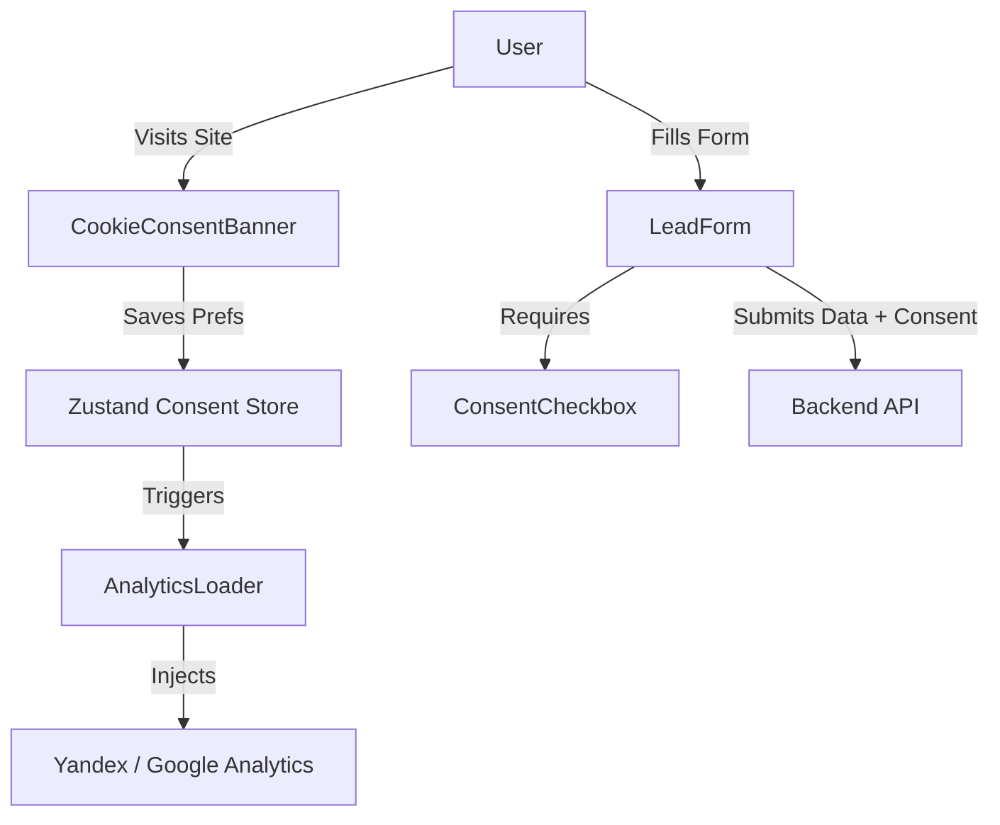

# System Design: Content Delivery Frontend

## 1. Overview
The Content Delivery Frontend manages the presentation of legal documents and user interfaces for gathering privacy and marketing consent in compliance with Russian 152-FZ and global standards.

## 2. Goals & Non-Goals
**Goals**: Provide clear, accessible legal pages; capture explicit consent via forms; block third-party analytics/marketing scripts until consent is granted.
**Non-Goals**: Managing the physical storage of consent logs (handled by backend).

## 3. Background & Context
Part of the Genesis v4 Compliance & Security Remediation.
Related PRD: [REQ-001] Legal Pages and Consent, [REQ-003] Cookie Consent Management.

## 4. Architecture


## 5. Interface Design
- **Global State**: `useConsentStore` (Zustand).
- **Properties**: `analyticsConsent` (boolean), `marketingConsent` (boolean).
- **Methods**: `acceptAll()`, `rejectAll()`, `savePreferences(prefs)`.

## 6. Data Model
Form Payload Extension:
```json
{
  "formData": { ... },
  "consent": {
    "type": "personal_data",
    "version": "v1.0",
    "timestamp": "ISO8601"
  }
}
```

## 7. Technology Stack
- Next.js 15 App Router (React)
- Zustand (State management)
- `next/script` (Conditional script loading)

## 8. Trade-offs & Alternatives
- **Zustand vs React Context**: Zustand selected to prevent unnecessary re-renders of the entire layout when consent state changes, allowing precise subscriptions for the script loaders.
- **Cookies vs LocalStorage for State Persistence**: Cookies selected to allow future SSR optimizations (e.g., edge middleware geo-blocking), though client-side reading is required for hydration.

## 9. Security Considerations
- Consent cookies must be set with `Secure` and `SameSite=Lax`.
- Default state for all non-essential scripts is strictly `denied`.

## 10. Performance Considerations
- The Cookie Banner should be dynamically imported (lazy-loaded) to avoid blocking the initial render for returning users.

## 11. Testing Strategy
- Unit tests for the Zustand store.
- E2E testing (Playwright/Cypress) to verify that network requests to third-party domains do not fire until the "Accept" button is clicked.
