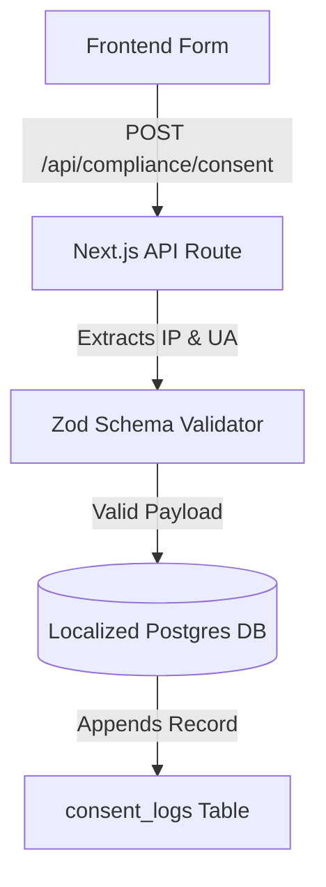

# System Design: Data Logging Layer (Consent DB)

## 1. Overview
The Data Logging Layer is a backend service responsible for securely and immutably recording user consent for personal data processing and marketing, ensuring compliance with 152-FZ and providing a verifiable audit trail.

## 2. Goals & Non-Goals
**Goals**: Provide an append-only audit trail of user consent. Securely store metadata (timestamp, policy version).
**Non-Goals**: Processing the actual lead data (CRM forwarding happens after consent is logged).

## 3. Background & Context
Part of the Genesis v4 Compliance & Security Remediation.
Related PRD: [REQ-002] Consent Logging, [REQ-004] Data Localization.

## 4. Architecture


## 5. Interface Design
**Endpoint**: `POST /api/compliance/consent`
**Payload**:
```ts
{
  formId: string;
  purposes: ("personal_data" | "marketing")[];
  policyVersion: string;
  // userAgent and IP extracted from headers
}
```

## 6. Data Model
`consent_logs` table (Append-Only):
- `id`: UUID (PK)
- `session_id` / `user_id`: String (Pseudonymized identifier)
- `purpose`: String (e.g., 'personal_data')
- `status`: Enum ('GRANTED', 'WITHDRAWN')
- `timestamp`: DateTime (Default Now)
- `form_id`: String
- `policy_version`: String
- `ip_address`: String (Encrypted or masked)
- `user_agent`: String

## 7. Technology Stack
- Next.js 15 API Routes (Node.js runtime)
- Postgres (Hosted in Russian Federation)
- Drizzle ORM or Prisma (Type-safe DB access)
- Zod (Input validation)

## 8. Trade-offs & Alternatives
- **Append-Only vs Mutable Table**: Selected append-only. To comply with audit requirements, if a user revokes consent, a new `status: 'WITHDRAWN'` row is added rather than overwriting the `status: 'GRANTED'` row.
- **Node.js Runtime vs Edge**: Selected Node.js. Direct database connections (like Postgres TCP) are often problematic on Edge runtimes without connection pooling proxies.

## 9. Security Considerations
- **SQL Injection**: Prevented by using an ORM.
- **Data Minimization**: IP addresses should be masked (e.g., drop the last octet) if full precision is not strictly required by the legal team, balancing auditability with privacy.
- **Access Control**: The `consent_logs` table should be strictly limited to append operations for the web application user. Only administrators/DPOs can read it.

## 10. Performance Considerations
- Database inserts should be fast. Ensure the API route responds quickly to not block the user's form submission flow.

## 11. Testing Strategy
- Integration tests verifying that a `GRANTED` record is successfully written.
- Tests verifying that missing required fields (like `policyVersion`) return a 400 Bad Request.
