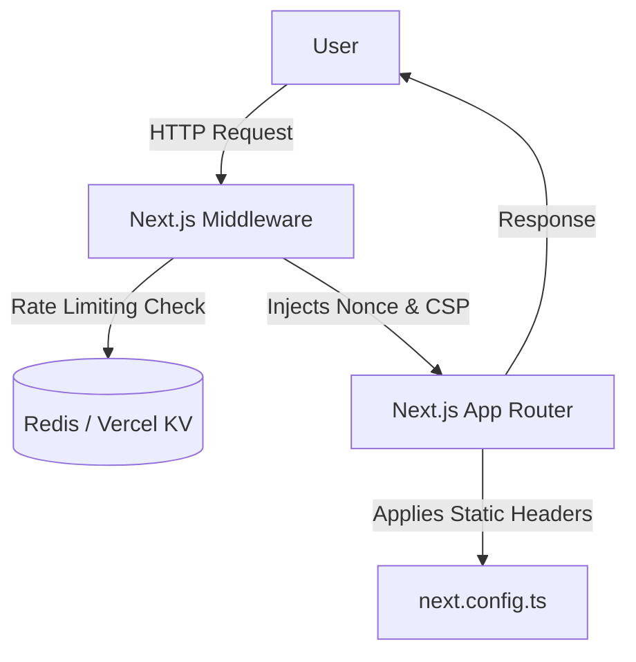

# System Design: Infrastructure & Security

## 1. Overview
The Infrastructure & Security system protects the Expoint ADV platform from web vulnerabilities (XSS, Clickjacking) and enforces network-level policies required for 152-FZ compliance.

## 2. Goals & Non-Goals
**Goals**: Enforce strict HTTP security headers, prevent spam/brute-force via rate limiting, establish backup and disaster recovery protocols.
**Non-Goals**: Managing user permissions inside the CMS (handled by auth system).

## 3. Background & Context
Part of the Genesis v4 Compliance & Security Remediation.
Related PRD: [REQ-005] Security Hardening.

## 4. Architecture

## 5. Interface Design
- **next.config.ts**: Static headers applied to all routes (HSTS, X-Content-Type-Options, Referrer-Policy).
- **middleware.ts**: Dynamic Content-Security-Policy (CSP) injection with request-specific nonces.

## 6. Technology Stack
- Next.js Edge Middleware
- Vercel KV or Upstash Redis (Rate Limiting)
- Docker / Nginx (If self-hosted proxy)

## 7. Trade-offs & Alternatives
- **Static vs Dynamic CSP**: A static CSP with `unsafe-inline` is easier to implement but provides weak XSS protection. A dynamic nonce-based CSP requires `middleware.ts` and forces dynamic rendering for pages utilizing the nonce, which slightly impacts caching but significantly boosts security.
- **Rate Limiting at Edge vs API Route**: Implementing rate limiting at the Edge (Middleware) is preferred because it drops malicious traffic before it consumes Node.js server resources.

## 8. Security Considerations
- The CSP will initially be deployed using `Content-Security-Policy-Report-Only` to monitor violations from legitimate scripts (Metrica, Analytics) without breaking the site functionality.
- Database backups must be automated (e.g., pg_dump cron job) and stored securely, preferably offsite or in a separate localized cloud bucket.

## 9. Performance Considerations
- The edge middleware execution must be kept extremely lightweight (under 10ms) to avoid adding noticeable latency to every request.

## 10. Testing Strategy
- Use tools like Mozilla Observatory or SecurityHeaders.com to verify header presence.
- Simulate DDoS or brute-force form submissions to trigger and verify the rate limiting logic (e.g., HTTP 429 response).
