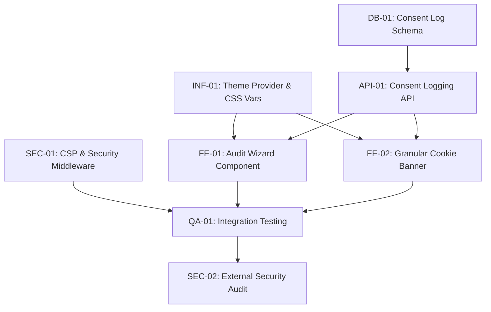

# Genesis v4: Execution Tasks (Blueprint)

## 1. Phase Overview
*   **Phase 1: Foundation (Infrastructure & Styling)** - Establishes the core security middleware and the premium theme system.
*   **Phase 2: Data Layer (Logging)** - Sets up the append-only database schema for 152-FZ compliance.
*   **Phase 3: Frontend Compliance Hub** - Builds the user-facing consent management and audit wizard.
*   **Phase 4: Integration & Validation** - End-to-end testing and security auditing.

## 2. Dependency Graph

## 3. Detailed Task List (WBS)

### Phase 1: Foundation (Infrastructure & Styling)

*   [ ] **[INF-01] Implement Theme System**
    *   **Goal**: Setup `next-themes`, CSS variables, and light/dark toggle.
    *   **Input**: `04_SYSTEM_DESIGN/theme-styling-system.md`
    *   **Output**: `app/layout.tsx` (ThemeProvider), `app/globals.css` (variables), `tailwind.config.ts`, `components/ThemeToggle.tsx`.
    *   **Verification**: Toggling theme changes background/foreground without FOUC.
    *   **Dependencies**: None

*   [ ] **[SEC-01] Configure Security Middleware**
    *   **Goal**: Implement strict Content Security Policy (CSP) with nonces and standard security headers.
    *   **Input**: `04_SYSTEM_DESIGN/infrastructure-security.md`
    *   **Output**: `middleware.ts`, `next.config.ts` (if applicable).
    *   **Verification**: Inspect network tab; `Content-Security-Policy` and `Strict-Transport-Security` headers are present.
    *   **Dependencies**: None

### Phase 2: Data Layer (Logging)

*   [ ] **[DB-01] Initialize Consent DB Schema**
    *   **Goal**: Create an append-only table for consent logs located in the RF.
    *   **Input**: `04_SYSTEM_DESIGN/data-logging-layer.md`
    *   **Output**: SQL migration file or Prisma schema.
    *   **Verification**: Database instance accepts the schema without errors.
    *   **Dependencies**: None

*   [ ] **[API-01] Create Consent Logging API Endpoint**
    *   **Goal**: Build a secure Next.js Route Handler to receive and store consent records.
    *   **Input**: `04_SYSTEM_DESIGN/data-logging-layer.md`
    *   **Output**: `app/api/consent/route.ts`
    *   **Verification**: POST request with valid payload returns 201 Created and inserts into DB.
    *   **Dependencies**: [DB-01]

### Phase 3: Frontend Compliance Hub

*   [ ] **[FE-01] Develop Audit Wizard Component**
    *   **Goal**: Refactor/Implement the interactive compliance wizard with the new theme system.
    *   **Input**: `AuditWizard.tsx` (provided by user), `04_SYSTEM_DESIGN/theme-styling-system.md`.
    *   **Output**: `components/compliance/AuditWizard.tsx`
    *   **Verification**: Component renders correctly in both light/dark modes and completes its flow.
    *   **Dependencies**: [INF-01]

*   [ ] **[FE-02] Implement Granular Cookie Banner & Consent Manager**
    *   **Goal**: Build the UI and Zustand store for managing user consents across categories.
    *   **Input**: `04_SYSTEM_DESIGN/content-delivery-frontend.md`
    *   **Output**: `components/compliance/CookieBanner.tsx`, `store/consentStore.ts`.
    *   **Verification**: Accepting/Rejecting specific categories updates the store and fires [API-01].
    *   **Dependencies**: [INF-01], [API-01]

### Phase 4: Integration & Validation

*   [ ] **[QA-01] End-to-End Integration Testing**
    *   **Goal**: Verify the entire flow from banner click to DB insertion with active CSP.
    *   **Input**: All previous tasks.
    *   **Output**: Test execution logs or documentation.
    *   **Verification**: Consent is logged successfully, UI updates, no CSP errors in console.
    *   **Dependencies**: [SEC-01], [FE-01], [FE-02]

*   [ ] **[SEC-02] Final Security Audit**
    *   **Goal**: Validate headers using external tools (e.g., SecurityHeaders.com or local curl).
    *   **Input**: Deployed staging URL or local build.
    *   **Output**: Audit report in `genesis/v4/06_CHANGELOG.md` or a new artifact.
    *   **Verification**: Grade 'A' on security headers audit.
    *   **Dependencies**: [QA-01]

## 4. Execution Strategy
1.  **Parallel Execution**: Phase 1 and Phase 2 can be executed in parallel by different agents/developers.
2.  **Sequential Blockers**: Phase 3 requires the Theme System (INF-01) for styling and the API (API-01) for data binding.
3.  **Final Polish**: Phase 4 must strictly follow the completion of Phases 1-3.
