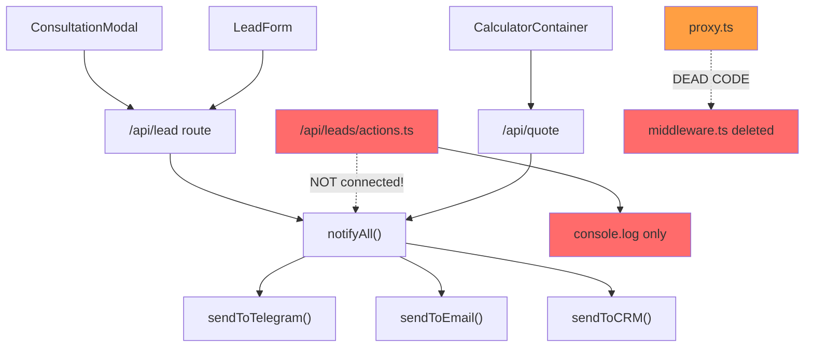

# 🕵️ Scout Risk Report — Expoint ADV Tabs

**Project**: Expoint ADV Tabs (Next.js 16 + React 19 + Tailwind 4)  
**Analysis Date**: 2026-05-13  
**Analyst**: Scout Agent  
**Genesis Version**: v5  
**Status**: 🟡 PROCEED WITH CAUTION

---

## 1. Executive Summary

**Recommendation: 🟡 Proceed — но с обязательным устранением критических рисков перед production.**

Проект `Expoint_ADV Tabs` — коммерческий лендинг/платформа для рекламного бизнеса (наружная реклама) с AI-ассистентом, калькулятором цен, системой лидогенерации, compliance-модулем (152-ФЗ) и академией контента.

### Ключевые метрики

| Метрика | Значение | Оценка |
|---|---|---|
| Файлов в проекте | ~3 894 | Крупный проект |
| LOC (src/) | ~10 773 | Средний размер кодовой базы |
| Коммитов в git | 2 | 🔴 Критически мало |
| Авторов | 1 (corearte@yandex.ru) | 🔴 Bus Factor = 1 |
| API маршрутов | 9 | Нормально |
| Тестов | **0** | 🔴 Нет ни одного теста |
| Genesis-итераций | v1–v4 | Активная итерация архитектуры |
| Незакоммиченных изменений | 6 файлов (226+, 132-) | 🟡 Есть dirty state |

---

## 2. 🚨 Top 3 Critical Risks (The "Mines")

### RISK-001: Полное отсутствие тестов — CRITICAL

> **CAUTION:** В проекте **нет ни одного unit/integration/e2e теста**. Нет конфигов Jest, Vitest, Playwright. Директория `test-results/` содержит только `.last-run.json` — артефакт от deleted playwright config.

**Severity**: 🔴 CRITICAL  
**Likelihood**: Certain  
**Impact**: Любое изменение может сломать production без обнаружения  
**Evidence**: `find src -name '*.test.*' -o -name '*.spec.*'` → 0 результатов; нет `jest.config.*`, `vitest.config.*`, `playwright.config.*`  
**Mitigation**: Написать минимальный smoke-тест для API маршрутов (`/api/lead`, `/api/quote`, `/api/health`) + unit-тест для `security.ts`, `pricingEngine.ts`

---

### RISK-002: Middleware удалён, но proxy не активирован — HIGH

> **WARNING:** `src/middleware.ts` помечен как deleted в git diff. Функция `proxy()` из `src/proxy.ts` содержит rate-limiter, CSP-заголовки, HTTPS enforcement — но **нигде не вызывается** после удаления middleware.

**Severity**: 🔴 HIGH  
**Likelihood**: High  
**Impact**: В production: нет rate-limiting, нет CSP, нет HSTS, нет HTTPS enforcement  
**Evidence**: `git diff --stat` → `src/middleware.ts deleted: 24 lines`; `grep -rn 'proxy' src/` → proxy.ts определяет функцию, но import нигде не найден  
**Mitigation**: Восстановить middleware.ts с вызовом `proxy()`, или перенести логику напрямую в Next.js middleware export

---

### RISK-003: Дублирование путей лидогенерации — MEDIUM-HIGH

> **WARNING:** Существуют **два независимых пути** обработки лидов, которые не связаны:
> 1. `/api/lead` (route.ts) → `notifyAll()` → Telegram + Email + CRM
> 2. `/api/leads/actions.ts` (Server Action) → `submitLead()` → только console.log + Turnstile verification
> 
> При этом `ConsultationModal.tsx` и `LeadForm.tsx` используют `/api/lead`, а Server Action `submitLead` не использует `notifyAll`.

**Severity**: 🟠 MEDIUM-HIGH  
**Likelihood**: High  
**Impact**: Лиды, отправленные через submitLead, **теряются** — не доходят до Telegram/Email/CRM  
**Evidence**:  
- `src/app/api/lead/route.ts:25` → `await notifyAll({...})`  
- `src/app/api/leads/actions.ts:94` → `console.log("[CRM] Dispatching lead...")`  
- `grep -rn 'notifyAll' → 0 results in actions.ts`  
**Mitigation**: Объединить пути: Server Action должен вызывать `notifyAll()` вместо console.log

---

## 3. 🔥 Hotspot Map

Файлы с наибольшей сложностью и частотой изменений — самые опасные для модификации.

| File | LOC | Churn | Risk |
|---|---|---|---|
| `src/app/(marketing)/services/[slug]/ServiceLandingContent.tsx` | 697 | 0 | 🟠 God-Component |
| `src/components/calculator/CalculatorContainer.tsx` | 432 | 0 | 🟠 Complex + fetch calls inside |
| `src/components/three/HeroSignScene.tsx` | 373 | 0 | 🟡 Heavy 3D rendering |
| `src/components/compliance/AuditWizard.tsx` | 342 | 0 | 🟡 Domain-critical |
| `src/lib/services/security.ts` | 34 | 2 | 🔴 Hottest — most changed + security-critical |
| `src/app/api/leads/actions.ts` | 76 | 2 | 🔴 Hottest — most changed + business-critical |
| `src/components/sections/Header.tsx` | 223 | 1* | 🟡 Actively modified (uncommitted) |
| `src/data/services.ts` | 303 | 0 | 🟡 Static data, high coupling |

> \* `Header.tsx` имеет 183 строки незакоммиченных изменений.

---

## 4. Coupling Analysis

### Structural Coupling

### Temporal Coupling (Git co-change)

Из-за всего 2 коммитов, temporal coupling анализ ограничен:

| Pair | Co-changes | Risk |
|---|---|---|
| `security.ts` ↔ `actions.ts` | 2/2 (100%) | 🔴 Всегда меняются вместе = тесная связь |

### Config Drift

| Конфиг | .env.example | .env.local | Дрейф? |
|---|---|---|---|
| `POSTGRES_URL` | ✅ | ❌ | 🔴 **Отсутствует в .env.local** |
| `SMTP_*` | ✅ | ❌ | 🟠 Email не работает локально |
| `ADMIN_API_KEY` | ✅ | ❌ | 🟠 Admin API не защищён |
| `NEXT_PUBLIC_GA_ID` | ✅ | ❌ | 🟡 Analytics не работает |
| `NEXT_PUBLIC_POSTHOG_KEY` | ✅ | ❌ | 🟡 PostHog не работает |

---

## 5. Team Knowledge Risk (Bus Factor)

> **CAUTION:** **Bus Factor = 1.** Единственный автор: `corearte@yandex.ru`. 
> 
> Всего 2 коммита в истории — проект фактически не имеет git-истории. Это означает:
> - Нет blame-контекста для понимания решений
> - Нет возможности откатиться к промежуточным состояниям
> - Нет PR-ревью, нет code review

**Рекомендация**: Начать коммитить регулярно (минимум после каждого логического блока работы). Добавить `.commitlintrc` для структурированных сообщений.

---

## 6. Detailed Recommendations

### Immediate (перед production)

| # | Action | Effort | Risk Addressed |
|---|---|---|---|
| 1 | **Восстановить middleware.ts** с вызовом `proxy()` | 30 мин | RISK-002 |
| 2 | **Объединить lead submission paths** — подключить `notifyAll()` в Server Action | 1 час | RISK-003 |
| 3 | **Написать smoke-тесты для API** (`/api/lead`, `/api/quote`, `/api/health`) | 2-3 часа | RISK-001 |
| 4 | **Закоммитить незакоммиченные изменения** | 5 мин | Dirty state |
| 5 | **Синхронизировать .env.local с .env.example** | 15 мин | Config drift |

### Short-term (1-2 недели)

| # | Action | Effort | Impact |
|---|---|---|---|
| 6 | Разбить `ServiceLandingContent.tsx` (697 LOC) на подкомпоненты | 4-6 часов | Maintainability |
| 7 | Разбить `CalculatorContainer.tsx` (432 LOC) — вынести fetch-логику | 2-3 часа | Testability |
| 8 | Добавить error boundaries для React | 1-2 часа | UX resilience |
| 9 | Настроить Vitest + конфиг | 1 час | Testing infrastructure |

### Strategic (рефакторинг)

| # | Action | Rationale |
|---|---|---|
| 10 | Создать единый `LeadService` вместо двух путей | Архитектурная чистота |
| 11 | Перенести все `process.env` доступы в единый `src/lib/config.ts` | Config centralization |
| 12 | Docker compose: убрать hardcoded пароль `expoint` для Postgres | Security |

---

## 7. Risk Register

| risk_id | title | severity | likelihood | impact | evidence_ref | owner | mitigation | status | acceptance_check | last_updated |
|---|---|---|---|---|---|---|---|---|---|---|
| R-001 | Zero test coverage | CRITICAL | Certain | Any change can break prod | `find src -name '*.test.*'` → 0 | Dev Team | Add smoke tests | OPEN | `npm test` passes | 2026-05-13 |
| R-002 | Middleware deleted, proxy dead | HIGH | High | No security headers in prod | `git diff` → middleware.ts deleted | Dev Team | Restore middleware.ts | OPEN | `curl -I` returns CSP | 2026-05-13 |
| R-003 | Dual lead path | MEDIUM-HIGH | High | Leads lost via submitLead | `grep notifyAll actions.ts` → 0 | Dev Team | Wire notifyAll | OPEN | Both paths notify | 2026-05-13 |
| R-004 | Bus Factor = 1 | MEDIUM | Medium | Knowledge loss | `git log --format='%ae'` → 1 | Management | Document decisions | OPEN | ≥2 contributors | 2026-05-13 |
| R-005 | Config drift (.env) | MEDIUM | High | Runtime failures | .env diff | Dev Team | Sync env files | OPEN | All vars present | 2026-05-13 |
| R-006 | God-component (697 LOC) | MEDIUM | Medium | Hard to modify | `wc -l` → 697 | Dev Team | Split components | OPEN | Max 300 LOC | 2026-05-13 |
| R-007 | Docker hardcoded creds | MEDIUM | Low | Security risk | docker-compose.yml | DevOps | Use env vars | OPEN | No hardcoded pw | 2026-05-13 |
| R-008 | Uncommitted changes | LOW | Certain | Work loss risk | `git status` → 6 files | Dev Team | Commit | OPEN | Clean status | 2026-05-13 |
| R-009 | In-memory rate limiter | LOW | Medium | Resets on deploy | proxy.ts:7 → Map() | Dev Team | Redis/KV | DEFERRED | Persists across deploys | 2026-05-13 |

---

## 8. Delta Log

| Snapshot | Date | Change Type | Description | Evidence Refs |
|---|---|---|---|---|
| Initial Scout | 2026-05-13 | BASELINE | First comprehensive risk analysis | All evidence above |
| Note | 2026-05-13 | OBSERVATION | 4 genesis iterations (v1-v4) = rapid architecture evolution | `genesis/v1..v4/` |
| Note | 2026-05-13 | OBSERVATION | 152-ФЗ consent requires POSTGRES_URL (missing in .env.local) | `consent/route.ts:38` |

---

## Concept Model Summary

### Core Domain Nouns

| Concept in Code | Domain Term | Alignment |
|---|---|---|
| `Lead`, `LeadPayload` | Лид / Заявка | ✅ |
| `Service` | Услуга (реклама) | ✅ |
| `Calculator`, `Quote` | Калькулятор / Расчёт | ✅ |
| `Compliance`, `Consent` | 152-ФЗ Согласие | ✅ |
| `Knowledge`, `Academy` | База знаний / Академия | ✅ |
| `Signal`, `Envelope` | Аналитический сигнал | ✅ |
| `proxy` (function name) | Middleware | 🟡 Naming mismatch |

### Ambiguous Names

| Name | Location | Issue |
|---|---|---|
| `proxy.ts` | `src/proxy.ts` | Это middleware, не proxy. Переименовать в `middleware-logic.ts` |
| `actions.ts` | `src/app/api/leads/` | Path `/api/leads/` конфликтует с route `/api/lead/` |

---

*Report generated by Scout Agent. No code was modified during this analysis.*
