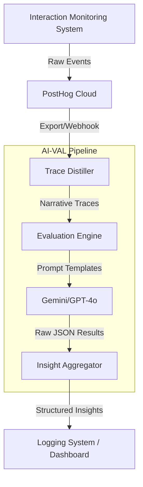

# System Design: AI Validation Pipeline (AI-VAL)

**Status**: Draft
**Version**: 1.0
**System ID**: `ai-validation-pipeline`
**Related Requirements**: [REQ-002], [REQ-003]

---

## 1. Overview
AI-VAL — это аналитический конвейер, который превращает сырые поведенческие данные (Trace Logs) в структурированные бизнес-инсайты. Система автоматически «просматривает» сессии пользователей и выявляет точки трения, ошибки логики и возможности для повышения конверсии.

## 2. Goals & Non-Goals

### Goals
- Автоматизировать аудит воронки продаж с использованием LLM.
- Выявлять аномальное поведение (фрод, боты, технические сбои).
- Формировать гипотезы для A/B тестирования на основе реальных данных.
- Обеспечивать 152-ФЗ комплаенс при анализе (отсутствие PII в промптах).

### Non-Goals
- Real-time реакция на действия пользователя (система работает асинхронно).
- Замена полноценного BI (система фокусируется на качественном анализе, а не на количественных графиках).

## 3. Background & Context
Система является вторым уровнем «лаборатории данных» Expoint ADV. Она потребляет данные от `interaction-monitoring-system` (IMS) и подготавливает выводы для модуля `logging-system`.

---

## 4. Architecture

### High-Level Diagram


### Core Components
1. **Trace Distiller (TD)**: 
   - Превращает поток событий JSON-L в текстовое описание сессии.
   - Пример: `event: click, target: #calc-btn` -> `User started calculation`.
   - Выполняет финальную проверку на отсутствие PII (Double-Check).

2. **Evaluation Engine (EE)**:
   - Управляет контекстом LLM.
   - Использует паттерн **Multi-Persona Review**: анализирует сессию с точки зрения Техлида (ошибки), Маркетолога (конверсия) и Юриста (комплаенс).

3. **Insight Aggregator (IA)**:
   - Сопоставляет выводы по тысячам сессий.
   - Формирует «Карту трения» (Friction Map).

---

## 5. Interface Design

### Data Input (Internal Contract)
```json
{
  "session_id": "uuid",
  "distilled_events": [
    "00:05 - Landing Page View",
    "00:45 - Entered Area: 150sqm",
    "01:12 - Hesitation (15s) on 'Phone' field",
    "01:30 - Form Exit without submission"
  ],
  "context": {
    "segment": "Horeca",
    "device": "mobile",
    "region": "RU-MOS"
  }
}
```

### AI Output Schema
```json
{
  "verdict": "DROPOFF_FRICTION",
  "confidence": 0.85,
  "issue": "User hesitated on phone field and exited.",
  "hypothesis": "Mandatory phone field in Horeca segment is a barrier. Try Telegram-only login.",
  "severity": "HIGH"
}
```

---

## 6. Technology Stack
- **Engine**: Node.js / TypeScript (Runtime).
- **AI Models**: Google Gemini 1.5 Pro (за счет длинного контекста для длинных сессий).
- **Orchestration**: LangGraph (для сложных цепочек рассуждений).
- **Storage**: Vector DB (опционально, для поиска похожих сессий с ошибками).

---

## 7. Trade-offs & Alternatives

| Decision | Choice | Reason |
| :--- | :--- | :--- |
| **Model Choice** | Gemini 1.5 Pro | 2M context window позволяет анализировать очень длинные B2B сессии целиком без потери связей. |
| **Execution** | Batch (Daily/Hourly) | Снижение затрат на API и возможность группировки похожих инсайтов перед выдачей. |
| **PII Strategy** | Pre-prompt Scrubbing | Мы никогда не отправляем сырые данные в LLM, только "Distilled Traces". |

---

## 8. Security & Performance

### Security
- **Data Residency**: Логи IMS хранятся в РФ. AI-VAL работает как прокси, передавая только анонимизированные "истории действий".
- **Prompt Injection Protection**: Строгая типизация выходного JSON от LLM.

### Performance
- **Cost Control**: Использование кэширования контекста (Context Caching) в Gemini для часто повторяющихся инструкций.
- **Async Processing**: Не блокирует основной UI.

---

## 9. Testing Strategy
- **Golden Sets**: Набор «эталонных» сессий с известными проблемами для проверки точности AI.
- **Hallucination Audit**: Регулярная проверка случайных 5% выводов AI человеком.
