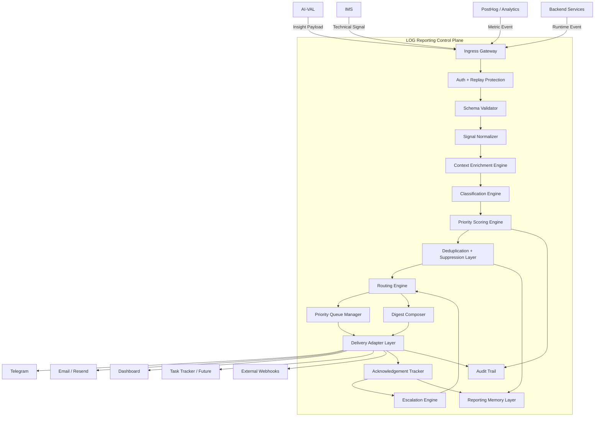
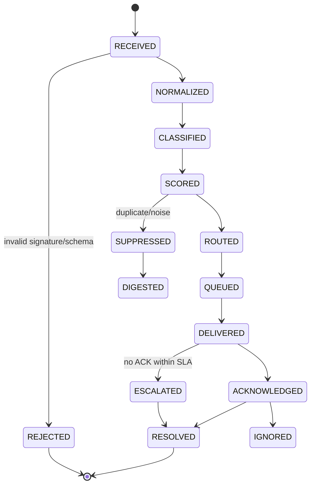

# System Design: Automated Reporting System — LOG

**Status:** Rebuilt Draft
**Version:** 2.0
**System ID:** `automated-reporting-system`
**Architecture Role:** Reporting Control Plane
**Related Requirements:** `[REQ-002]`, `[REQ-004]`, `[REQ-OBS-001]`, `[REQ-HITL-001]`, `[REQ-GOV-001]`
**Parent Architecture:** Genesis v5 — Data-Rich Laboratory
**Primary Function:** Signal-to-Action Orchestration

---

## 1. Overview

Automated Reporting System, далее **LOG**, — это центральный слой маршрутизации, приоритизации и операционного управления сигналами, отчетами, алертами и business insights.

LOG принимает структурированные события от:

* **AI-VAL** — инсайты, гипотезы, friction analysis, anomaly reports;
* **IMS** — технические события, ошибки, latency spikes, behavioral events;
* **PostHog / Analytics Layer** — метрики, funnels, cohorts, drop-offs;
* **Backend / API Services** — runtime errors, integration failures, queue failures;
* **Future Agents** — autonomous audits, recommendations, self-check reports.

Главная задача LOG — не просто доставлять уведомления, а превращать сигналы в управляемые действия:

```text
Raw Signal → Prioritized Alert → Routed Message → Human Action → Feedback → System Learning
```

---

## 2. Goals & Non-Goals

### 2.1 Goals

1. **Real-Time Critical Alerting**
   Доставлять критические технические и бизнес-события нужным получателям в режиме near real-time.

2. **Business Digest Automation**
   Формировать ежедневные, еженедельные и executive-level отчеты по friction map, конверсиям, лидам, калькуляторам, формам, продажам и сегментам.

3. **Alert Fatigue Prevention**
   Предотвращать усталость от алертов через дедупликацию, throttling, grouping, suppression и digest-routing.

4. **Signal Prioritization**
   Определять не только severity, но и priority, urgency, owner, expected impact, required action.

5. **Human-in-the-Loop Feedback**
   Поддерживать подтверждение, комментарии, resolution status и обучение системы на реакции команды.

6. **Operational Traceability**
   Хранить audit trail для всех критичных сигналов: кто получил, когда, какой канал, была ли реакция.

7. **Scalable Delivery Layer**
   Поддерживать Telegram, Email, Dashboard, Webhook, Task Tracker и будущие MCP-интеграции.

---

### 2.2 Non-Goals

1. **Raw Log Storage**
   LOG не хранит сырые логи. Это зона ответственности PostHog, Sentry, observability stack или data warehouse.

2. **Primary Insight Generation**
   LOG не генерирует первичные аналитические инсайты. Это зона AI-VAL.

3. **Full Incident Management Replacement**
   LOG не заменяет PagerDuty / Opsgenie / Sentry, но может интегрироваться с ними.

4. **Manual CRM Replacement**
   LOG может создавать задачи и уведомления, но не является CRM.

---

## 3. System Role

### 3.1 Core Role

LOG является **Reporting Control Plane** между машинным анализом и человеческим действием.

```text
IMS / AI-VAL / Analytics / Backend
        ↓
      LOG
        ↓
DevOps / Marketing / Sales / Founder / Product / Dashboard
```

### 3.2 Responsibilities

| Responsibility  | Description                                                  |
| --------------- | ------------------------------------------------------------ |
| Signal Intake   | принимает webhook-события от внутренних систем               |
| Validation      | проверяет подпись, схему, source trust level                 |
| Normalization   | приводит разные payloads к единому Signal Envelope           |
| Enrichment      | добавляет owner, system context, KPI impact, historical data |
| Classification  | определяет signal type, severity, urgency, business area     |
| Scoring         | рассчитывает priority score                                  |
| Deduplication   | объединяет повторяющиеся события                             |
| Routing         | выбирает канал, получателя, формат и SLA                     |
| Delivery        | отправляет через Telegram, Email, Dashboard, Webhook         |
| Acknowledgement | фиксирует получение и реакцию                                |
| Escalation      | усиливает сигнал при отсутствии реакции                      |
| Digesting       | группирует low / medium signals в отчеты                     |
| Learning        | сохраняет patterns, false positives, useful alerts           |

---

## 4. Architecture

### 4.1 High-Level Architecture



---

## 5. Signal Lifecycle

Every incoming signal follows a strict state machine.



### Signal States

| State          | Meaning                                 |
| -------------- | --------------------------------------- |
| `RECEIVED`     | LOG получил событие                     |
| `REJECTED`     | событие отклонено                       |
| `NORMALIZED`   | приведено к единой структуре            |
| `CLASSIFIED`   | определен тип и категория               |
| `SCORED`       | рассчитан priority score                |
| `SUPPRESSED`   | событие подавлено как шум или дубль     |
| `ROUTED`       | определены канал и получатели           |
| `QUEUED`       | поставлено в очередь                    |
| `DELIVERED`    | отправлено в канал                      |
| `ACKNOWLEDGED` | человек подтвердил получение            |
| `ESCALATED`    | реакция не получена, сигнал поднят выше |
| `RESOLVED`     | проблема закрыта                        |
| `DIGESTED`     | включено в digest                       |

---

## 6. Interface Design

### 6.1 Canonical Signal Envelope

```json
{
  "id": "uuid",
  "schema_version": "2.0",
  "timestamp": "2026-05-11T12:00:00Z",
  "source": {
    "system": "AI-VAL",
    "component": "friction-analyzer",
    "trust_level": "internal"
  },
  "signal": {
    "type": "BUSINESS_INSIGHT",
    "topic": "CONVERSION_FRICTION",
    "severity": "MEDIUM",
    "urgency": "NORMAL",
    "title": "High Drop-off in Horeca Calculator",
    "summary": "Users from Horeca segment abandon the calculator after material selection.",
    "markdown_body": "## Issue\nHigh drop-off detected...\n\n**Hypothesis**: pricing uncertainty after configuration step."
  },
  "impact": {
    "business_area": "Marketing",
    "affected_segment": "Horeca",
    "affected_kpi": "calculator_completion_rate",
    "estimated_revenue_risk": "medium",
    "session_count": 45,
    "confidence": 0.78
  },
  "routing": {
    "suggested_owner": "marketing",
    "suggested_channel": "telegram",
    "requires_ack": false,
    "sla_minutes": 1440
  },
  "metadata": {
    "posthog_link": "https://posthog.example/project/123",
    "dashboard_link": "https://dashboard.example/friction/horeca",
    "correlation_id": "corr_20260511_001"
  }
}
```

---

## 7. Classification Model

### 7.1 Signal Types

| Type                   | Description                     | Example                       |
| ---------------------- | ------------------------------- | ----------------------------- |
| `TECHNICAL_INCIDENT`   | сбой инфраструктуры или сервиса | API down, webhook failed      |
| `BUSINESS_INSIGHT`     | аналитический инсайт            | high drop-off, low conversion |
| `ANOMALY`              | аномальное поведение метрик     | conversion suddenly dropped   |
| `SECURITY_EVENT`       | подозрительная активность       | invalid HMAC burst            |
| `SALES_SIGNAL`         | сигнал продаж                   | hot lead, abandoned quote     |
| `MARKETING_SIGNAL`     | маркетинговый сигнал            | campaign underperforming      |
| `QUALITY_GATE_FAILURE` | провал validation gate          | AI-VAL confidence too low     |
| `SYSTEM_HEALTH`        | состояние системы               | daily health check            |

### 7.2 Severity

| Severity   | Meaning                                                     |
| ---------- | ----------------------------------------------------------- |
| `CRITICAL` | немедленное влияние на деньги, безопасность или доступность |
| `HIGH`     | значимый риск, требуется реакция в течение дня              |
| `MEDIUM`   | важно, но можно включить в digest или backlog               |
| `LOW`      | информационный сигнал                                       |
| `INFO`     | наблюдение без действия                                     |

### 7.3 Urgency

| Urgency       | SLA          |
| ------------- | ------------ |
| `IMMEDIATE`   | 5–15 минут   |
| `FAST`        | 1 час        |
| `TODAY`       | до конца дня |
| `NORMAL`      | 24–48 часов  |
| `DIGEST_ONLY` | только отчет |

---

## 8. Priority Scoring Engine

Severity не должен быть единственным параметром. LOG рассчитывает `priority_score`.

### 8.1 Formula

```text
priority_score =
  severity_weight * 0.30 +
  urgency_weight * 0.20 +
  business_impact_weight * 0.20 +
  confidence_weight * 0.10 +
  recurrence_weight * 0.10 +
  owner_criticality_weight * 0.10
```

### 8.2 Score Bands

|  Score | Band | Action                                      |
| -----: | ---- | ------------------------------------------- |
| 90–100 | P0   | Real-time alert + escalation + ACK required |
|  75–89 | P1   | Real-time alert + ACK recommended           |
|  55–74 | P2   | same-day delivery or digest priority        |
|  35–54 | P3   | digest only                                 |
|   0–34 | P4   | store / suppress / weekly summary           |

### 8.3 Example

```json
{
  "severity": "HIGH",
  "urgency": "TODAY",
  "business_impact": "HIGH",
  "confidence": 0.82,
  "recurrence": "REPEATED",
  "priority_score": 81,
  "priority_band": "P1"
}
```

---

## 9. Routing Engine

### 9.1 Routing Inputs

Routing Engine uses:

* `signal.type`;
* `severity`;
* `urgency`;
* `priority_score`;
* `business_area`;
* `affected_kpi`;
* `source.system`;
* `confidence`;
* `owner`;
* `time_of_day`;
* `deduplication status`;
* `team calendar / quiet hours`;
* `requires_ack`.

### 9.2 Ownership Matrix

| Signal Area            | Primary Owner | Backup Owner  | Channel            |
| ---------------------- | ------------- | ------------- | ------------------ |
| Technical incidents    | DevOps        | Backend Lead  | Telegram Tech      |
| AI-VAL failure         | AI Engineer   | Product Owner | Telegram AI        |
| Conversion friction    | Marketing     | Product       | Business Digest    |
| Sales hot lead         | Sales         | Founder       | Telegram Sales     |
| Security event         | DevOps        | Founder       | Telegram Critical  |
| Weekly business report | Founder       | Marketing     | Email + Dashboard  |
| Calculator performance | Product       | Marketing     | Dashboard + Digest |

### 9.3 Routing Rules

```yaml
routing_rules:
  - id: critical_technical_incident
    when:
      type: TECHNICAL_INCIDENT
      severity: CRITICAL
    then:
      channel: telegram
      chat: tech_critical
      requires_ack: true
      sla_minutes: 15
      escalation:
        after_minutes: 15
        to: founder

  - id: business_friction_medium
    when:
      type: BUSINESS_INSIGHT
      topic: CONVERSION_FRICTION
      severity: MEDIUM
    then:
      channel: digest
      digest_type: daily_business
      owner: marketing
      requires_ack: false

  - id: sales_hot_lead
    when:
      type: SALES_SIGNAL
      severity: HIGH
    then:
      channel: telegram
      chat: sales
      requires_ack: true
      sla_minutes: 30
```

---

## 10. Queue Manager

### 10.1 Queue Types

| Queue               | Purpose                                  |
| ------------------- | ---------------------------------------- |
| `realtime_queue`    | P0 / P1 alerts                           |
| `priority_queue`    | P2 same-day alerts                       |
| `digest_queue`      | P3 digest candidates                     |
| `weekly_queue`      | low-priority strategic summaries         |
| `retry_queue`       | failed deliveries                        |
| `dead_letter_queue` | permanently failed events                |
| `escalation_queue`  | delayed checks for unacknowledged alerts |

### 10.2 Queue Requirements

* idempotency key required;
* retry with exponential backoff;
* max retry count per channel;
* dead-letter after repeated failure;
* priority ordering;
* poison message detection;
* queue health monitoring.

---

## 11. Deduplication & Suppression

### 11.1 Deduplication Key

```text
dedup_key = hash(source.system + signal.type + topic + affected_kpi + affected_segment + time_bucket)
```

### 11.2 Suppression Rules

| Case                              | Action                                |
| --------------------------------- | ------------------------------------- |
| Same alert within 10 minutes      | suppress duplicate                    |
| Same medium insight 5+ times/day  | group into digest                     |
| Same critical incident unresolved | update existing thread                |
| Low-confidence AI insight         | hold for digest or request validation |
| Repeated false positive           | reduce score automatically            |

### 11.3 Alert Threading

Instead of sending 20 messages:

```text
[CRITICAL] API latency spike
Update 1: still active after 5 min
Update 2: partial recovery
Update 3: resolved
```

LOG should maintain one alert thread where possible.

---

## 12. Delivery Adapter Layer

### 12.1 Supported Channels

| Channel        | Use Case                                    |
| -------------- | ------------------------------------------- |
| Telegram       | real-time operational alerts                |
| Email / Resend | daily / weekly executive summaries          |
| Dashboard      | persistent reporting and status             |
| Webhook        | integrations with external systems          |
| Task Tracker   | future Jira / Linear / Notion task creation |
| MCP Adapter    | future agent-to-tool reporting              |

### 12.2 Adapter Responsibilities

Each adapter must handle:

* formatting;
* escaping;
* retries;
* channel limits;
* delivery confirmation where available;
* error mapping;
* rate limit handling;
* message templates.

### 12.3 Telegram Formatting Rules

* escape MarkdownV2 symbols;
* limit message length;
* split long messages;
* attach dashboard links;
* use thread update if possible;
* avoid spam bursts;
* never expose secrets.

---

## 13. Digest Composer

### 13.1 Digest Types

| Digest                    | Frequency      | Audience                  |
| ------------------------- | -------------- | ------------------------- |
| `daily_business_digest`   | daily          | Founder, Marketing, Sales |
| `daily_technical_digest`  | daily          | DevOps, Engineering       |
| `weekly_executive_report` | weekly         | Founder / Leadership      |
| `friction_map_digest`     | daily / weekly | Product, Marketing        |
| `sales_signal_digest`     | daily          | Sales                     |
| `ai_quality_digest`       | weekly         | AI / Product              |

### 13.2 Digest Structure

```markdown
# Daily Business Digest — 2026-05-11

## 1. Executive Summary
- Conversion dropped by 7% in Horeca calculator.
- 3 high-intent leads abandoned at pricing stage.
- Top friction point: material selection → price uncertainty.

## 2. Critical Signals
...

## 3. Friction Map
...

## 4. Recommended Actions
...

## 5. Owner Assignments
...

## 6. Links
- Dashboard
- PostHog
- CRM
```

### 13.3 Digest Quality Rules

Digest must be:

* grouped by business area;
* ranked by priority;
* action-oriented;
* no duplicate items;
* include owner and next step;
* include confidence level;
* include links to evidence.

---

## 14. Escalation Engine

### 14.1 Escalation Logic

```text
If alert requires_ack = true
AND no acknowledgement within SLA
THEN escalate to backup owner
AND increase priority level
AND create audit event
```

### 14.2 Escalation Matrix

| Priority | First Channel        | Escalation                   |
| -------- | -------------------- | ---------------------------- |
| P0       | Telegram Critical    | Founder after 15 min         |
| P1       | Team Telegram        | Backup owner after 30–60 min |
| P2       | Dashboard + Telegram | Digest + reminder            |
| P3       | Digest               | no escalation                |
| P4       | Archive              | no escalation                |

---

## 15. Memory & Learning Layer

### 15.1 Memory Types

| Memory Layer       | Stored Data                                              | TTL       |
| ------------------ | -------------------------------------------------------- | --------- |
| Short-Term Memory  | recent alerts, dedup keys, delivery status               | 24–72h    |
| Operational Memory | recurring incidents, resolved alerts, owners             | 30–90d    |
| Semantic Memory    | patterns, useful alerts, false positives, best actions   | long-term |
| Governance Memory  | routing overrides, suppression rules, escalation changes | long-term |

### 15.2 Learning Signals

LOG should learn from:

* acknowledged vs ignored alerts;
* resolved vs unresolved incidents;
* false positives;
* repeated topics;
* owner response time;
* action effectiveness;
* digest engagement;
* manual feedback.

### 15.3 Feedback Payload

```json
{
  "signal_id": "uuid",
  "feedback": {
    "useful": true,
    "false_positive": false,
    "resolved": true,
    "resolution_note": "Pricing explanation added to calculator step.",
    "owner": "marketing",
    "time_to_ack_minutes": 18,
    "time_to_resolve_minutes": 240
  }
}
```

---

## 16. Governance

### 16.1 Hard Rules

1. Critical security and uptime alerts must never be digest-only.
2. No secret or PII may be sent to Telegram or Email.
3. Every P0/P1 alert must have owner and SLA.
4. Every delivery failure must enter retry or DLQ.
5. Every schema change must increment `schema_version`.
6. Every route override must be logged.
7. Digest must never include raw personal data.
8. Suppressed alerts must remain auditable.
9. LOG must fail safe: if routing fails, send to fallback critical channel.
10. LOG must not block source systems longer than 200ms.

### 16.2 Override Rules

```yaml
override_policy:
  allowed:
    - channel_override
    - owner_override
    - severity_downgrade
    - digest_frequency_change
  requires_audit:
    - severity_downgrade
    - suppression_rule_create
    - escalation_disable
  forbidden:
    - disable_critical_alerts_without_backup
    - send_pii_to_unsecured_channel
    - route_security_events_to_digest_only
```

---

## 17. Security Considerations

### 17.1 Webhook Security

Required:

* HMAC SHA-256 signature;
* timestamp header;
* nonce;
* replay protection;
* source allowlist;
* schema validation;
* body size limit;
* rate limiting;
* per-source secret rotation.

### 17.2 Headers

```http
X-LOG-Source: AI-VAL
X-LOG-Timestamp: 2026-05-11T12:00:00Z
X-LOG-Nonce: random-string
X-LOG-Signature: sha256=...
```

### 17.3 Replay Protection

Reject if:

* timestamp older than 5 minutes;
* nonce already used;
* signature mismatch;
* source not allowlisted.

---

## 18. Performance Requirements

| Requirement           | Target           |
| --------------------- | ---------------- |
| Ingress response time | `<200ms`         |
| P0 delivery start     | `<5s`            |
| P1 delivery start     | `<30s`           |
| Digest generation     | `<60s`           |
| Duplicate detection   | `<50ms`          |
| Queue retry delay     | exponential      |
| Max Telegram burst    | under API limits |
| Availability target   | 99.5%+ for MVP   |

---

## 19. Observability

### 19.1 LOG Internal Metrics

| Metric                     | Description                 |
| -------------------------- | --------------------------- |
| `signals_received_total`   | total incoming signals      |
| `signals_rejected_total`   | invalid/rejected events     |
| `signals_suppressed_total` | deduplicated/noise events   |
| `delivery_success_rate`    | successful deliveries       |
| `delivery_failure_rate`    | failed deliveries           |
| `time_to_deliver_p0`       | latency for critical alerts |
| `ack_rate_p0_p1`           | acknowledgement rate        |
| `false_positive_rate`      | bad alert ratio             |
| `digest_open_rate`         | email/dashboard engagement  |
| `alerts_per_owner_per_day` | fatigue indicator           |
| `escalation_rate`          | unresolved alert pressure   |

### 19.2 Health Check Endpoint

```http
GET /api/reporting/health
```

Response:

```json
{
  "status": "ok",
  "version": "2.0",
  "queues": {
    "realtime": "ok",
    "digest": "ok",
    "retry": "ok",
    "dlq": 0
  },
  "adapters": {
    "telegram": "ok",
    "email": "ok",
    "dashboard": "ok"
  }
}
```

---

## 20. Technology Stack

### 20.1 MVP Stack

| Layer      | Choice                                     |
| ---------- | ------------------------------------------ |
| Runtime    | Node.js / Next.js API Routes               |
| Validation | Zod                                        |
| Queue      | Vercel KV / Upstash Redis                  |
| Storage    | PostgreSQL / Supabase                      |
| Email      | Resend                                     |
| Telegram   | Telegram Bot API                           |
| Scheduling | Vercel Cron / GitHub Actions / Trigger.dev |
| Dashboard  | Next.js Admin Panel                        |
| Monitoring | Sentry + PostHog                           |

### 20.2 Scale Stack

| Layer             | Choice                                 |
| ----------------- | -------------------------------------- |
| Queue             | BullMQ / Redis                         |
| Workflow          | Temporal / Inngest / Trigger.dev       |
| Storage           | PostgreSQL + partitioned event tables  |
| Stream            | Kafka / Redpanda if event volume grows |
| Incident          | PagerDuty / Opsgenie integration       |
| Tasks             | Linear / Jira / Notion                 |
| AI Classification | AI-VAL classifier submodule            |

---

## 21. Data Model

### 21.1 `reporting_signals`

```sql
CREATE TABLE reporting_signals (
  id UUID PRIMARY KEY,
  schema_version TEXT NOT NULL,
  source_system TEXT NOT NULL,
  source_component TEXT,
  signal_type TEXT NOT NULL,
  topic TEXT NOT NULL,
  severity TEXT NOT NULL,
  urgency TEXT NOT NULL,
  priority_score INT NOT NULL,
  priority_band TEXT NOT NULL,
  title TEXT NOT NULL,
  summary TEXT,
  markdown_body TEXT,
  business_area TEXT,
  affected_segment TEXT,
  affected_kpi TEXT,
  confidence NUMERIC,
  status TEXT NOT NULL,
  dedup_key TEXT,
  correlation_id TEXT,
  created_at TIMESTAMP NOT NULL,
  updated_at TIMESTAMP NOT NULL
);
```

### 21.2 `reporting_deliveries`

```sql
CREATE TABLE reporting_deliveries (
  id UUID PRIMARY KEY,
  signal_id UUID REFERENCES reporting_signals(id),
  channel TEXT NOT NULL,
  recipient TEXT NOT NULL,
  status TEXT NOT NULL,
  provider_message_id TEXT,
  error_message TEXT,
  delivered_at TIMESTAMP,
  acknowledged_at TIMESTAMP,
  created_at TIMESTAMP NOT NULL
);
```

### 21.3 `reporting_feedback`

```sql
CREATE TABLE reporting_feedback (
  id UUID PRIMARY KEY,
  signal_id UUID REFERENCES reporting_signals(id),
  owner TEXT,
  useful BOOLEAN,
  false_positive BOOLEAN,
  resolved BOOLEAN,
  resolution_note TEXT,
  time_to_ack_minutes INT,
  time_to_resolve_minutes INT,
  created_at TIMESTAMP NOT NULL
);
```

---

## 22. API Design

### 22.1 Ingress Endpoint

```http
POST /api/webhooks/reporting
```

Responsibilities:

1. verify HMAC;
2. check timestamp and nonce;
3. validate schema;
4. normalize payload;
5. enqueue classification/routing job;
6. return fast response.

Response:

```json
{
  "accepted": true,
  "signal_id": "uuid",
  "status": "queued"
}
```

---

### 22.2 Acknowledgement Endpoint

```http
POST /api/reporting/signals/:id/ack
```

Payload:

```json
{
  "owner": "marketing",
  "note": "Will review calculator friction today."
}
```

---

### 22.3 Resolution Endpoint

```http
POST /api/reporting/signals/:id/resolve
```

Payload:

```json
{
  "owner": "marketing",
  "resolution_note": "Added pricing explanation and CTA near material step.",
  "linked_task": "TASK-123"
}
```

---

### 22.4 Digest Endpoint

```http
POST /api/reporting/digests/generate
```

Payload:

```json
{
  "digest_type": "daily_business_digest",
  "date": "2026-05-11"
}
```

---

## 23. Testing & Validation

### 23.1 Quality Gates

| Gate              | Requirement                     |
| ----------------- | ------------------------------- |
| Schema Validation | invalid payload rejected        |
| HMAC Validation   | unsigned request rejected       |
| Replay Protection | reused nonce rejected           |
| Routing Accuracy  | expected owner/channel selected |
| Deduplication     | duplicate event suppressed      |
| Retry Logic       | failed delivery retried         |
| DLQ               | poison message isolated         |
| Digest Quality    | grouped, ranked, no duplicates  |
| PII Safety        | sensitive fields redacted       |
| SLA Escalation    | no ACK triggers escalation      |

### 23.2 Regression Tests

Required test suites:

```text
tests/reporting/
  ingress.spec.ts
  hmac.spec.ts
  replay-protection.spec.ts
  schema-validation.spec.ts
  priority-scoring.spec.ts
  routing-engine.spec.ts
  deduplication.spec.ts
  telegram-adapter.spec.ts
  email-digest.spec.ts
  escalation.spec.ts
  pii-redaction.spec.ts
  healthcheck.spec.ts
```

### 23.3 Test Scenarios

1. AI-VAL sends medium friction insight → goes to daily business digest.
2. IMS sends critical API failure → Telegram critical + ACK required.
3. Same alert sent 10 times → one alert + grouped update.
4. Telegram API fails → retry queue.
5. Retry fails repeatedly → DLQ.
6. P0 alert has no ACK after SLA → escalated to backup owner.
7. Payload contains PII → sensitive fields redacted.
8. Invalid HMAC → rejected and audit event created.

---

## 24. Failure Modes & Fallbacks

| Failure                   | Protection                                                  |
| ------------------------- | ----------------------------------------------------------- |
| Telegram API down         | fallback to Email / Dashboard                               |
| Email provider down       | retry + dashboard-only backup                               |
| Queue unavailable         | temporary direct delivery for P0                            |
| DB unavailable            | fail closed for low-priority, fail open for P0 notification |
| Routing rules broken      | fallback route to critical admin channel                    |
| Digest generation fails   | send minimal fallback digest                                |
| AI classifier unavailable | use deterministic rule-based classifier                     |
| Repeated spam source      | rate-limit and quarantine                                   |

---

## 25. Trade-offs & Alternatives

| Decision          | Choice                            | Reason                                       |
| ----------------- | --------------------------------- | -------------------------------------------- |
| Routing           | Hybrid rule-based + scoring       | deterministic MVP with scalable intelligence |
| Queue             | Redis/BullMQ or Vercel KV for MVP | simple start, migration path available       |
| Delivery          | Telegram-first                    | fastest human response                       |
| Email             | Resend                            | clean digest delivery                        |
| Dashboard         | required for persistence          | Telegram is not a source of truth            |
| AI Classification | optional Phase 2                  | avoid overengineering MVP                    |
| Kafka             | not MVP                           | unnecessary before high event volume         |
| PagerDuty         | optional                          | only if uptime becomes mission-critical      |

---

## 26. MVP Implementation Plan

### Phase 0 — Contracts

* define Signal Envelope v2;
* define Zod schemas;
* define routing rules YAML;
* define ownership matrix;
* define severity / urgency / priority taxonomy.

### Phase 1 — Secure Ingress

* create `/api/webhooks/reporting`;
* add HMAC validation;
* add replay protection;
* add schema validation;
* add fast `202 Accepted` response.

### Phase 2 — Routing + Queue

* implement classification;
* implement priority scoring;
* implement deduplication key;
* implement realtime / digest / retry queues.

### Phase 3 — Delivery

* Telegram adapter;
* Email adapter;
* Dashboard persistence;
* delivery status tracking.

### Phase 4 — Digest

* daily business digest;
* daily technical digest;
* weekly executive digest;
* digest composer with grouping and ranking.

### Phase 5 — HITL

* acknowledgement endpoint;
* resolution endpoint;
* feedback capture;
* escalation engine.

### Phase 6 — Learning Layer

* false positive tracking;
* recurring pattern detection;
* routing improvement proposals;
* alert usefulness scoring.

---

## 27. Success Metrics

| Metric                         | Target                             |
| ------------------------------ | ---------------------------------- |
| P0 delivery latency            | `<5s`                              |
| P1 delivery latency            | `<30s`                             |
| Ingress response               | `<200ms`                           |
| Delivery success rate          | `>99%`                             |
| Duplicate suppression accuracy | `>90%`                             |
| P0/P1 ACK rate                 | `>95%`                             |
| False positive rate            | `<10%`                             |
| Digest usefulness rating       | `>80%`                             |
| Alert volume per owner         | controlled under fatigue threshold |
| Escalation miss rate           | `0` for P0                         |

---

## 28. Extension System

### 28.1 Adding New Signal Source

Required steps:

1. create source identity;
2. create HMAC secret;
3. define schema mapping;
4. add source to allowlist;
5. add routing rules;
6. add tests;
7. add dashboard visibility.

### 28.2 Adding New Channel

Required steps:

1. implement adapter interface;
2. define formatter;
3. define rate limits;
4. define retry logic;
5. define delivery receipt model;
6. add tests;
7. add fallback rules.

### 28.3 Adapter Interface

```ts
export interface DeliveryAdapter {
  channel: string;

  canDeliver(signal: ReportingSignal): boolean;

  format(signal: ReportingSignal): Promise<FormattedMessage>;

  deliver(message: FormattedMessage): Promise<DeliveryResult>;

  handleError(error: unknown): DeliveryError;
}
```

---

## 29. Final Architecture Principle

LOG must follow this rule:

> No important signal should disappear.
> No human should be spammed.
> Every alert should either create action, become knowledge, or be suppressed by explicit logic.
