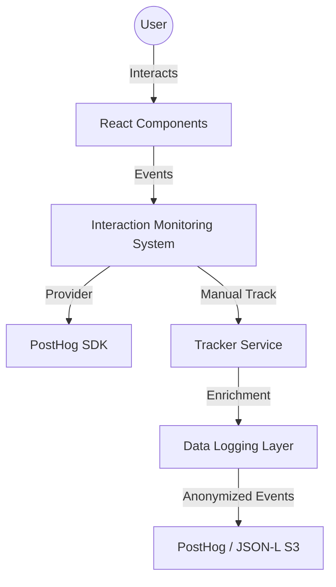

# System Design: Interaction Monitoring System (IMS)

## 1. Overview
The **Interaction Monitoring System (IMS)** is the "eyes" of the Expoint platform. It captures high-fidelity user interaction data, enriches it with business context (segments, compliance states), and pipes it into an AI-consumable data stream.

## 2. Goals & Non-Goals
### Goals
- Capture every meaningful interaction (clicks, scrolls, form fills).
- Provide "AI-Ready" structured logs (JSON-L compatible).
- Enforce strict 152-FZ compliance (mask PII).
- Minimal performance impact (TBT < 50ms).

### Non-Goals
- Real-time AI processing (handled by `AI-Validation-Pipeline`).
- Server-side event storage (handled by `PostHog` and `Data-Logging-Layer`).

## 3. Background & Context
Based on **PRD [REQ-ANL-001]**, we need to track user friction in the 902-PP Audit Wizard. Existing analytics (GA4) are too generic and don't provide the raw event traces needed for LLM evaluation.

## 4. Architecture
### Component Diagram


### Physical Structure
- `src/components/analytics/AnalyticsProvider.tsx`: Context wrapper.
- `src/lib/services/analytics/tracker.ts`: Core tracking logic.
- `src/lib/services/analytics/hooks.ts`: `useAnalytics` hook.

## 5. Interface Design
### Tracker API
```typescript
interface InteractionProps {
  interaction_type: 'click' | 'input' | 'scroll' | 'hesitation';
  target_id: string;
  value?: any;
  context?: Record<string, any>;
}

const trackInteraction = (eventName: string, props: InteractionProps) => {
  // Logic to enrich and send to PostHog
}
```

## 6. Data Model
### Interaction Event Schema
```json
{
  "event": "audit_step_completed",
  "properties": {
    "distinct_id": "uuid-v4",
    "timestamp": "ISO-8601",
    "segment": "horeca",
    "compliance_status": "in_progress",
    "step_index": 2,
    "time_spent_ms": 4500,
    "is_anonymized": true
  }
}
```

## 7. Technology Stack
- **Engine**: PostHog (Session Replay + Event Stream).
- **Library**: `posthog-js`, `@posthog/react`.
- **Anonymization**: Custom `PIIStripper` utility.

## 8. Trade-offs & Alternatives
### Manual vs. Autocapture
- **Decision**: Hybrid approach.
- **Trade-off**: Autocapture provides "safety net" but lacks business context. Manual tracking in key modules (`Calculator`, `AuditWizard`) ensures AI has the "why" behind the interaction.

### Real-time vs. Batch
- **Decision**: Real-time transmission (PostHog default) for recording, batch evaluation for AI.
- **Trade-off**: Real-time processing of AI insights is expensive; batching allows for deeper analysis of session patterns.

## 9. Security Considerations
- **PII Masking**: All `input` type events must pass through `PIIStripper`.
- **152-FZ**: Data is sent to a RU-compliant proxy if required (PostHog Cloud EU/US support masking).
- **CSP**: Ensure PostHog domains are allowlisted.

## 10. Performance Considerations
- **Beacon API**: Use `navigator.sendBeacon` for exit events.
- **Idle Processing**: Use `requestIdleCallback` for non-critical enrichment logic.

## 11. Testing Strategy
- **Unit Tests**: Validate `PIIStripper` regex patterns.
- **E2E Tests**: Verify that clicking a "Get Consultation" button triggers a PostHog event with correct segment metadata.
