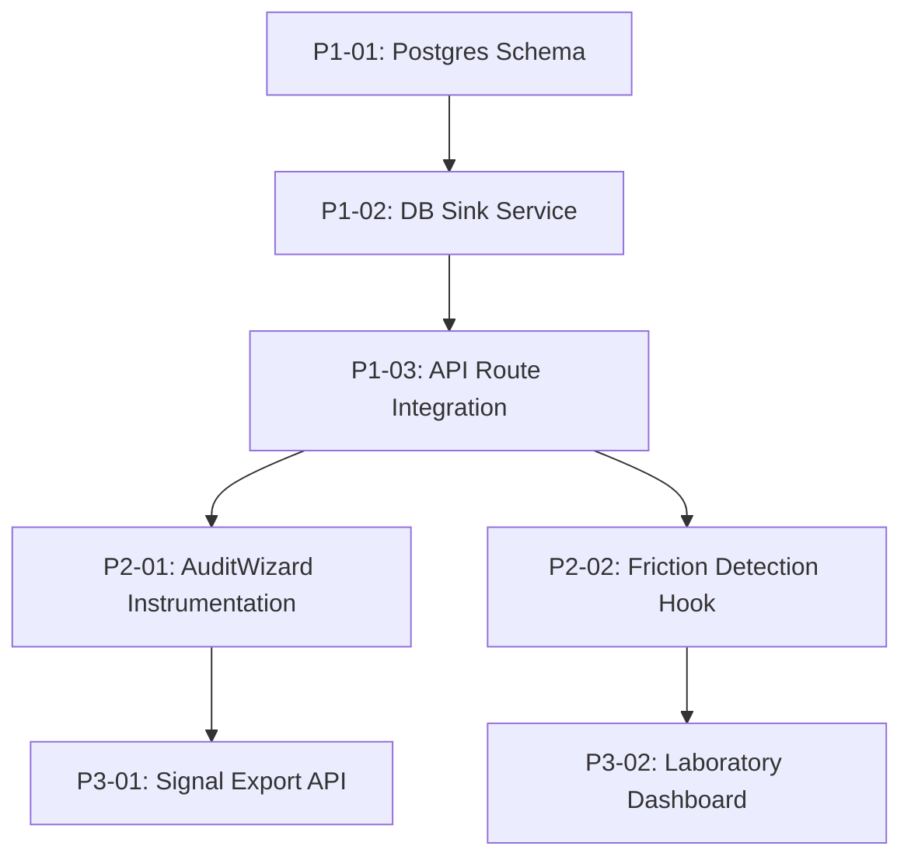

# 📋 Genesis v5: Analytics Laboratory - Task Blueprint

This document defines the WBS (Work Breakdown Structure) for the Phase 1 implementation of the Behavioral Analytics Laboratory.

## 📍 Phase Overview

| Phase | Goal | Status |
|---|---|---|
| **P1: Foundation** | Secure persistent storage and signal verification | 🟢 Ready |
| **P2: Instrumentation** | Deep behavioral tracking in core components (Audit/Calc) | 🟡 Planned |
| **P3: AI Integration** | Reporting control plane and AI-readable signal exports | ⚪ Upcoming |

---

## 🌳 Dependency Graph

---

## 🛠 Detailed Task List (WBS)

### Phase 1: Foundation & Secure Ingress (P1)

- [x] **[P1-01] Design Behavioral Log Schema**
  - **Goal**: Create database table for `behavioral_signals` (JSONB).
  - **Input**: `04_SYSTEM_DESIGN/data-logging-layer.md`
  - **Output**: `src/lib/db/schema.ts` (Drizzle/Prisma update)
  - **Verification**: Database migration success.
  - **Dependencies**: None

- [x] **[P1-02] Implement Persistent DB Sink Service**
  - **Goal**: Service to write `SignalEnvelope` to Postgres.
  - **Input**: `src/lib/validators/analytics.ts`
  - **Output**: `src/lib/services/analytics-db.ts`
  - **Verification**: Unit test writing mock signal to DB.
  - **Dependencies**: [P1-01]

- [x] **[P1-03] Connect Log Ingress to DB Sink**
  - **Goal**: Update `/api/v5/log` to persist valid signals.
  - **Input**: `/api/v5/log/route.ts`
  - **Output**: Updated route handler with DB write.
  - **Verification**: `POST /api/v5/log` returns 201 and record exists in DB.
  - **Dependencies**: [P1-02]

### Phase 2: Enhanced Instrumentation (P2)

- [x] **[P2-01] Instrument AuditWizard Component**
  - **Goal**: Capture step-by-step progress and compliance results.
  - **Input**: `src/components/compliance/AuditWizard.tsx`
  - **Output**: Updated component with `useAnalytics` calls.
  - **Verification**: Signals appear in PostHog/DB during manual audit run.
  - **Dependencies**: [P1-03]

- [x] **[P2-02] Implement Behavioral Friction Hook**
  - **Goal**: Monitor hesitation and correction markers.
  - **Input**: `active/behavioral-friction-monitor.md` skill.
  - **Output**: `src/hooks/useFrictionMonitor.ts`
  - **Verification**: Rage clicks or loops trigger a `friction_detected` event.
  - **Dependencies**: [P1-03]

### Phase 3: AI-Ready Reporting (P3)

- [x] **[P3-01] Create AI-Readable Signal Export API**
  - **Goal**: Endpoint for bulk signal retrieval in JSON-L format.
  - **Input**: `04_SYSTEM_DESIGN/ai-ready-layer.md`
  - **Output**: `/api/v5/reports/signals/route.ts`
  - **Verification**: Endpoint returns redacted, signed JSON-L stream.
  - **Dependencies**: [P1-03]

- [x] **[P3-02] Build Laboratory Dashboard (MVP)**
  - **Goal**: Internal page for visualizing AI performance vs behavioral logs.
  - **Input**: `04_SYSTEM_DESIGN/automated-reporting-system.md`
  - **Output**: `src/app/admin/laboratory/page.tsx`
  - **Verification**: Page displays signal stats and funnel conversion heatmaps.
  - **Dependencies**: [P3-01]

---

## ⚡ Execution Strategy

1. **Sequential Foundation**: P1 must be completed first to ensure data is not lost.
2. **Parallel Frontend**: P2-01 and P2-02 can be implemented simultaneously once the API is ready.
3. **Audit Gate**: Before P3-01, run a "PII Leakage" audit on the redacted logs.

**Last Updated**: 2026-05-11
