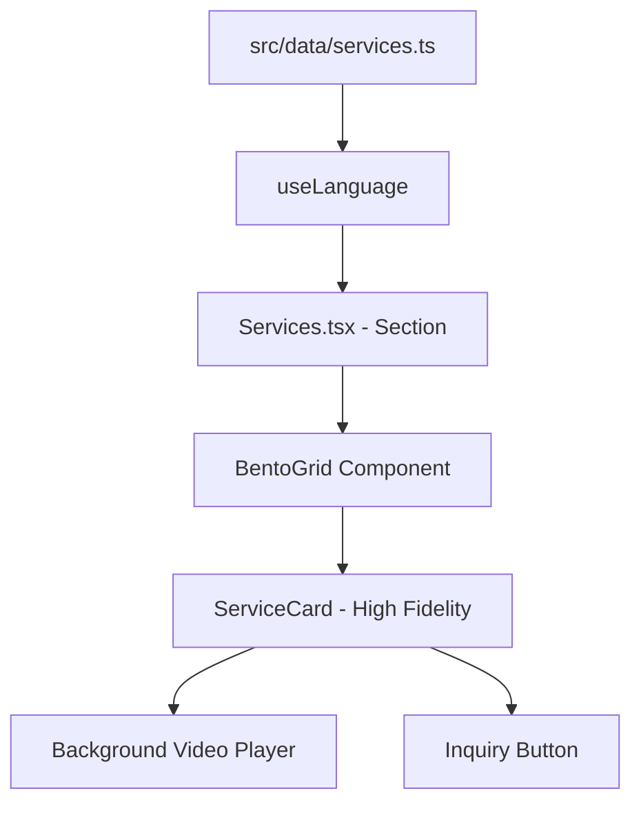

# System Design: Services Hub System (SHS)
**Status**: DRAFT
**Version**: 1.0
**Owner**: Antigravity Architect

## 1. Overview
The **Services Hub System (SHS)** is the primary conversion driver for Expoint ADV. It transforms static service descriptions into a cinematic, industrial-grade interactive experience using high-fidelity video previews and a "Quiet Luxury" visual language.

## 2. Goals & Non-Goals
### Goals
- Implement a dynamic, data-driven Bento Grid.
- Support cinematic background video previews for every service.
- Align with the AntiQ v3 "Luxury" profile (high contrast, premium typography, micro-interactions).
- Ensure full localization support (RU, BE, KK, EN, ZH, CE, TT).

### Non-Goals
- Building a full e-commerce checkout (only lead inquiry).
- Implementing a 3D configurator (separate system).

## 3. Architecture


## 4. Interface Design
### ServiceCard Props
```typescript
interface ServiceCardProps {
  service: Service;
  variant: 'featured' | 'standard' | 'mini';
  className?: string;
}
```

## 5. Technology Stack
- **Styling**: Tailwind CSS v4 (Standardized utility tokens).
- **Animation**: Framer Motion (Spring physics for hover/reveal).
- **Assets**: 4K MP4 Video (H.265 optimized).

## 6. Trade-offs & Alternatives
- **Video vs Static Image**: Video is preferred for "Hardware" credibility. Alternative (Image) is a fallback.
- **Hardcoded vs Dynamic**: Dynamic rendering from `services.ts` ensures consistency across the whole platform (Services page vs Home page).

## 7. Performance & Security
- **Lazy Loading**: Use `loading="lazy"` for images and `preload="none"` + `IntersectionObserver` for videos.
- **Safety**: Ensure all videos are hosted locally and served with correct MIME types for cross-browser stability.

---
*Generated by Antigravity Design System*
