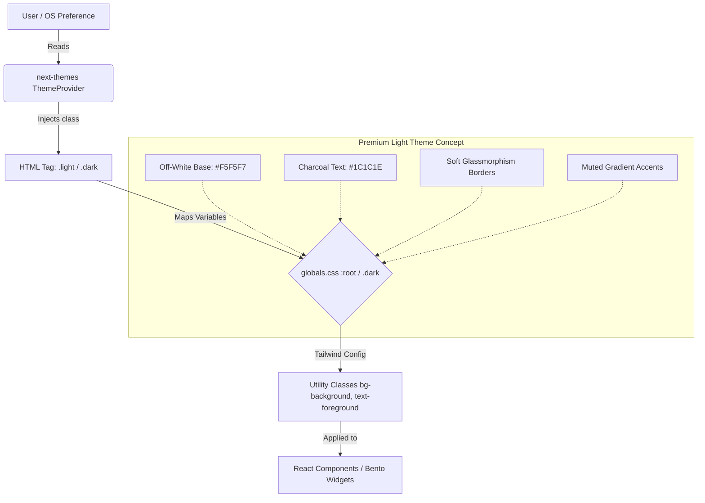

# System Design: Theme & Styling System (Premium Concept)

## 1. Overview
The Theme & Styling System provides the visual foundation for the Expoint ADV v6 platform. This design specifically elevates the "Premium Light Theme" alongside the existing dark mode, adhering to "Quiet Luxury" principles. It utilizes Tailwind CSS variables to enable seamless, FOUC-free switching while maintaining a highly sophisticated, high-conversion B2B aesthetic.

## 2. Goals & Non-Goals

### Goals
- **Quiet Luxury Aesthetic**: Implement a high-end Light Theme using soft off-whites, refined typography, and subtle depth (glassmorphism/semantic shadows) rather than harsh contrast.
- **FOUC Prevention**: Ensure zero "Flash of Unstyled Content" during initial load or theme switching.
- **Dynamic B2B Trust**: Enhance readability and user focus through precise color tokening, directly supporting [REQ-005] B2B Conversion Psychology.
- **Motion Compatibility**: Provide a stable DOM and CSS variable structure that interacts smoothly with [REQ-004] Premium Motion & GSAP without triggering layout thrashing.

### Non-Goals
- Complex client-side state management for themes (relying instead on native CSS variables and SSR-compatible Next-Themes).
- Support for arbitrary user-generated themes (strict Light/Dark binary to maintain brand consistency).

## 3. Background & Context
Historically, the application leaned heavily on a single dark theme. To maximize B2B reach and cater to diverse corporate environments, a Light Theme is introduced. However, a generic white theme feels "cheap" and degrades trust. Research into premium B2B SaaS and luxury industrial design dictates a muted, editorial approach. This system defines the technical implementation of that aesthetic constraint.

## 4. Architecture



### Components
1. **Theme Provider**: A Next.js compatible wrapper that manages `localStorage` and `matchMedia`.
2. **CSS Token Registry**: `globals.css` where HSL variables are defined for both themes.
3. **Tailwind Abstraction Layer**: `tailwind.config.ts` mapping CSS variables to Tailwind utility classes.

## 5. Interface Design

### 5.1 CSS Variables (The Token Contract)
The system exposes semantic tokens rather than hardcoded colors.

**Premium Light Theme Palette (`:root`)**:
- `--background: 240 10% 98%` (Soft pearl / off-white, reduces glare)
- `--foreground: 240 5% 15%` (Deep charcoal, improves readability over pure black)
- `--card: 0 0% 100%` (Pure white for cards to float subtly off the off-white background)
- `--card-foreground: 240 5% 15%`
- `--border: 240 5% 90%` (Very subtle dividing lines)
- `--primary: 220 80% 40%` (Sophisticated deep blue/cyan accent, adapted from PRD gradient)
- `--primary-foreground: 0 0% 100%`
- `--muted: 240 10% 95%`
- `--muted-foreground: 240 5% 45%`

**Dark Theme Palette (`.dark`)**:
- `--background: 0 0% 4%` (Deep rich black `#0a0a0a` per PRD)
- `--foreground: 0 0% 95%`
- *(Existing dark tokens...)*

### 5.2 Component Application
Components consume these via Tailwind:
```tsx
<div className="bg-background text-foreground border border-border/50 backdrop-blur-xl shadow-premium-light">
  <h2 className="text-primary">Premium Header</h2>
</div>
```

## 6. Data Model
*N/A - Theme state is strictly managed via `localStorage` (key: `theme`) and DOM attributes by `next-themes`.*

## 7. Technology Stack
- **`next-themes`**: Prevents SSR mismatch and handles system preference detection.
- **Tailwind CSS v4**: For utility-first consumption of CSS variables.
- **CSS Variables (Custom Properties)**: For zero-JS runtime color switching.

## 8. Trade-offs & Alternatives

### Trade-off 1: CSS Variables vs. Tailwind Dark Variant (`dark:bg-black`)
- **Choice**: CSS Variables.
- **Why**: Using `dark:bg-black bg-white` everywhere litters the JSX and makes global palette tweaks difficult. CSS variables allow defining "Premium Light" centrally in `globals.css`, keeping components clean (`bg-background`).
- **Alternative Rejected**: Hardcoding colors in Tailwind config and using the `dark:` modifier.

### Trade-off 2: Pure White vs. Off-White (Premium Light)
- **Choice**: Soft Off-White (`#F5F5F7` or HSL `240 10% 98%`).
- **Why**: Pure white (`#FFFFFF`) with pure black text creates extreme contrast halation, causing eye fatigue. Off-white signals "print/editorial" quality, aligning with the luxury B2B requirement.

### Trade-off 3: JS-based Theme Switching vs. CSS-based
- **Choice**: CSS-based via `next-themes` script injection.
- **Why**: Avoids FOUC. The script runs before the DOM is painted, setting the `.dark` or `.light` class immediately.

## 9. Security Considerations
- **Storage**: Theme preference stored in `localStorage` is benign and does not contain PII. It complies with 152-FZ without requiring a cookie consent banner for this specific key.
- **XSS**: No user input is passed into the theme generator.

## 10. Performance Considerations
- **Render Blocking**: The `next-themes` inline script is deliberately render-blocking for a microsecond to prevent FOUC, which is a widely accepted best practice (used by Vercel, Radix, etc.).
- **Paint Thrashing**: Using CSS variables means switching themes does not trigger React reconciliation for every component. The browser merely repaints based on the new variable definitions at the `:root` level, which is highly performant.

## 11. Testing Strategy
- **Visual Regression**: Chromatic or similar tools to capture both Light and Dark states of Bento widgets to ensure contrast ratios meet WCAG AA standards.
- **Manual QA**: Verify OS-level theme toggling correctly triggers the `system` preference state.
