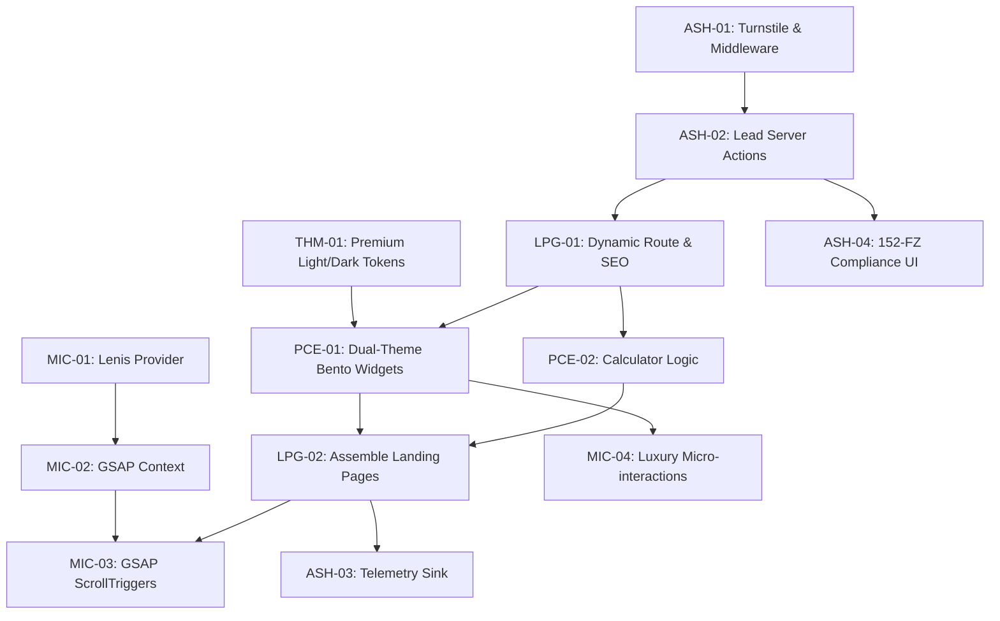

# Genesis V6 Tasks Blueprint (WBS)

## Phase Overview

1.  **Phase 1: Foundation (Security, Motion & Theme)** - Establishing the base infrastructure: security middleware, server actions, global context providers for animations, and the "Premium Light" theme CSS architecture.
2.  **Phase 2: Core Features (Routing & Components)** - Building the dynamic landing page structure and modular Bento widgets with dual-theme (Light/Dark) support.
3.  **Phase 3: Integration & Motion** - Assembling the landings and implementing complex GSAP scroll-driven animations with premium visual fidelity.
4.  **Phase 4: Polish & Telemetry** - Finalizing compliance (152-FZ), micro-interactions, and behavioral tracking sinks.

## Dependency Graph

## Detailed Task List (WBS)

### Phase 1: Foundation (Security, Motion & Theme)

- [ ] **[ASH-01] Setup Edge Security & Turnstile**
  - **Goal**: Implement Cloudflare Turnstile for invisible CAPTCHA and setup Next.js Middleware for rate limiting.
  - **Input**: `ASH.md`
  - **Output**: `src/middleware.ts`, `src/components/ui/TurnstileWidget.tsx`
  - **Verification**: Middleware successfully blocks high-frequency requests; Turnstile widget renders.
  - **Dependencies**: None

- [ ] **[THM-01] Implement Premium Theme Tokens (Light/Dark)**
  - **Goal**: Setup the "Quiet Luxury" Light Theme and High-Contrast Dark Theme CSS variables.
  - **Input**: `theme-styling-system.md`
  - **Output**: `src/app/globals.css`, `tailwind.config.ts`
  - **Verification**: Switching `<html>` class from `.light` to `.dark` updates the background to off-white (#F5F5F7) and text to charcoal (#1C1C1E) respectively.
  - **Dependencies**: None

- [ ] **[MIC-01] Implement Lenis Smooth Scroll Provider**
  - **Goal**: Setup global smooth scrolling using Lenis to normalize scroll behavior.
  - **Input**: `MIC.md`
  - **Output**: `src/components/motion/SmoothScrollProvider.tsx`
  - **Verification**: Scrolling is hardware-accelerated and smooth across browsers.
  - **Dependencies**: None

- [ ] **[MIC-02] Setup Global GSAP Context**
  - **Goal**: Create a provider/utility for managing GSAP instances and ScrollTrigger registration globally.
  - **Input**: `MIC.md`
  - **Output**: `src/components/motion/GSAPProvider.tsx`, `src/lib/gsap.ts`
  - **Verification**: GSAP timelines can be instantiated and cleaned up without memory leaks.
  - **Dependencies**: MIC-01

### Phase 2: Core Features (Routing & Components)

- [ ] **[LPG-01] Scaffold Dynamic Landing Pages**
  - **Goal**: Create the `/services/[slug]` route with `generateStaticParams` and dynamic SEO metadata.
  - **Input**: `PRD.md`, `ARCHITECTURE_OVERVIEW.md`
  - **Output**: `src/app/(marketing)/services/[slug]/page.tsx`
  - **Verification**: Navigating to `/services/neon` renders with correct dynamic meta tags.
  - **Dependencies**: None

- [ ] **[PCE-01] Develop Dual-Theme Bento Widgets**
  - **Goal**: Build modular Tailwind UI components (cases, benefits, CTAs) that look premium in both Light (soft shadows, glassmorphism) and Dark modes.
  - **Input**: `PCE.md`, `theme-styling-system.md`
  - **Output**: `src/components/ui/bento/`
  - **Verification**: Widgets are visually accurate in both themes; contrast ratios meet WCAG AA.
  - **Dependencies**: THM-01, LPG-01

- [ ] **[PCE-02] Build Interactive Calculator Component**
  - **Goal**: Implement client-side pricing logic with a transparent "Formula View".
  - **Input**: `PCE.md`
  - **Output**: `src/components/calculator/PricingCalculator.tsx`
  - **Verification**: Sliders update estimated price instantly; formula is visible.
  - **Dependencies**: LPG-01

### Phase 3: Integration & Motion

- [ ] **[LPG-02] Assemble Full Landing Page Layout**
  - **Goal**: Integrate Bento widgets, Calculator, and Lead Action into the dynamic `[slug]` page with seamless theme switching.
  - **Input**: `LPG-01`, `PCE-01`, `PCE-02`, `ASH-02`
  - **Output**: `src/app/(marketing)/services/[slug]/page.tsx`
  - **Verification**: The complete page renders with all functional components; theme toggle works without FOUC.
  - **Dependencies**: PCE-01, PCE-02, ASH-02

- [ ] **[MIC-03] Animate Sections with GSAP ScrollTrigger**
  - **Goal**: Apply staggered fade-ups, sticky sections, and parallax effects to the assembled pages.
  - **Input**: `MIC.md`, `PRD.md` (Motion Ultra-Prompt)
  - **Output**: `src/app/(marketing)/services/[slug]/page.tsx`
  - **Verification**: Complex animations trigger performantly without layout thrashing.
  - **Dependencies**: LPG-02, MIC-02

- [ ] **[MIC-04] Add Luxury Micro-Interactions (Framer Motion)**
  - **Goal**: Implement hover spring effects, glow strokes, and state changes to Bento widgets.
  - **Input**: `MIC.md`, `PRD.md`
  - **Output**: `src/components/ui/bento/*.tsx` (updated)
  - **Verification**: Interaction feels "expensive" and high-fidelity.
  - **Dependencies**: PCE-01

### Phase 4: Polish & Telemetry

- [ ] **[ASH-03] Build Telemetry Sink & Tracker**
  - **Goal**: Implement lightweight behavioral tracking (scroll depth, time) with a non-blocking server endpoint.
  - **Input**: `ASH.md`
  - **Output**: `src/lib/analytics/tracker.ts`, `src/app/api/telemetry/route.ts`
  - **Verification**: POST requests to `/api/telemetry` succeed without impacting UI performance.
  - **Dependencies**: LPG-02

- [ ] **[ASH-04] Implement 152-FZ Compliance UI**
  - **Goal**: Add premium consent banners and ensure server actions enforce explicit consent.
  - **Input**: `ASH.md`
  - **Output**: `src/components/ui/ConsentBanner.tsx`, `src/lib/validations/lead.ts` (updated)
  - **Verification**: Form submission is blocked without checked consent; UI matches premium theme.
  - **Dependencies**: ASH-02

## Execution Strategy

*   **Foundation First**: `THM-01`, `ASH-01`, and `MIC-01` are critical path items that should be completed in parallel.
*   **Component Parallelism**: Once `THM-01` is ready, `PCE-01` (Bento) and `PCE-02` (Calculator) can be developed independently.
*   **Recommendation**: Prioritize `THM-01` to ensure all subsequent UI development is theme-aware from the start.
