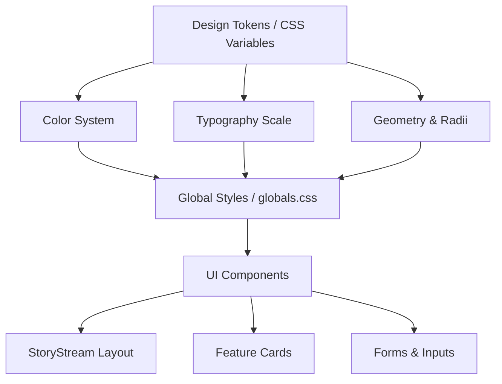

# Theme & Styling System (Verge 2024 Inspired)

## 1. Overview
The Theme & Styling System defines the comprehensive visual language, UI components, typography, and layout rules for the Expoint ADV platform. This system implements a strict, highly opinionated aesthetic inspired by The Verge's 2024 redesign ("developer console meets club night meets tech tabloid"). It relies on a dark canvas (`#131313`), heavy display typography (Manuka), and saturated "hazard-tape" accents.

## 2. Goals & Non-Goals
### Goals
- Establish a strict, unmistakable visual identity using a dark canvas and high-saturation accents.
- Implement a rigid typography hierarchy featuring Manuka for display and PolySans for UI/body.
- Define a color-as-elevation depth model (flat depth, no shadows, 1px borders, solid fills).
- Provide a highly responsive layout strategy with frequent breakpoint tuning.

### Non-Goals
- No "Light Mode" support (the dark canvas is the core product).
- No atmospheric blurs, gradients, or soft drop-shadows.
- No generic, un-opinionated "bootstrap" style components.

## 3. Background & Context
The previous "Quiet Luxury" aesthetic is being entirely replaced. The new direction requires stricter UI/UX rules, eliminating soft gradients and generic padding in favor of a brutally heavy, editorial, and tech-forward design language. This system touches every frontend component, dictating exact hex codes, border radii, and typographic tracking.

## 4. Architecture

### Core Philosophy
- **Depth over Breadth**: Every system element is designed with a specific visual role. 
- **Color-as-Elevation**: Hierarchy is defined by color saturation (e.g., Mint fill) rather than z-index shadows.

## 5. Interface Design & Design Tokens

### 5.1 Color Palette
- **Canvas Black**: `#131313` (Default background for all views)
- **Jelly Mint**: `#3cffd0` (Primary CTA, active states, high-attention tiles)
- **Verge Ultraviolet**: `#5200ff` (Secondary hazard, promotional tiles)
- **Surface Slate**: `#2d2d2d` (Secondary card background)
- **Image Frame**: `#313131` (1px border for imagery)
- **Deep Link Blue**: `#3860be` (Universal hover state for text links)

### 5.2 Typography System
- **Hero/Display**: *Manuka* (Fallback: Impact, Helvetica). 900 weight, tight line-height (0.80). Used only for massive headers (60px - 107px).
- **UI/Body**: *PolySans* (Fallback: Helvetica). Weights 300/400/500/700.
- **Labels/Metadata**: *PolySans Mono*. Used exclusively in UPPERCASE with positive tracking (1.1px - 1.9px).

### 5.3 Geometry & Radii
Strict radius scale: `2px`, `3px`, `4px`, `20px` (Story tiles), `24px` (Feature cards/Primary buttons), `30px`, `40px` (Outlined buttons), `50%`.

## 6. Component Stylings

### Buttons
- **Primary Pill**: `#3cffd0` background, `#000000` UPPERCASE Mono text, 24px radius. Hover: translucent white (`rgba(255,255,255,0.2)`) + 1px `#c2c2c2` ring.
- **Secondary Pill**: `#2d2d2d` background, `#e9e9e9` text.

### StoryStream Cards
- **Format**: 20px radius, `#131313` background with `1px solid #ffffff` border, OR saturated accent fill (no border).
- **Infographics**: Интегрировать визуальную инфографику (иконки, технические параметры, ценовые индикаторы) для повышения информативности карточек.
- **CTA**: Использовать текст "В РАЗДЕЛ" вместо "Подробнее" для навигационных кнопок в карточках.
- **Rail**: Left-aligned 1px solid/dashed vertical rule (`#3d00bf` or `#ffffff`) connecting mono timestamps.

### Map Section
- **Format**: Full-width (`100vw`), no side padding, no border radii (sharp edges).
- **Visuals**: Grayscale filter (`grayscale(100%)`), subtle `invert(0.1)` to match dark canvas depth.
- **Interactions**: Scroll-locked by default, interactive on click/hover if needed, but primarily a "wide-screen architectural" element.

## 7. Technology Stack
- **Styling**: Vanilla CSS (CSS Variables) via `globals.css` and `tokens.css`.
- **Layout**: CSS Grid for complex StoryStream interleaving; Flexbox for component internals.

## 8. Trade-offs & Alternatives
- **Solid Colors vs. Gradients**: Chosen solid colors to maintain the "hazard tape" aesthetic. Gradients would dilute the brand impact.
- **No Light Mode**: Limits accessibility for users preferring light themes, but enforces the editorial "night club" vibe as a non-negotiable brand pillar.
- **Extensive Breakpoints**: Requires more CSS media queries (26 discrete breakpoints detected in reference) but ensures pixel-perfect pacing across all devices.

## 9. Security Considerations
- N/A for visual styling, though care must be taken to sanitize user-generated content before rendering in the heavy display typography to prevent layout shifts or injection.

## 10. Performance Considerations
- **Font Loading**: Manuka and PolySans are custom web fonts. `font-display: swap` must be used. Subset fonts to Cyrillic/Latin to reduce payload.
- **DOM Depth**: Keep StoryStream DOM flat to maintain 60fps scrolling on mobile devices despite many border-radii and strict 1px borders.

## 11. Testing Strategy
- **Visual Regression Testing**: Automated screenshots at key breakpoints (375px, 768px, 1024px, 1280px).
- **Accessibility**: Verify contrast ratios, particularly for inverted text (`#131313` on `#3cffd0`) and muted text (`#949494` on `#131313`).
