# Task Blueprint: Genesis v7 — Commerce Layer

## Phase Overview
- **Phase 5: Commercial Foundation** - Implement the persistent Cart store and verify the pricing logic.
- **Phase 6: Catalog & Prices Implementation** - Build the `/prices` and `/catalog` pages with dynamic data and segment filtering.
- **Phase 7: Calculator & Cart Integration** - Implement the full checkout flow, including the `/calculator` page, `/cart` summary, and lead submission.

## Dependency Graph

```mermaid
graph TD
    %% Foundation (Completed)
    UI01[UI-01: Tokens] --> UI02[UI-02: Type]
    UI02 --> UI03[UI-03: Resets]
    UI03 --> UI04[UI-04: Button]
    UI03 --> UI05[UI-05: Card]
    UI03 --> UI06[UI-06: Input]
    UI04 --> UI07[UI-07: Header]
    UI05 --> UI08[UI-08: Hero]
    UI05 --> UI09[UI-09: Timeline]
    UI10[UI-10: Audit]
    
    %% Phase 5: Commerce Foundation
    UI07 --> COM01[COM-01: Cart Store]
    COM01 --> COM02[COM-02: Pricing Integration]
    
    %% Phase 6: Pages
    COM01 --> COM03[COM-03: Prices Page]
    COM01 --> COM04[COM-04: Catalog Page]
    COM04 --> COM05[COM-05: Pack Card]
    UI09 --> COM06[COM-06: Service Price Blocks]
    
    %% Phase 7: Checkout
    COM02 --> COM07[COM-07: Calculator Page]
    COM01 --> COM08[COM-08: Cart Page]
    COM08 --> COM09[COM-09: Checkout Form]
    COM09 --> COM10[COM-10: Order Submission]
    COM01 --> COM11[COM-11: Header Cart Indicator]
    COM10 --> COM12[COM-12: E2E Verification]
```

## Detailed Task List (WBS)

### Phase 1-4: Verge 2024 Theme (Completed)
- [x] [UI-01] Update Color Tokens
- [x] [UI-02] Load Typography
- [x] [UI-03] Global Layout Resets
- [x] [UI-04] Button Components
- [x] [UI-05] Card & StoryStream Components
- [x] [UI-06] Form Inputs
- [x] [UI-07] Header & Navigation
- [x] [UI-08] Hero Section Refactor
- [x] [UI-09] Feeds to StoryStream Timeline
- [ ] **[UI-10] Responsive Tuning & Hover Audits**
  - **Goal**: Finalize mobile responsiveness, hover states, and **Refactor global layout (Map & Footer)**.
  - **Input**: `theme-styling-system.md`
  - **Output**: `src/components/sections/Footer.tsx`, `src/components/sections/MapSection.tsx`, `src/app/(marketing)/page.tsx`
  - **Verification**: Map is removed from Footer; new full-width grayscale Map section exists; Footer UI matches "Verge 2024" style.
  - **Dependencies**: [UI-07]

---

### Phase 5: Commercial Foundation

- [ ] **[COM-01] Cart Store (Zustand)**
  - **Goal**: Create a persistent Zustand store for managing items (Product Packs and Custom Sign Configurations).
  - **Input**: `genesis/v7/01_PRD.md` [REQ-030]
  - **Output**: `src/store/useCartStore.ts`
  - **Verification**: Verify that items added to the store survive a page refresh (localStorage check).
  - **Dependencies**: [UI-07]

- [ ] **[COM-02] Pricing Engine Integration & Verification**
  - **Goal**: Ensure the `PricingEngine` accurately calculates estimate ranges for all service types.
  - **Input**: `src/lib/pricingEngine.ts`, `conversion-layer.md`
  - **Output**: Unit tests / manual verification logs
  - **Verification**: `calculatePrice` returns expected ranges for small/medium/large items with/without installation.
  - **Dependencies**: [COM-01]

---

### Phase 6: Catalog & Prices Implementation

- [ ] **[COM-03] Prices Page (`/prices`)**
  - **Goal**: Implement the `/prices` page with tariff grids for all services and "Calculate" CTAs.
  - **Input**: `01_PRD.md` [US-001]
  - **Output**: `src/app/(marketing)/prices/page.tsx`
  - **Verification**: Page displays all `SERVICES` with base prices; clicking "Calculate" redirects to `/calculator?type={id}`.
  - **Dependencies**: [COM-01]

- [ ] **[COM-04] Catalog Page (`/catalog`)**
  - **Goal**: Implement the `/catalog` page with segment filtering (horeca, retail, etc.) and `PRODUCT_PACKS`.
  - **Input**: `01_PRD.md` [US-003]
  - **Output**: `src/app/(catalog)/catalog/page.tsx`
  - **Verification**: Filtering by segment updates the visible packs list; "Add to Cart" increases store count.
  - **Dependencies**: [COM-01]

- [ ] **[COM-05] Product Pack Card & Mini-Configurator**
  - **Goal**: Build a specialized card for `PRODUCT_PACKS` that allows toggling "Premium Lighting" for an instant price update.
  - **Input**: `01_PRD.md` [REQ-025]
  - **Output**: `src/components/ui/ProductPackCard.tsx`
  - **Verification**: Toggling premium lighting updates the displayed "starting at" price.
  - **Dependencies**: [COM-04]

- [ ] **[COM-06] Service Page Price Blocks**
  - **Goal**: Integrate price ranges and "Calculate" CTAs into the dynamic service pages.
  - **Input**: `01_PRD.md` [US-005]
  - **Output**: `src/app/(marketing)/services/[slug]/page.tsx`
  - **Verification**: Each service page shows its specific base price and links to the calculator.
  - **Dependencies**: [UI-09]

---

### Phase 7: Calculator & Cart Integration

- [ ] **[COM-07] Calculator Page (`/calculator`)**
  - **Goal**: Implement the dedicated `/calculator` route and embed the `CalculatorContainer`.
  - **Input**: `01_PRD.md` [US-002]
  - **Output**: `src/app/(calculator)/calculator/page.tsx`
  - **Verification**: The calculator opens, respects the `?type=` param, and allows adding to cart.
  - **Dependencies**: [COM-02]

- [ ] **[COM-08] Cart Page (`/cart`)**
  - **Goal**: Implement the main `/cart` route with the item list and total summary.
  - **Input**: `01_PRD.md` [US-004]
  - **Output**: `src/app/cart/page.tsx`
  - **Verification**: Shows all added items (Packs and Custom); allows removing items.
  - **Dependencies**: [COM-01]

- [ ] **[COM-09] Checkout Form**
  - **Goal**: Create the checkout lead capture form with Zod validation.
  - **Input**: `01_PRD.md` [REQ-033]
  - **Output**: `src/components/cart/CheckoutForm.tsx`
  - **Verification**: Form prevents submission with invalid data; captures name/phone/comment.
  - **Dependencies**: [COM-08]

- [ ] **[COM-10] Order Submission Logic**
  - **Goal**: Connect the checkout form to the `leads` API, passing the `cartSnapshot`.
  - **Input**: `01_PRD.md` [REQ-034]
  - **Output**: `src/app/api/leads/actions.ts` (Update)
  - **Verification**: Order submission returns success, clears cart, and redirects to a "Thank You" page.
  - **Dependencies**: [COM-09]

- [ ] **[COM-11] Header Cart Indicator**
  - **Goal**: Add a reactive cart counter to the site Header.
  - **Input**: `01_PRD.md` [REQ-037]
  - **Output**: `src/components/sections/Header.tsx`
  - **Verification**: Adding items instantly updates the counter in the header.
  - **Dependencies**: [COM-01]

- [ ] **[COM-12] Final End-to-End Flow Verification**
  - **Goal**: Perform a full "Configurator -> Cart -> Checkout" audit.
  - **Input**: PRD Verification Checklist
  - **Output**: Verification Report
  - **Verification**: All scenarios (Catalog purchase, Calculator build, Mixed cart) work flawlessly.
  - **Dependencies**: [COM-10], [COM-11]
